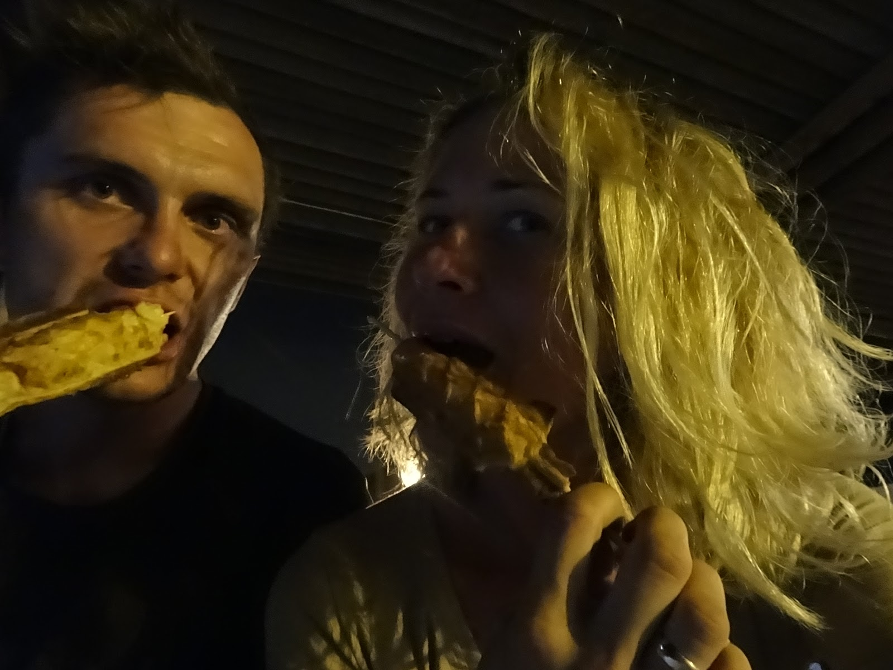
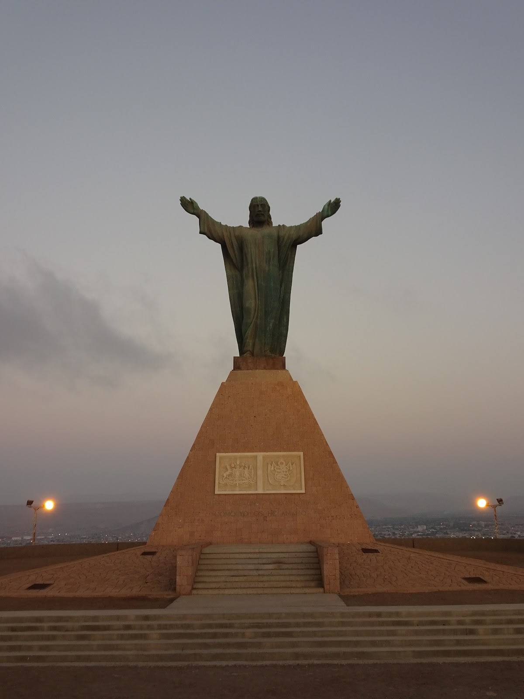
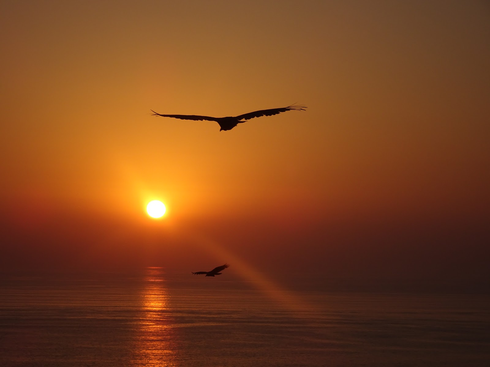

Arica was the last city we visited in Chile. We got there at 9 pm and we totally did not know where to find a nice cozy place to survive the whole night. Although the beach wasn't near, we decided to get there somehow in the dark night. Getting closer and closer to te city centre, I was more and more shocked. All the lights went on and people appeared everywhere. It was almost impossible to ride through them. What's more, many of them started to dance on the streets, but it wasn't spontaneuos dance, everybody knew the choreography. What the hell ? ! My mind was exhausted and it didn't let me to think about that situation clearly. It was February, the carnaval was in two weeks or so.

<youtube>BZEFR3XPNnk</youtube>

I just thought "I'd like to dance with them" the rhythm was so moving, but surely after some steps I would drop death of having no power.
All of a sudden we saw the beach. Bedtime! that's all we wished for. But wait, there were still so many people on the beach with kids, laughing and swimming.
Ok, let's find something to eat.

A sausage! on a stick with cheese.. yummy,,, we were chewing slowly and waitng for people to go home, but instead of getting empty it was getting crowdy. At midnight loud music went off form the speakers. We were done. Apart from parting Chillian society we still wanted to hide in a tent and sleep. We found a shady place near the big building. After settling up, a guy peeked out from the window and called me to come. Problems.. not again, but I was mistaken the guy just warned us that in the early morning they cleaned the toilets with a hose or whatever and all of water was flushed on the beach, the place we had our tent... so we had to move. Anyway thanks for the advise bro.
At about 4 am they stopped playing music.
At 5 I was woken up by the cleanig service.
At 6 the sun warmed our tent so much we had to get out.
All of that was seen by almighty Jesus who "he'd been telling me everything's gonna be alright"
and it was!

In the morning we came to our senses. We left drunkish beach party animals (we were lucky that nobody gave us hard time) and found out that there were many more beach places. We went out of town but there were camps everywhere, I mean wild camps. People set their own beach villages with kitchen, shower and toilet ;) Many, many cars and enourmous tents were spreading to the horizon.

<grid columns="2">-./dsc02462.jpg -./dsc02461.jpg</grid>

In Poland it is forbidden to camp on any beach, but in Chile - freedom. We parked our bicycles and set up a tent quickly. Finally, the longed-for rest. "Oh no, a woman from the nearest camp is looking at us and she is coming, probably to charge us for the "free camping" Paul said. It turned out, she just brought us cool pinapple juice, and a few minutes later borught us some sweet cookies, and at the end of the day the rest of the family gathered there and invited us for a big birthday party.
We drank vine from melon cup, ate grilled beef and on the top of that, a huge birthday cake. My stomach was so happy and aching at the same time.
What a feast!

<grid columns="3">-./dsc02440.jpg -./dsc02437.jpg -./dsc02439.jpg</grid>

Funny crabs woke us up in the early morning :)

<youtube>-UKskDZqFVY</youtube>
We were very lucky because the family enjoyed our company so much that they invited
us to their home so we could ... do the proper laundry :) Fresh and clean we could
be taken to the city tour in Arica by Claudio and his wife Claudia. Apart from nice
beaches, the previously mentioned enourmous statue of Jesus is the main attraction
there, which is also the viewpoint of the whole city. Awesome!{' '}

## Album

<grid columns="3">
  -./dsc02441.jpg -./dsc02443.jpg -./dsc02448.jpg -./dsc02447.jpg
  -./dsc02446.jpg -./dsc02445.jpg -./dsc02454.jpg -./dsc02451.jpg
  -./dsc02449.jpg -./dsc02463.jpg -./dsc02462.jpg -./20170130_200737.jpg
  -./dsc02473.jpg -./dsc02480.jpg -./dsc02555.jpg -./dsc02559.jpg
</grid>
<grid columns="2">
  -./dsc02461.jpg -./dsc02460.jpg -./dsc02457.jpg -./dsc02464.jpg
  -./dsc02474.jpg -./dsc02490.jpg
</grid>
<grid columns="3">
  -./dsc02468.jpg -./dsc02466.jpg -./dsc02485.jpg -./dsc02483.jpg
  -./dsc02482.jpg -./dsc02475.jpg -./dsc02491.jpg -./dsc02489.jpg
  -./dsc02487.jpg -./dsc02486.jpg -./dsc02496.jpg -./dsc02492.jpg
  -./dsc02498.jpg -./dsc02505.jpg -./dsc02508.jpg -./dsc02506.jpg
  -./dsc02512.jpg -./dsc02515.jpg -./dsc02535.jpg -./dsc02528.jpg
  -./dsc02529.jpg
</grid>
<grid columns="2">
  -./dsc02520.jpg -./dsc02547.jpg -./dsc02550.jpg -./dsc02556.jpg
</grid>
