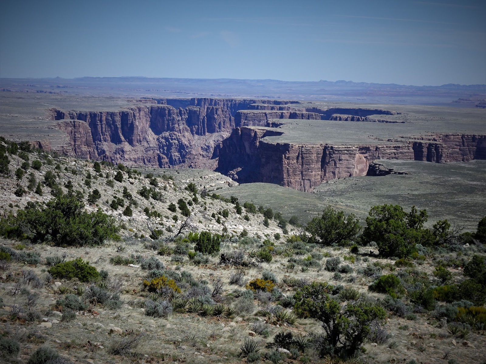

To jeden z moich ulubionych stanów w USA. Arizona nie tylko nas rozpieszczała sosnowymi lasami, gdzie rządziły dostojne jelenie kanadyjskie (Elk), ale także zjeżdżając z Południowej Krawędzi Wielkiego Kanionu Kolorado trafiliśmy do królestwa ciepłolubnych gadów- węży i jaszczurek, czyli na pustynie. Arizońska pustynia różni się znacznie od znanych nam pustyń. W okresie wiosennym cała rozkwita. Otwierają się piękne różowe pąki na kaktusach, kremowe płatki zdobią jukki oraz wiele żółtych, fioletowych i czerwonych kwiatków migało nam podczas jazdy na tle ciepłych skał.

<youtube>R9ZKz9FUh1o</youtube>Z Wielkiego Kanionu ruszyliśmy drogą 64, następnie
89 i w małym miasteczku Gap, znajdującym się w rezerwacie plemienia Navajo,
obraliśmy drogę nr 20 prowadzącą do Page, zwaną też Copper Mine Road. Przepiękna
trasa...

## Album

<grid columns="3">
  -./dsc03761.jpg -./dsc03766.jpg -./dsc03767.jpg -./dsc03771.jpg
  -./dsc03768.jpg -./dsc03777.jpg -./dsc03778.jpg -./dsc03781.jpg
  -./20170418_105933.jpg -./dsc03784.jpg -./dsc03788.jpg -./dsc03786.jpg
  -./dsc03793.jpg -./dsc03795.jpg -./dsc03796.jpg -./dsc03811.jpg
  -./dsc03809.jpg -./dsc03818.jpg -./dsc03817.jpg -./dsc03824.jpg
  -./dsc03825.jpg -./dsc03829.jpg -./dsc03830.jpg -./dsc03826.jpg
  -./dsc03828.jpg -./dsc03827.jpg -./dsc03834%2b%25282%2529.jpg
</grid>
<grid columns="2">-./dsc03831.jpg -./20170419_112228.jpg</grid>
