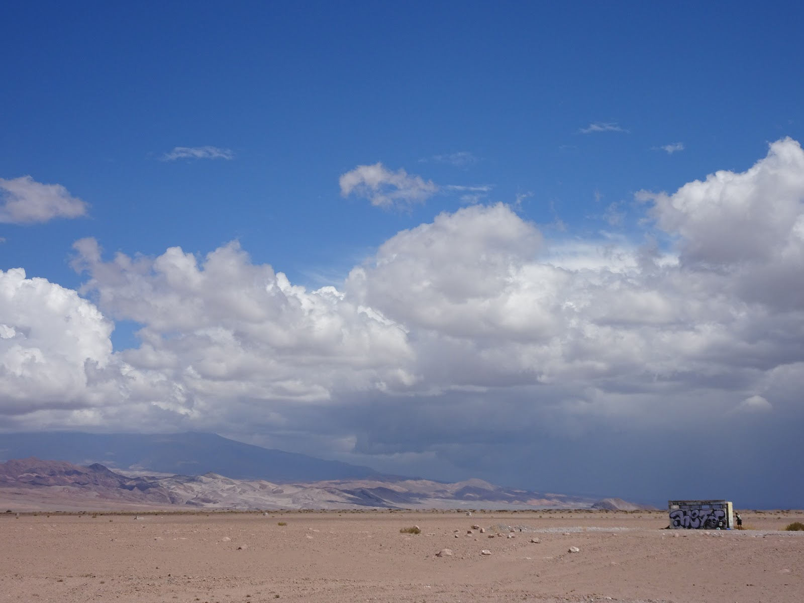
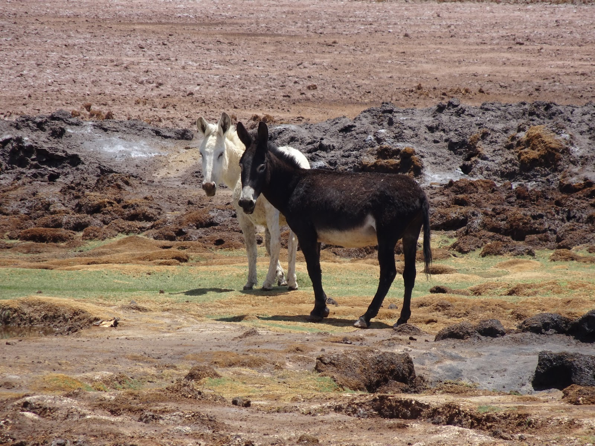
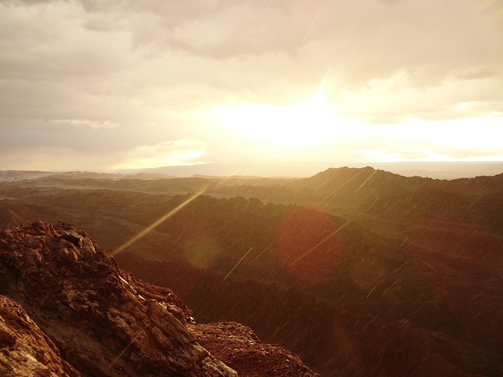

We saw many landscapes during our trip but we've never seen such beautiful <strong>nothingness</strong>... When we left Pacific coast we rode towards north and the landscape changed totally. We felt like on<strong> different planet</strong>, sand, rocks, bald hills, road and nothing more...

<grid>-./dsc02154.jpg -./dsc02188.jpg -./dsc02212.jpg</grid>

Finally, we got to the city called<strong> Calama</strong> and we were very disappointed :( There was so much rubbish everywhere that we couldn't survive without flat tires... Anyway, we heard that not far away from the city there is <strong>the biggest copper mine</strong> in the world (4 km long, 3 km wide and 900 m deep). We climbed up to take some pics :)

<grid columns="2">
  -./dsc02408.jpg -./dsc02411.jpg -./dsc02414.jpg -./dsc02415.jpg
</grid>

Let's leave the industrial part and sink into the nature. In<strong> San Pedro de Atacama</strong> (100 km from Calama) we got a surprise. It was raining cats and dogs. We got soaking wet. As I mentioned before we haven't had many rainy days during our trip and when we got to the desert we got free shower ( warmshower ;) ) Actually, we really needed a shower but no cyclist lived there and prices of showers in San Pedro were very high for us :/
All in all, we got lucky because <strong>on Atacama rains every three years </strong>and it is claimed to be the driest place on the world! (Really?!) Someone said in Spanish that rain was apart of the journey... and I said "Si, pero ... f\*ck" ;D

The small city of San Pedro was cute and looked like made of clay because it actually was made of clay ;) We loved the church !

<grid>-./dsc02253.jpg -./dsc02256.jpg</grid>

Riding between ponds we found a good spot for a tent and in the morning we were welcomed by <strong>Licancabur volcano (mountain of the people) ,</strong> 5920 m.

<grid>-./dsc02242.jpg -./dsc02243.jpg</grid>

The next day we spent on the saddle pedaling towards<strong> Salar de Atacama</strong> and we stayed at nearby hotel (on the right)

In the morning, we went to meet cute <strong>flamingos</strong> and see the salty desert.
It was raining a little bit and the pinky birds weren't happy of this fact at all. They didn't want to pose to photos and showed me only their tail feathers ;)

but I was wet and patient

<grid>-./dsc02326.jpg -./dsc02262.jpg</grid>

On our way back we stopped in oasis that we had seen before on the way to flamingos. We were very happy and confident that we had a nice place to sleep and it was a park full trees :) looked nice from the road. With full enthusiasm that it was<strong> the end of the cycling </strong>we rode into the park and across it to find nice place for a tent... and suddenly pffuuu... The whole ground of the park was covered with thorns that had felt down from those special trees.

We sat on the bench with no extra tubes to change. We were very hungry so I tried to cook sth first but it was so windy that I couldn't set the fire on that stupid eco stove (that burns wood). We did not know what to do. It was getting darker with rainy clouds so we did not want to move any further and we couldn't pitch the tent on those thorns either. Frustrated, I picked the other job of patching tubes, thinking that it could not have been worse...and suddenly some tourists came by car and sat next to us. They brought wine, snacks and they were laughing, talking and smiling. I thought I was going to kill'em all but we changed our tubes and realized that there was a small "hut" behind the trees.
"Anybody lives there?" asking stupid question to ourselves instead of going and checking it. There was nobody in or around so we carried our stuff and bikes there and pitched the tent in one of the rooms.

We still weren't sure if we wouldn't be kicked out in the middle of the night. In the park there were many animals like sheep and donkeys so we thought that maybe someone who looked after those animals would come. It was sleepless night for me because the donkeys were speaking very loudly about love or arguing... noisy but cute.

Nobody came that night though. In the morning, we were ready to explore another wonder of that area called<strong> The Moon Valley.</strong> We got there in the late afternoon because I dreamed about romantic sunset in one of those hills. The surface and rocks were so beautiful and made a big impression on us... and after big bottle of<strong> Cristal</strong>, Chilean beer, we felt like on the moon ;)

Anyway, we could ride bikes in the valley but unfortunately, all the good spots were only for walkers so we had to split and one person had to look after bikes and stuff.
In the end there was no sunset at all. When I was climbing to the top it started to rain and the sky started flashing everywhere so I had to run fast to get some pictures and then ran down before I got hit by the lightening.

Since hopped on bikes we rode as fast as light to the exit of the reserve. Luckily, when we got to the road, the rain stopped. We found a place next to the river, camped, and passed out ;)

In the morning we started laughing because we thought we had chosen the best hidden spot behind the bush (costed us 15 min of discussion) but we were seen from everywhere :) After packing and the last shot with volcano ...

we went towards<strong> Peru</strong> :)

Soon I will update videos with eng subtitles.

## Album

<grid>
  -./dsc02181.jpg -./dsc02182.jpg -./dsc02184.jpg -./dsc02188.jpg
  -./dsc02191.jpg -./dsc02193.jpg -./dsc02194.jpg -./dsc02200.jpg
  -./dsc02204.jpg
</grid>

<grid>-./dsc02195.jpg -./dsc02196.jpg</grid>

<grid>
  -./dsc02206.jpg -./dsc02208.jpg -./dsc02210.jpg -./dsc02212.jpg
  -./dsc02217.jpg -./dsc02224.jpg -./dsc02231.jpg -./dsc02223.jpg
  -./dsc02222.jpg -./dsc02239.jpg -./dsc02242.jpg -./dsc02243.jpg
  -./dsc02247.jpg -./dsc02251.jpg -./dsc02253.jpg -./dsc02254.jpg
  -./dsc02257.jpg -./dsc02258.jpg -./dsc02259.jpg -./dsc02262.jpg
  -./dsc02260.jpg -./dsc02264.jpg -./dsc02272.jpg -./dsc02270.jpg
  -./dsc02268.jpg -./dsc02265.jpg -./dsc02276.jpg -./dsc02277.jpg
  -./dsc02284.jpg -./dsc02285.jpg -./dsc02279.jpg -./dsc02280.jpg
  -./dsc02281.jpg -./dsc02282.jpg -./dsc02291.jpg -./dsc02290.jpg
  -./dsc02288.jpg -./dsc02286.jpg -./dsc02302.jpg -./dsc02303.jpg
  -./dsc02318.jpg -./dsc02317.jpg -./dsc02306.jpg -./dsc02319.jpg
  -./dsc02320.jpg -./dsc02324.jpg
</grid>
<grid columns="2">
  -./dsc02326.jpg -./dsc02333.jpg -./lrg_dsc02336.jpg -./dsc02341.jpg
</grid>
<grid>
  -./dsc02343.jpg -./dsc02344.jpg -./dsc02345.jpg -./dsc02347.jpg
  -./dsc02349.jpg -./dsc02351.jpg -./dsc02352.jpg -./dsc02358.jpg
  -./dsc02355.jpg -./dsc02356.jpg -./dsc02353.jpg -./dsc02359.jpg
  -./dsc02360.jpg -./dsc02365.jpg -./dsc02367.jpg -./dsc02368.jpg
  -./dsc02366.jpg -./dsc02369.jpg -./dsc02377.jpg -./dsc02373.jpg
  -./dsc02378.jpg -./dsc02379.jpg -./dsc02381.jpg -./dsc02383.jpg
  -./dsc02384.jpg -./dsc02387.jpg -./dsc02386.jpg -./dsc02385.jpg
  -./dsc02390.jpg -./dsc02391.jpg -./dsc02394.jpg
</grid>

<grid columns="2">
  -./dsc02395.jpg -./lrg_dsc02397.jpg -./dsc02398.jpg -./dsc02402.jpg
</grid>
