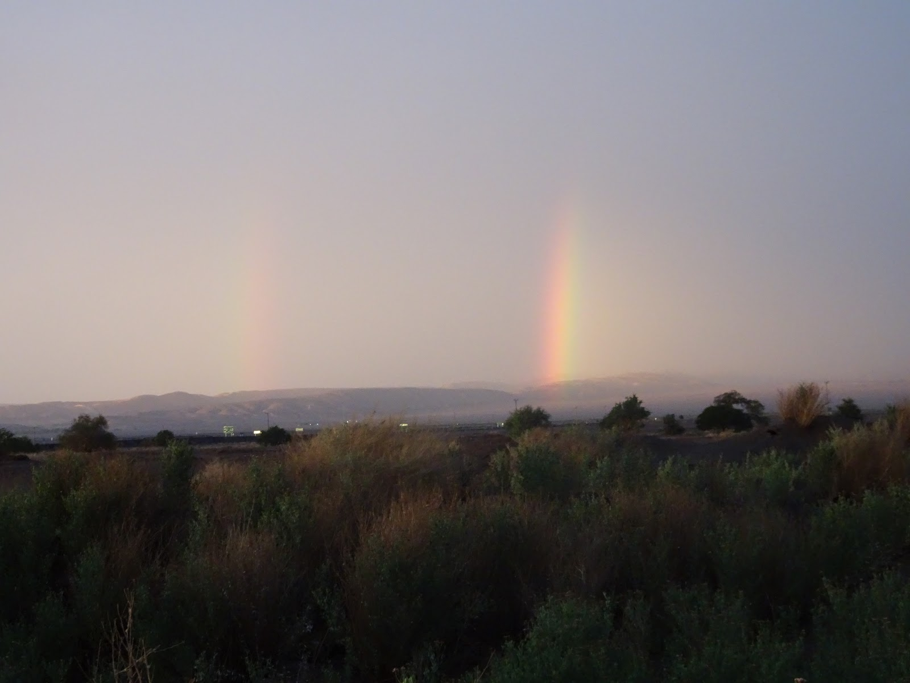
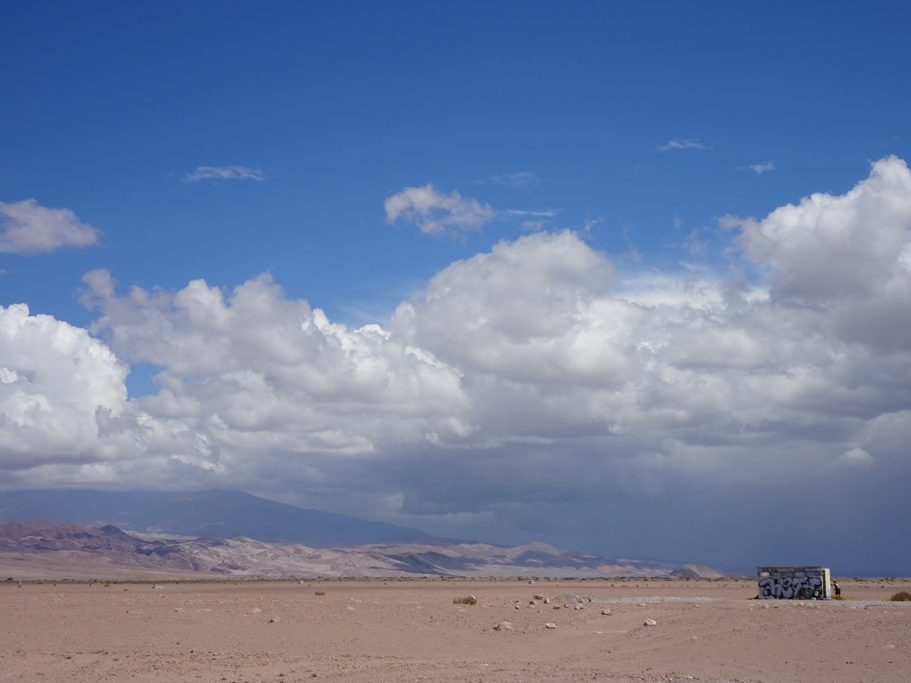
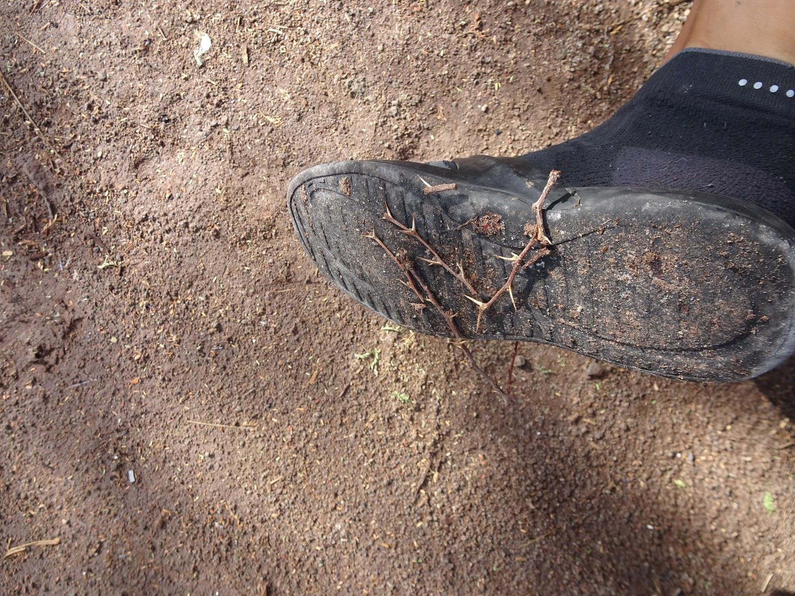
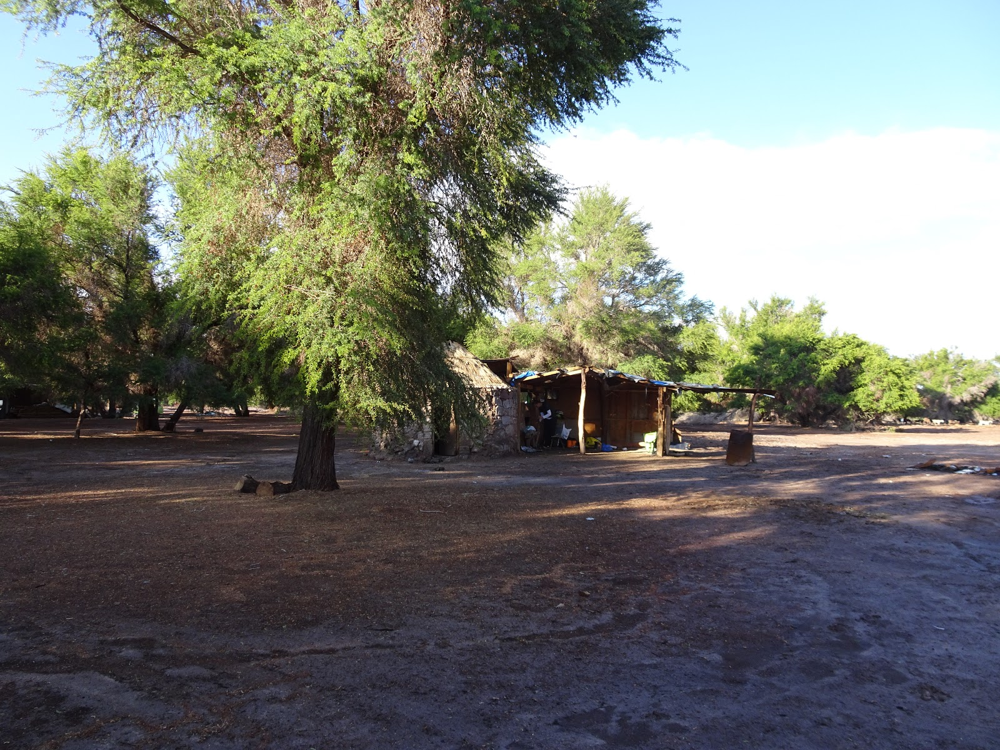
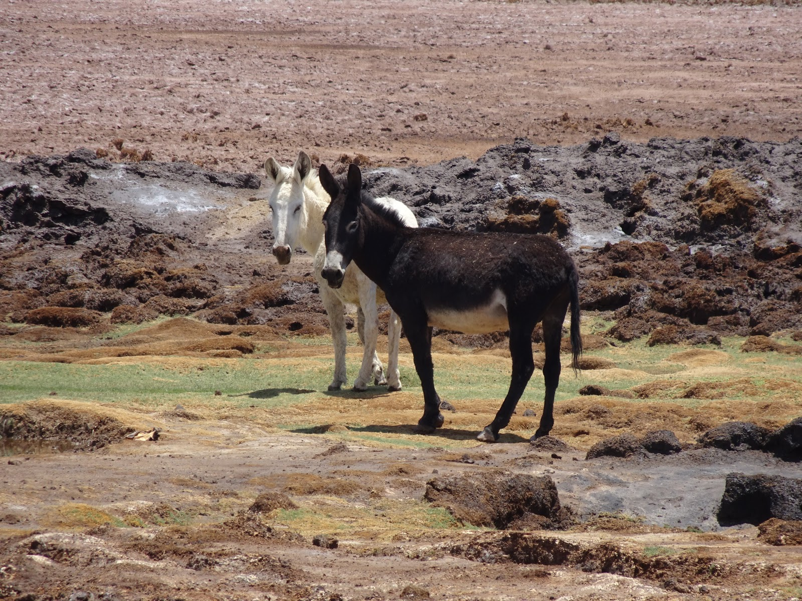
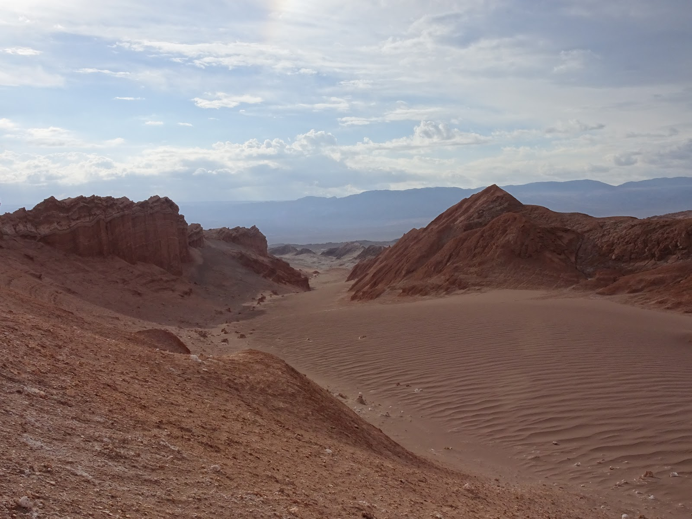
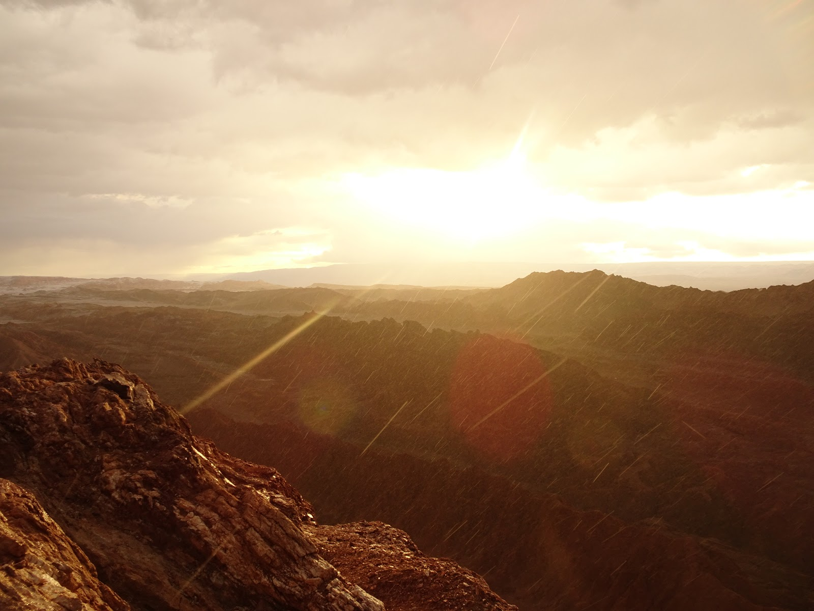
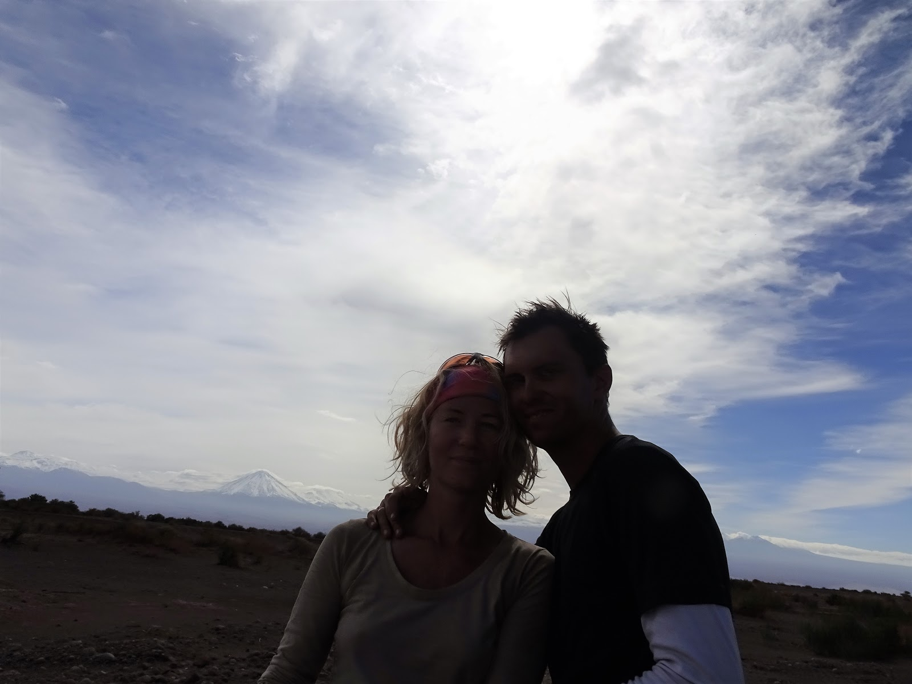

Ruszając na południe<strong> Chile</strong> nie spodziewaliśmy się, że znajdziemy się na innej planecie. Ogromne <strong>piaskowe góry</strong>, kolorowe skały i puste przestrzenie przywitały nas po opuszczeniu wybrzeża.

<grid>-./dsc02154.jpg -./dsc02188.jpg -./dsc02212.jpg</grid>

Kiedy znów dotarliśmy do cywilizacji skończyło się piękno przyrody. <strong>Calama</strong> ustanowiła nowy rekord przebitych dętek. Syf i pełno szkła. :( pękały oczy

Niedaleko Calamy, w Chuquicamata, znajduje się największa na świecie <strong>kopalnia odkrywkowa huty miedzi</strong> położona na wysokości 2850 m n.p.m., a jej krater ma 4,3 km długości, 3 km szerokości i 900 m głębokości. Wspięliśmy się na górę obok po kilka fotek :

<grid columns="2">
  -./dsc02408.jpg -./dsc02411.jpg -./dsc02414.jpg -./dsc02415.jpg
</grid>
Czas zostawić przemysł i ruszyć ku naturze. W San Pedro (ok. 100 km od Calamy czekała
na nas niespodzianka. Jak już wcześniej pisałam, podczas naszej wyprawy mieliśmy
zaledwie kilka deszczowych dni, a jak dotarliśmy na pustynie to nas totalnie zlało. 
  <strong>Pustynia Atacama</strong>
 uchodzi za najsuchszą na świecie i pada tu raz na 3, 4 lata. :

Miasteczko San Pedro wygląda jakby ulepione z gliny. Bardzo spodobał nam się tamtejszy kościółek, zbudowany m. in. z kaktusowego drewna oraz skóry lamy.

<grid>-./dsc02253.jpg -./dsc02256.jpg</grid>

Pomiędzy kałużami wypedałowaliśy się z miasta w poszukiwaniu noclegu i znaleźliśmy fajne miejsce na namiot, gdzie rankiem przywitał nas piękny <strong>wulkan Licancabur,</strong> 5920 m n.p.m., który jest częścią Chile i Boliwii. W jego kraterze znajduje się zlodowaciałe jezioro, ale nie mieliśmy ochoty się tam wspinać :

<grid>-./dsc02242.jpg -./dsc02243.jpg</grid>

Kolejny dzień poświęciliśmy na przejazd w stronę Salar de Atacama, gdzie znajduję się rezerwat flamingów. Zatrzymaliśmy się w pobliskim hotelu na zdjęciu (ten po prawej... ;)

I rankiem kolejne kilometry zaprowadziły nas w towarzystwo ślicznych różowawych flamingów, gdzie dookoła piasek zamienił się w sól.

<grid>-./dsc02326.jpg -./dsc02262.jpg</grid>

W drodze powrotnej do San Pedro zatrzymaliśmy się w oazie, którą mijaliśmy wcześniej. Byliśmy bardzo szczęśliwi, że mamy już ustalone miejsce spoczynku i to w parku :) Z pełnym entuzjazmem wjechaliśmy do niego szukając miejsca na namiot i trach!! W tej oazie rosły drzewa z ogromnymi kolcami, które się wbijały we wszystko czego dotknęły.

Byliśmy głodni i zaczęło się robić coraz chłodniej. Zerwał się wiatr i nie mogłam rozpalić kuchenki. Nagle pod tą sama wiatę do parku przyjechali jacyś turyści, którzy totalnie nas dobili. Rozbawieni zrobili sobie piknik zaraz koło nas. Wyciągnęli wino i przekąski. Słuchając ich żucia i śmiechu w rozpaczy kleiłam dziurawe dętki. Nie wiedzieliśmy co robić, bo cały grunt pokryty był kolcami, więc nie było miejsca na namiot. Robiło się ciemno, więc nie chcieliśmy ruszać dalej. Niedaleko stała chatka... (na początku myśleliśmy, że ktoś tam mieszka)

Nikogo jednak tam nie było, więc rozbiliśmy się w jednym z pomieszczeń. Huh ulgaaa. Dookoła przechadzały się osły, a w nocy tak głośno gadały, że nie dało się spać :)

Rankiem ruszyliśmy odkrywać kolejne przepiękne miejsce zwane Valle de la Luna, czyli Dolina Księżycowa, gdzie wymarzyłam sobie romantyczny zachód słońca :) Przeróżne kształty i kolory skał zrobiły na nas ogromne wrażenie, a po piwku Cristal byliśmy na księżycu :)

Po dolinie mogliśmy jeździć rowerami, lecz na punkty widokowe musieliśmy wchodzić pojedynczo :/ Tak czy inaczej, plan z zachodem słońca nie wypalił, bo zaczęło grzmieć,lać i wiać, więc w biegu zrobiłam kilka fotek i zaczęłam uciekać przed piorunami.

W deszczu i ciemnościach, z prędkością światła pognaliśmy&nbsp;w stronę wyjścia ;) Nocleg znaleźliśmy przy rzece i na szczęście przestało padać, a burze poszły sobie w siną dal :) Po spokojnej nocy, zorientowaliśmy się, że namiot postawiliśmy w najbardziej widocznym miejscu jakim mogliśmy :) Niby było za krzakiem...

Po spakowaniu i ostatnim selfie z wulkanem...

w strugach palącego słońca opuściliśmy tereny Pustyni Atacama ruszając na spotkanie z Peru.

Zapraszamy do galerii poniżej. Video relacja z wyprawy po pustyni już wkrótce! :)

## Album

<grid>
  -./dsc02181.jpg -./dsc02182.jpg -./dsc02184.jpg -./dsc02188.jpg
  -./dsc02191.jpg -./dsc02193.jpg -./dsc02194.jpg -./dsc02200.jpg
  -./dsc02204.jpg
</grid>

<grid>-./dsc02195.jpg -./dsc02196.jpg</grid>

<grid>
  -./dsc02206.jpg -./dsc02208.jpg -./dsc02210.jpg -./dsc02212.jpg
  -./dsc02217.jpg -./dsc02224.jpg -./dsc02231.jpg -./dsc02223.jpg
  -./dsc02222.jpg -./dsc02239.jpg -./dsc02242.jpg -./dsc02243.jpg
  -./dsc02247.jpg -./dsc02251.jpg -./dsc02253.jpg -./dsc02254.jpg
  -./dsc02257.jpg -./dsc02258.jpg -./dsc02259.jpg -./dsc02262.jpg
  -./dsc02260.jpg -./dsc02264.jpg -./dsc02272.jpg -./dsc02270.jpg
  -./dsc02268.jpg -./dsc02265.jpg -./dsc02276.jpg -./dsc02277.jpg
  -./dsc02284.jpg -./dsc02285.jpg -./dsc02279.jpg -./dsc02280.jpg
  -./dsc02281.jpg -./dsc02282.jpg -./dsc02291.jpg -./dsc02290.jpg
  -./dsc02288.jpg -./dsc02286.jpg -./dsc02302.jpg -./dsc02303.jpg
  -./dsc02318.jpg -./dsc02317.jpg -./dsc02306.jpg -./dsc02319.jpg
  -./dsc02320.jpg -./dsc02324.jpg
</grid>
<grid columns="2">
  -./dsc02326.jpg -./dsc02333.jpg -./lrg_dsc02336.jpg -./dsc02341.jpg
</grid>
<grid>
  -./dsc02343.jpg -./dsc02344.jpg -./dsc02345.jpg -./dsc02347.jpg
  -./dsc02349.jpg -./dsc02351.jpg -./dsc02352.jpg -./dsc02358.jpg
  -./dsc02355.jpg -./dsc02356.jpg -./dsc02353.jpg -./dsc02359.jpg
  -./dsc02360.jpg -./dsc02365.jpg -./dsc02367.jpg -./dsc02368.jpg
  -./dsc02366.jpg -./dsc02369.jpg -./dsc02377.jpg -./dsc02373.jpg
  -./dsc02378.jpg -./dsc02379.jpg -./dsc02381.jpg -./dsc02383.jpg
  -./dsc02384.jpg -./dsc02387.jpg -./dsc02386.jpg -./dsc02385.jpg
  -./dsc02390.jpg -./dsc02391.jpg -./dsc02394.jpg
</grid>

<grid columns="2">
  -./dsc02395.jpg -./lrg_dsc02397.jpg -./dsc02398.jpg -./dsc02402.jpg
</grid>
