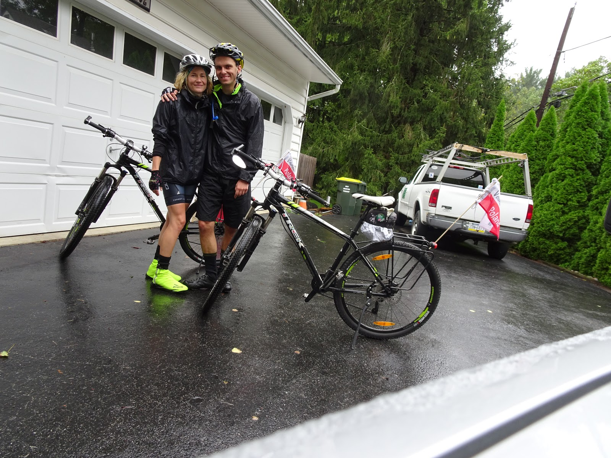
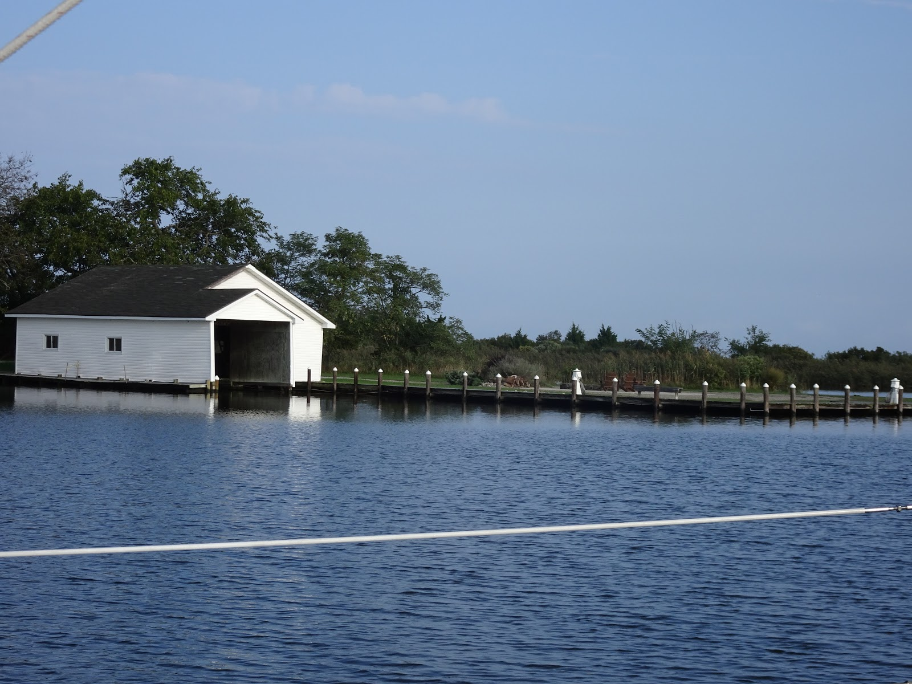

Z Filadelfii w deszczu ruszylismy dalej na poludnie i dzieki stowarzyszeniu rowerzystow z West Chester znalezlismy nocleg u jednego rowerzysty kawalek dalej w Marshallton. Jeden z czlonkow stowarzyszenia, z ktorym sie kontaktowalismy przez couchsurfing mial juz gosci, ale pomogl nam znalesc wyrko u kogos innego. Ten inny okazal sie super gosciu o imieniu Rob, ktory nas zabral kolejnego dnia na mala objazdowke po okolicy, mielismy szukac amiszowych farm, ale niestety znalezlismy duzo podjazdow, deszcz i wiatr:) Rob zlapal gume (ja w sumie tez dzin wczesniej wjechalam na pinezke :O) 

<youtube>mlfQfwCnYq8</youtube>

Gdy udalo sie wrocic z morderczego treningu Rob pomogl nam znales nocleg na kolejne 2 dni u swojej rodziny. Tak zwiedzilismy jeden z najstarszych domow w Ameryce z ok. 1776 roku oraz przeurocza chatke nad zatoczka Queenstown, gdzie trafilismy na uczte sasiedzka, ze ciezko bylo sie ruszac po niej. Poznalismy mase niesamowitych ludzi. Na kolejny dzien jedna z sasiadek zabrala nas truckiem przez rzeke Chester i za mostem ruszylismy w strone Waszyngtonu.

<youtube>M1OAGDmGFnY</youtube>

```grid|2


```
```grid|4


```
```grid|3


```
```grid|2


```
```grid|4


```
```grid|5


```
```grid|3


```
```grid|4


```grid|2


```
```grid|2


```


