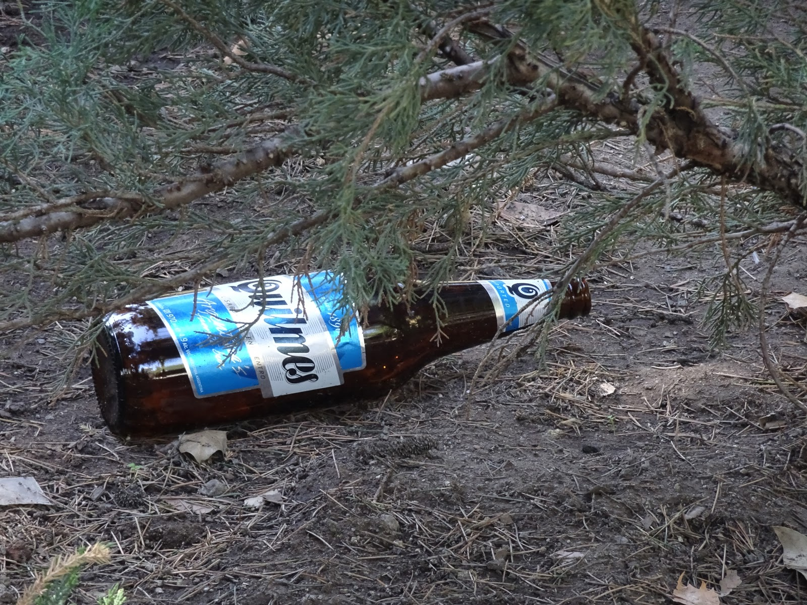
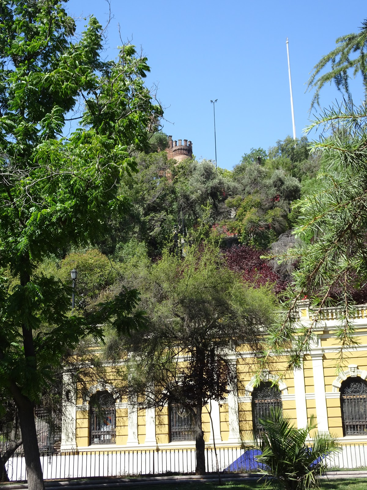
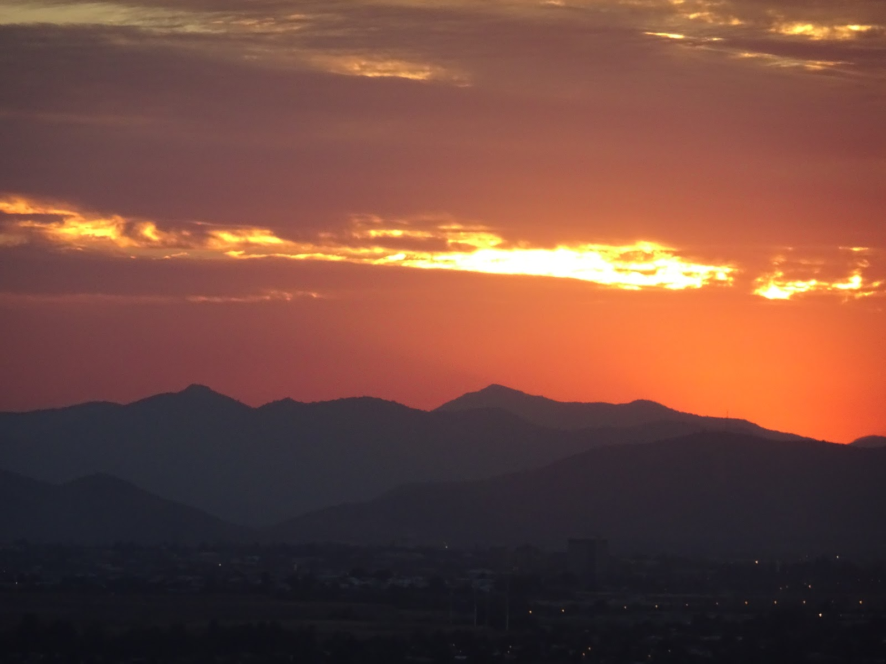
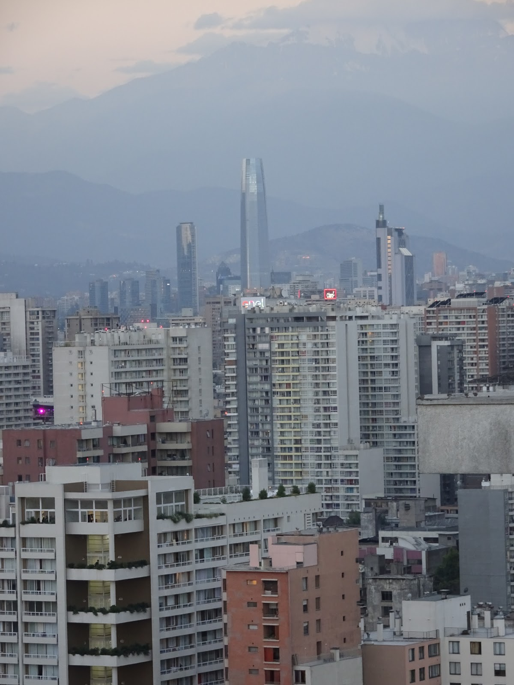
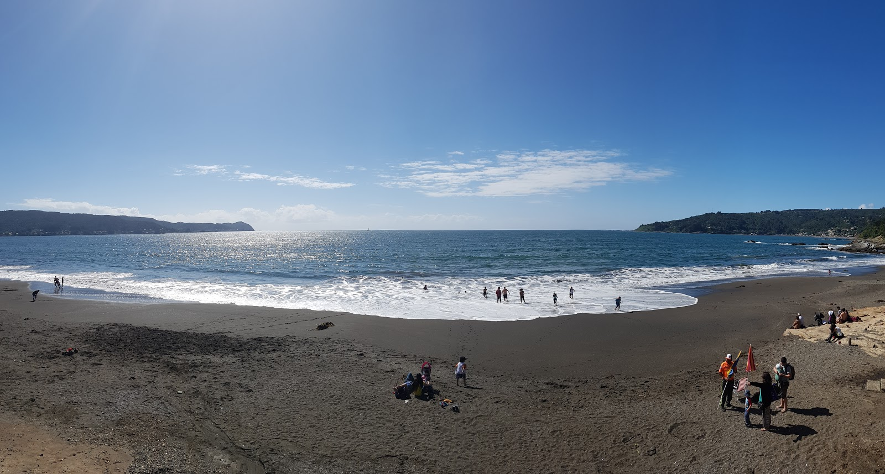

After Bariloche we had ambitious plan to get to Los Lagos before New Year's Eve. It was about 400 km to ride in 4 days. We got good start because we knew the first stages of our route but getting to San Martin was tough. First we wanted to go through Osorno, it was the easiest way but someone told us the route from San Martin to Puerto Fui is beautiful, it was not... We stopped before San Martin for a night and next day we wanted to cross Chilean border and take a ferry to Puerto Fuy. It was very challenging day for us because ferry was only at 10am, 2pm or 8pm so we wanted to take the 2pm so we could have easily find to place for a rest and sleep in Chile. Mission impossible. We woke up very early and in hurrry went to San Martin but the road 46 from San Martin was dirt with big stones and steep indeed, hot dusty... we almost broke our pannier. When we stopped for a snack we gave up our plan to catch the 2pm ferry but a nice woman stopped and took us on her truck. We were very happy that someone helped us and we were sure that everything would work as we had planned. Heh once we got to Chilean border we got stuck in 6 stage process of checking documents and your stuff. One hour of stupid control that actually is worth nothing. They asked if we have any vegetables or fruit and we confessed to have 3 potatoes and garlic. As you must know you cannot bring any of these products to Chile including honey and meat.
 They checked everything took our food and throw it into bin! (what a waste) but anyway they didn't find other food that we were carrying so this control is worth nothing, nada. We lost our precious time and we had to wait for the ferry for 4 hours. But the place was beautiful, the lake we went for swim in and the mountains around with the volcano... Fortunately, we found a spot to sleep next to the port. 
We got to Los Lagos riding through wonderful landscape and the road improved on Chilean side so it was pleasant ride. In Los Lagos we spent divine time with our hosts who showed us many interesting things and cities as Pucon or Valdivia and sweet sea-wolves ;)


To Santiago we rode on route 5. It was safe ride with a big shoulder but after 200 km we go bored and started looking for a truck to make the trip faster. We got lucky and we got to Santiago in two days. We were there at 11 am and got lot of time to spend. Our couchsurfing request was accepted but this guy said he was at work till 5 pm so we waited in the park for his message. After 6 pm we didn't get anything :(  we were so surprised, worried and scared because we were in the center of big city and it was getting dark soon. We started panicking and quarreling, wanting to go home with a magic teleport. Luckily, we found Diego on Warmshowers who host us at 11 pm in his flat on the twelfth floor... what a view!


 We called him an angel because he trusted us and saved us even thought we called him only once and he didn't know anything about us. Next day we were walking around the city and we had good time. There many parks and side walks so sightseeing Santiago is very nice and easy. Going by metro is also pretty simple and very cheap since you pay only once about dollar and you can go by all lines. After long a long day the day before we weren't feel like walking and sightseeing but we decided to see the biggest park in the world anyway. We went there on foot and came back by metro. The park is huge about 700 hectares and very "tall" so you can see the whole city and it's beautiful. We got to the top of San Cristóbal, where the sanctuary of Mary Virgin is situated, and her figure is well-seen from lower parts of the city. We also found statue of John Paul II :)


 I loved this park because you can go there with a bike as well. I wish I could see the rest part of it... maybe some day :) 
The next day we had do shopping because our bike stand was broken and we needed a new one. I was surprised positively. All the bike shops are on the same street so it was easy and quick shopping, however we didn't find the right stand. I liked the idea of theme streets because it creates some kind of culture and you can meet people with the same hobby. Santiago is also second-hand shop heaven. There are many of them and they organized very well so you can find something special :) 
There are not many big cities that I could live in but Santiago would be on the 1st place on my list of the coolest capitals ever. 

```grid|3


```
```grid|5


```
```grid|2


```
```grid|3


```
```grid|4


```
```grid|2


```
```grid|4


```
```grid|6


```
```grid|5



```
```grid|3


```
```grid|5





```
```grid|4


```
```grid|3


```
```grid|5


```
```grid|4


```
```grid|3


```
```grid|5


```
```grid|2


```
```grid|6


```
```grid|4


```
```grid|5




```
```grid|3


```
```grid|3



```
```grid|5


```
```grid|3


```
```grid|6




```