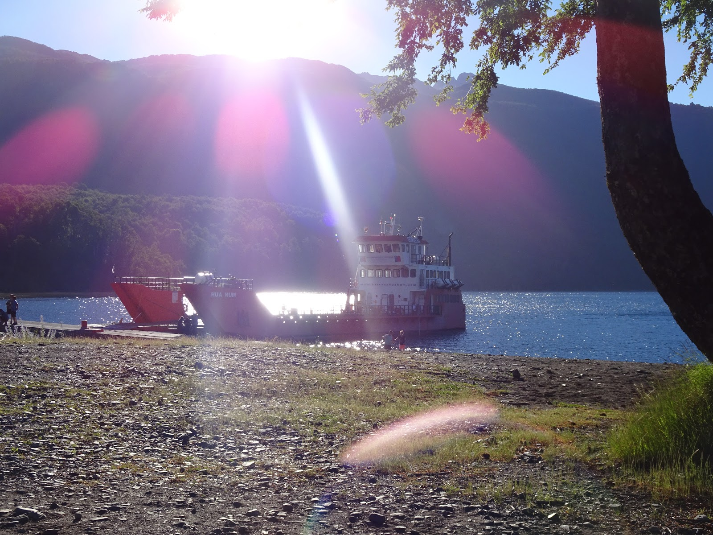
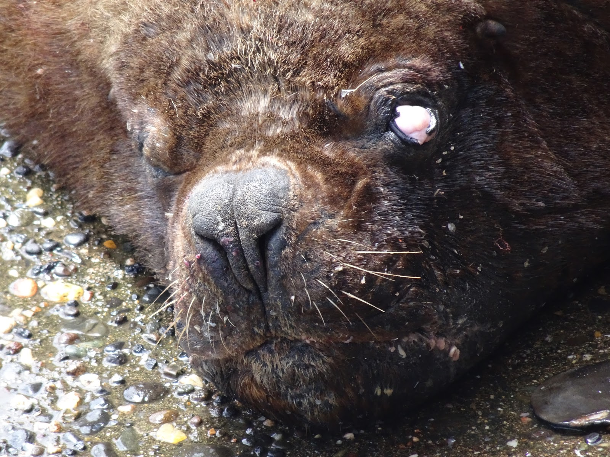
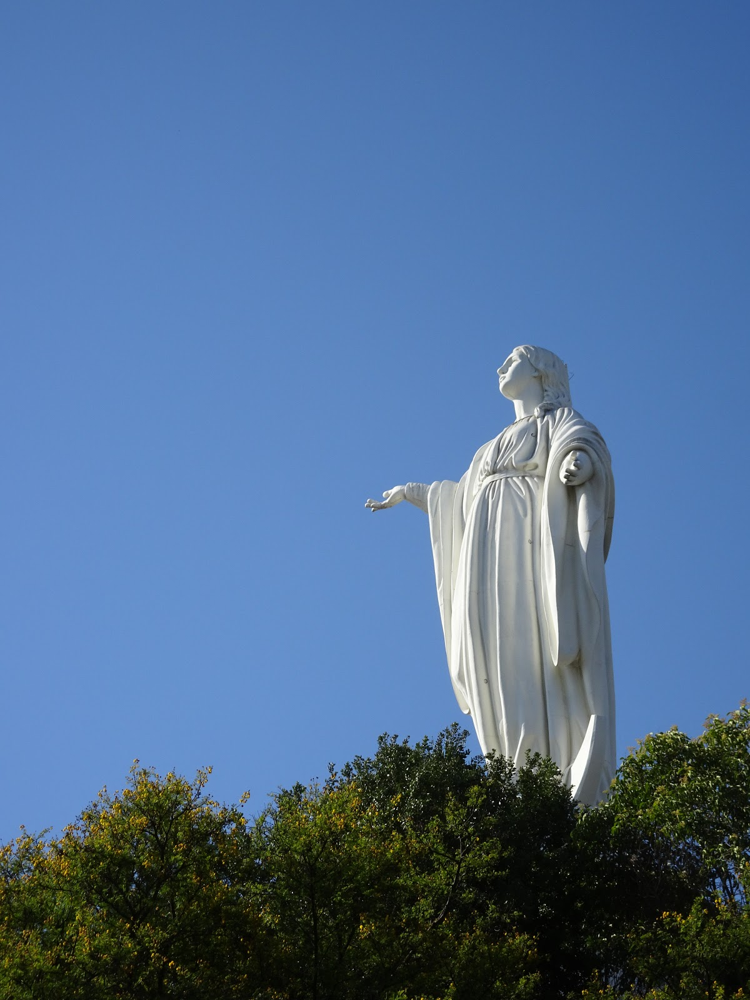

Podróż z San Martin do Chile była mordęgą :)

Podjazd jak ściana, droga kamienista, wyboista i pośpiech, aby zdążyć na prom i przedostać się do Puerto Fuy o godzinie 14; ponad 70 km. Wszystko zaczęło się o 5 rano, kiedy ruszyliśmy z nad rzeki Rio Hermoso, gdzie nocowaliśmy.

Do San Martin długo się wspinaliśmy, ale czekał nas przepiękny zjazd. Miasteczko całkiem zacne :)
Następnie wybraliśmy **drogę 48**, która nas prawie zamordowała ;) Najpierw stromy podjazd, że trzeba było pchać,...

a potem dziury, pędzące auta, kurz i skwar, równa się ślimaczenie. (Niestety po weekendzie w Valparaiso przez przypadek usunęłam filmiki z tej wyprawy :( Już wiedzieliśmy, że nie zdążymy, aż tu nagle zatrzymała się fajna ruda laska i zabrała nas truckiem 20 km dalej. Ucieszeni, że zdążymy na prom, pedałowaliśmy do granicy z Chile. Ładny budynek wyłonił się zza drzew, pomyślałam, nooo szybko pójdzie, mało aut itd. Natomiast w środku dostałam kartkę z 6 stopniową kontrolą i _ręce opadły_.
Do tego doszła kontrola bagaży, bo do Chile nie można wwozić żadnych warzyw, owoców i mięsa. Przyznaliśmy się do **3 ziemniaków** i czosnku :) , które z automatu powędrowały do śmieci (co za marnotrawstwo!)... a reszty na szczęście nie znaleźli, bo byśmy nie mieli co jeść. Wszystko zajęło ponad godzinę no i oczywiście nie zdążyliśmy.

Czekaliśmy na ostatni o 20 i jak dotarliśmy do Puerto Fuy było ciemno, ale udało się znaleźć miejsce na namiot w rzecznej dolinie u stóp **wulkanu Mocho-Choshuenco** :)

Kolejny dzień nas zaskoczył, bo zaczął się asfalt (cieszyliśmy się jak dzieci) i popędziliśmy do Panguipulli.
Następnie zatrzymawszy się niedaleko Los Lagos, gospodarz tamtejszej farmy ;) Yerko oprowadził nas po przepięknych miejscach w tej okolicy... poo raz pierwszy zobaczyliśmy Pacyfik.

Zobaczyliśmy "śliczne" wilki morskie :)

I objedliśmy się chilijskimi empanadas z serem i krabem. :)

ale najlepsze są owoce morza gotowane z kiełbasą i kurczakiem w jednym garze ;) nie próbujcie tego w domu ;)
W stronę Santiago ruszyliśmy drogą numer 5. Droga mało ruchliwa porównując do Stanów i do tego szerokie pobocze, jechało się elegancko. Trochę nudno zaczęło się robić po kilku dziesięciu kilometrach niczego, więc po ok 200 zatrzymaliśmy się na stacji i akurat odpoczywał tam wokalista metalowego zespołu Defacto, który grał koncert w Santiago. Miasto zaskoczyło nas mega pozytywnie! Na początku nie chcieliśmy się tu pchać, ale nocleg udało się na szybko załatwić przez couchsurfing i cały dzień czekaliśmy na kontakt od osoby, która miała nas przekimać. Siedząc w parku obserwowaliśmy Chilijczyków i stwierdziliśmy, że to bardzo wyluzowani, spoko ludzie. Wielu z nich grało w piłkę, tańczyło lub piło wino w wielkich kręgach znajomych. Gdy wybiła 18, nadal nie dostaliśmy żadnej odpowiedzi od hosta, więc zaczęliśmy się niepokoić i szukać nowego noclegu na szybko. Byliśmy w tarapatach. Pytałam wielu zgronionych ludzi o jakieś miejsce, gdzie można rozbić namiot... ale wiadomo, że nie ma takiego miejsca w wielkim mieście! i jest niebezpiecznie itd... Parki są zamykane i jest dużo ochrony, więc musieliśmy obdzwaniać znajomych i szukać dalej. W końcu dodzwoniłam się do Diego i pomógł nam, :D pomimo szalonej szybkiej i krótkiej rozmowy, dał kredyt zaufania i wpuścił nas do swojego mieszkania uffff jakaa ulga...

Na drugi dzień mogliśmy się wybrać na małe zwiedzanie. Bardzo dużo zieleni, parków i deptaków sprawia, że przyjemnie się włóczy po mieście z dala od zgiełku ulicznego ruchu. Szuraliśmy, aż zza wieżowców wyłonił się Park Metropolitan z Matką Boską (myśleliśmy, że to Jezus) na czele, który jest największy nie tylko w Chile, ale na całym świecie!!!

Ma ponad 700 hektarów i tworzą go trzy góry z których widać panoramę całego miasta.

Można wybrać się na piechotę, ale także wjechać rowerem lub kolejką.
Po drodze na górę spotkaliśmy naszego rodaka... :)

Niedaleko parku znajduję się dzielnica Recoleta, która jest po prostu galerią murali. Super miejski styl, na luuuzie.

Podczas gdy wszyscy turyści wspinają się na Gran Torre Santiago, najwyższy wieżowiec w Ameryce Południowej, nam udało się zobaczyć piękną panoramę miasta z mieszkania Diego, która na zawsze zapadnie w naszej pamięci... zobaczcie sami :)

## Album

<grid>
  -./dsc01883.jpg -./dsc01890.jpg -./dsc01891.jpg -./dsc01892.jpg
  -./dsc01897.jpg -./dsc01902.jpg -./dsc01901.jpg -./dsc01909.jpg
  -./dsc01914.jpg
</grid>

<grid>-./dsc01911.jpg -./dsc01912.jpg</grid>

<grid>
  -./dsc01918.jpg -./dsc01921.jpg -./dsc01925.jpg -./dsc01928.jpg
  -./dsc01933.jpg -./dsc01934.jpg -./dsc01935.jpg -./dsc01936.jpg
  -./dsc01931.jpg -./dsc01937.jpg -./dsc01938.jpg -./dsc01944.jpg
  -./dsc01943.jpg -./dsc01942.jpg -./dsc01941.jpg -./dsc01940.jpg
  -./dsc01939.jpg -./dsc01945.jpg -./dsc01946.jpg -./dsc01947.jpg
  -./dsc01948.jpg -./dsc01949.jpg -./dsc01950.jpg -./dsc01956.jpg
  -./dsc01955.jpg -./dsc01954.jpg -./dsc01953.jpg -./dsc01952.jpg
  -./dsc01951.jpg -./dsc01957.jpg -./dsc01958.jpg -./dsc01959.jpg
  -./dsc01960.jpg -./dsc01961.jpg -./dsc01962.jpg -./dsc01968.jpg
  -./dsc01967.jpg -./dsc01966.jpg -./dsc01965.jpg -./dsc01964.jpg
  -./dsc01963.jpg -./dsc01969.jpg -./dsc01970.jpg -./dsc01971.jpg
  -./dsc01972.jpg -./dsc01973.jpg -./dsc01980.jpg -./dsc01979.jpg
  -./dsc01978.jpg -./dsc01977.jpg -./dsc01976.jpg -./dsc01975.jpg
  -./dsc01981.jpg -./dsc01982.jpg -./dsc01983.jpg
</grid>

<grid>-./dsc01984.jpg -./dsc01985.jpg</grid>

<grid>
  -./dsc01986.jpg -./dsc01987.jpg -./dsc01988.jpg -./dsc01989.jpg
  -./dsc01990.jpg -./dsc01991.jpg -./dsc01992.jpg -./dsc01998.jpg
  -./dsc01997.jpg -./dsc01996.jpg -./dsc01995.jpg -./dsc01994.jpg
  -./dsc01993.jpg -./dsc02012.jpg -./dsc02011.jpg -./dsc02001.jpg
  -./dsc02000.jpg -./dsc02013.jpg -./dsc02014.jpg -./dsc02015.jpg
  -./dsc02016.jpg -./dsc02018.jpg -./dsc02029.jpg -./dsc02028.jpg
  -./dsc02025.jpg -./dsc02023.jpg -./dsc02019.jpg -./20161229_142054.jpg
  -./20161231_171112.jpg
</grid>

<grid columns="2">
  -./20161227_143410.jpg -./20161228_200354.jpg -./lrg_dsc02010.jpg
  -./20170108_184438.jpg -./20170108_182129.jpg -./20161228_085256.jpg
</grid>
