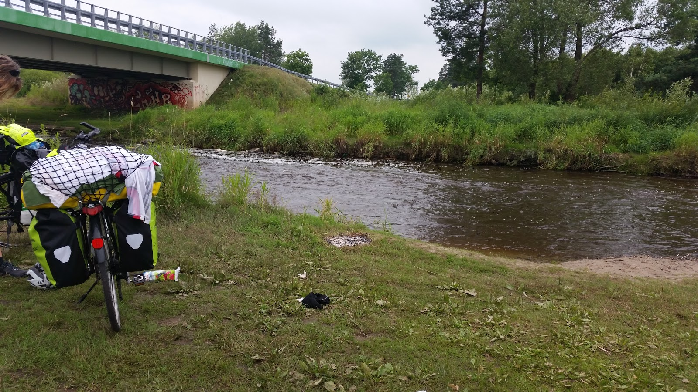

Jak zmieścić całą szafę w dwie sakwy? Jak być przygotowanym na 4 pory roku i każde warunki pogodowe? Niestety te ubrania, które nosimy na co dzień można zostawić w domu, bo po pierwsze są wielkie i ciężkie, a po drugie długo schną. Podczas ostatniej wyprawy dookoła Polski stwierdziliśmy, że lepiej jest ubrania wietrzyć niż prać 😉 Samo pranie nie jest problemem i chociaż mamy patent na mobilną suszarkę, suszenie ubrań podczas jazdy to nie lada wyzwanie. Wirówki raczej nie zabieramy… Dlatego pakując się w non-hotelową podróż wybierajcie szybkoschnące materiały. 
A oto jedna z przydrożnych pralni 😉 

Wybierając te super ubrania można stracić połowę życia. Wybór w sieci jest ogromny, lecz niestety kupujemy w ciemno, nie przymierzając i sprawdzając jakości materiału czy wykonania. Oczywiście nie można zapomnieć o wadze, która będzie nam towarzyszyć na każdym kroku. Zazwyczaj sklepy nie uwzględniają gramatury, więc albo mailujesz o podanie wagi albo oceniasz sam. Jeżeli chodzi o materiał to moim zdaniem poliester poliestrowi nierówny. Jeden jest miły jak bawełna, a drugi przypomina worek na trupa. Tak czy owak w naszym kraju brakuje sklepów z markową odzieżą sportową uszytą w Polsce, dlatego jesteśmy zmuszeni kupować marketową chińszczyznę lub właśnie zamawiać kota w worku nad którym i tak bardzo długo się zastanawiamy. Szczerze przyznam, że bardzo pozytywnie zaskoczyła mnie firma Attiq, której odzież jest zrobiona z dobrych materiałów za przystępną cenę i najważniejsze, że w Polsce. Podczas wcześniejszych wypraw również pozytywnie zaskoczyły nas nieprzemakalne skarpety firmy Dexshell, które świetnie się sprawdziły podczas ulewnej pogody oraz lekkie, szybkoschnące koszulki Odlo.

Może i będziemy mieli nowoczesne ubrania z nie wiadomo jakimi super technologiami, jednak sposób ubierania pozostanie zawsze ten sam- na cebulę, czyli warstwowo od najobciślejszego do najluźniejszego. Naprawdę warto dłużej pomyśleć o ubiorze, ponieważ mamy zwyczaj brania dużo niepotrzebnych rzeczy. Ja podzieliłam ubrania na trzy kategorie: 

* ubrania na rower
* ubrania po rowerze
* ubrania do muzeum ;)

Oczywiście zbiory mają części wspólne.

Poniżej przedstawiam szczegółową listę co zabieramy.

| Co                                   | Ilość  | Waga[g] | Waga x ilość [g] |
|--------------------------------------|--------|---------|------------------|
| Rękawiczki rowerowe                  | 1      | 26      | 26               |
| Rękawiczki ciepłe Dexshell           | 1      | 73      | 73               |
| Chusta                               | 1      | 33      | 33               |
| Kurtka przeciwdeszczowa              | 1      | 300     | 300              |
| Koszulka Odlo                        | 5      | 80      | 400              |
| Bluza rowerowa                       | 1      | 340     | 340              |
| Pielucha rowerowa Attiq              | 1      | 150     | 150              |
| Spodenki                             | 1      | 150     | 150              |
| Długie spodnie                       | 1      | 200     | 200              |
| Ocieplacze Attiq                     | 2      | 150     | 300              |
| Buty SPD                             | 1      | 500     | 500              |
| Przeciwdeszczowe ochraniacze na buty | 1      | 90      | 90               |
| Bielizna termoaktywna do spania      | 1      | 200     | 200              |
| Bluza ciepła polar Attiq             | 1      | 500     | 500              |
| Bielizna                             | 5      | 100     | 500              |
| Skarpetki Odlo                       | 5      | 50      | 250              |
| Skarpetki nieprzemakalne Dexshell    | 1      | 116     | 116              |
| Trampki                              | 1      | 442     | 442              |
| Bluzka bez rękawów                   | 1      | 50      | 50               |
| Szorty                               | 1      | 50      | 50               |
| Bluzka z dł. rękawem                 | 1      | 90      | 90               |
| Długie spodnie wyjściowe             | 1      | 200     | 200              |
| Klapki                               | 1      | 200     | 200              |
| Ręcznik                              | 1      | 100     | 100              |
| SUMA                                 | 37     | 4.19 kg | 5.26 kg          |