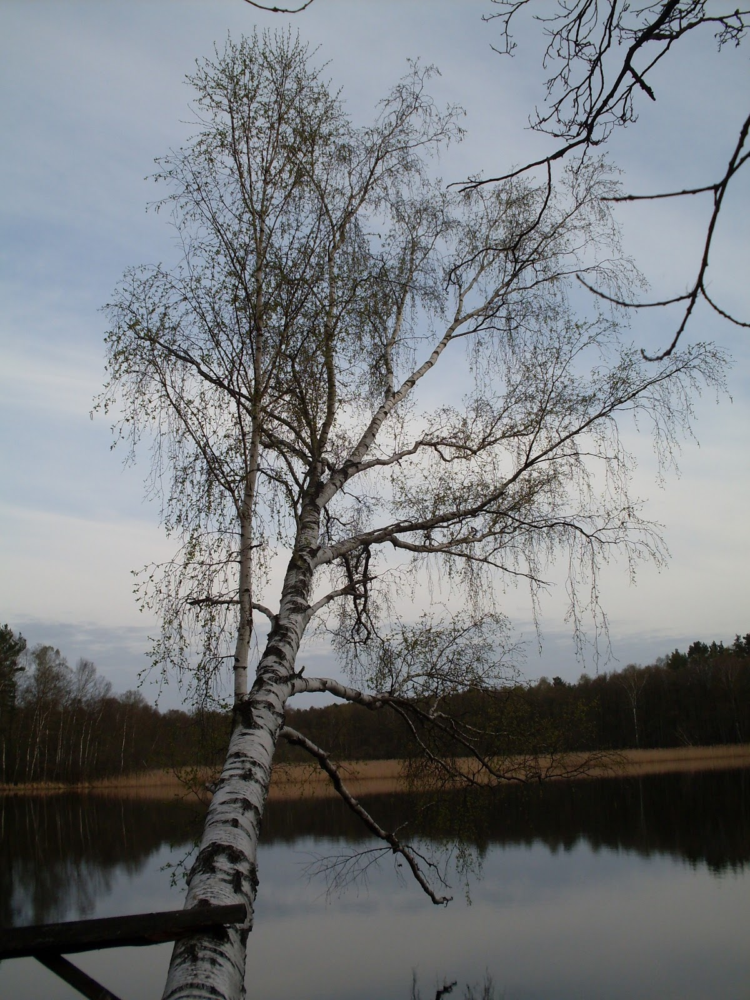
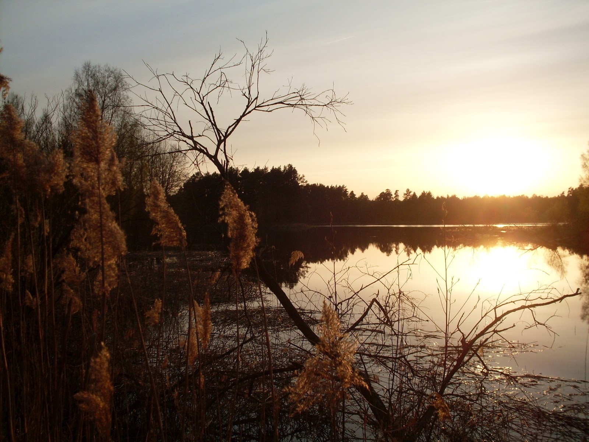
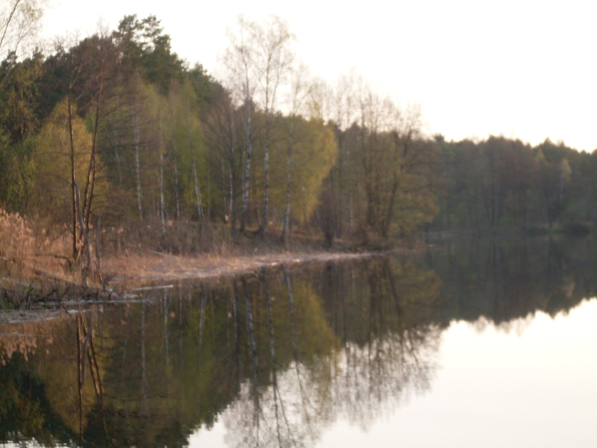
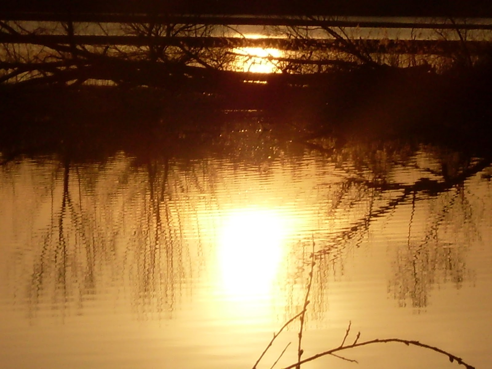
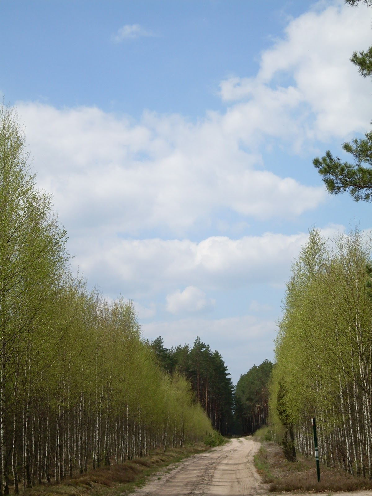
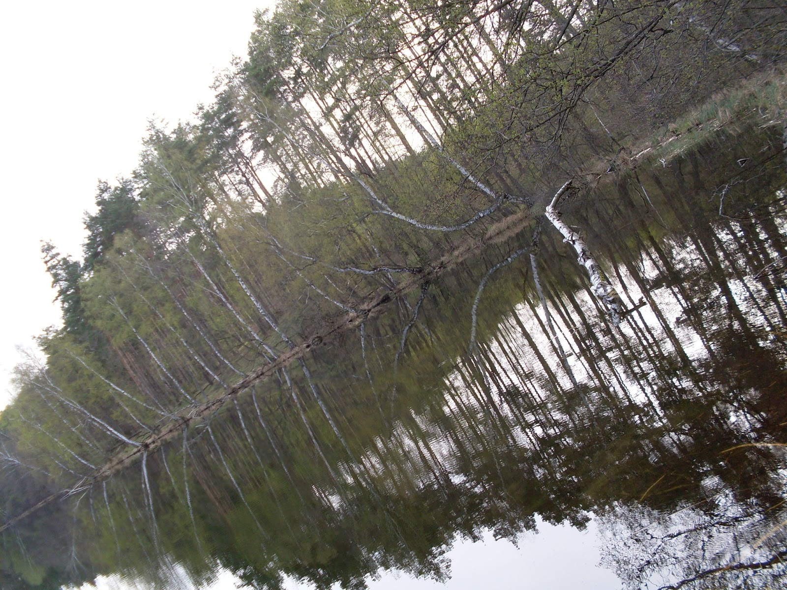
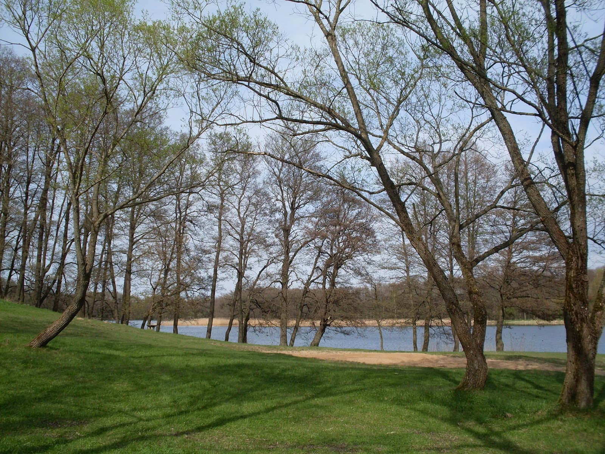
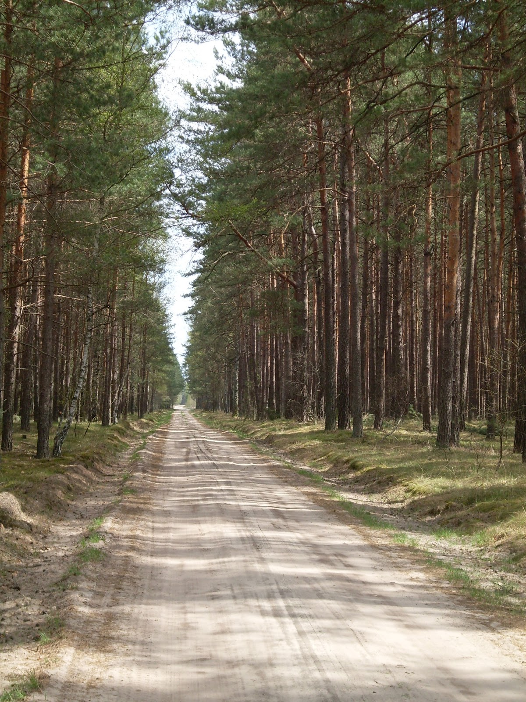
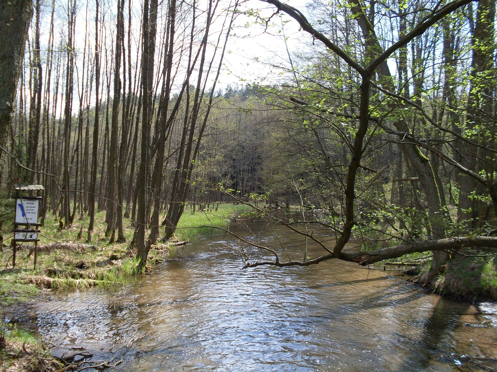

Dalsza część wędrówki z Kłomina. Po tym jak trafiliśmy do Bornego Sulinowa kierowaliśmy się do Nadarzyc. Trasa widokowa na szóstkę z plusem, a to za sprawą pięknych jezior i otaczających ich lasów. Jezioro Pile to największy wodny akwen tego rejonu, które kryje wiele sekretów. Otóż przy jednej z wysp na tym jeziorze znajduje się podwodny las, co stanowi niezwykłą atrakcję dla rowerów podwodnych:)
Zanim dotarliśmy do Nadarzyc natknęliśmy się na jeziora Lubicko, Wielkie Niewlino

```grid|3



```
```grid|2


```

```grid|3



```