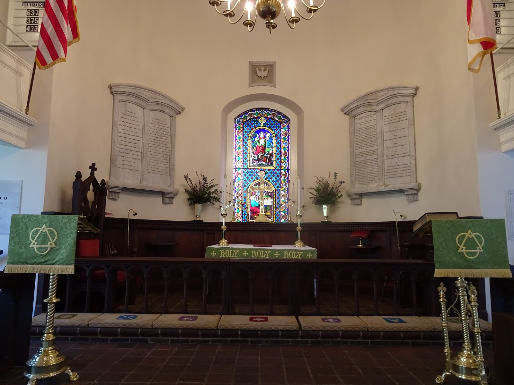
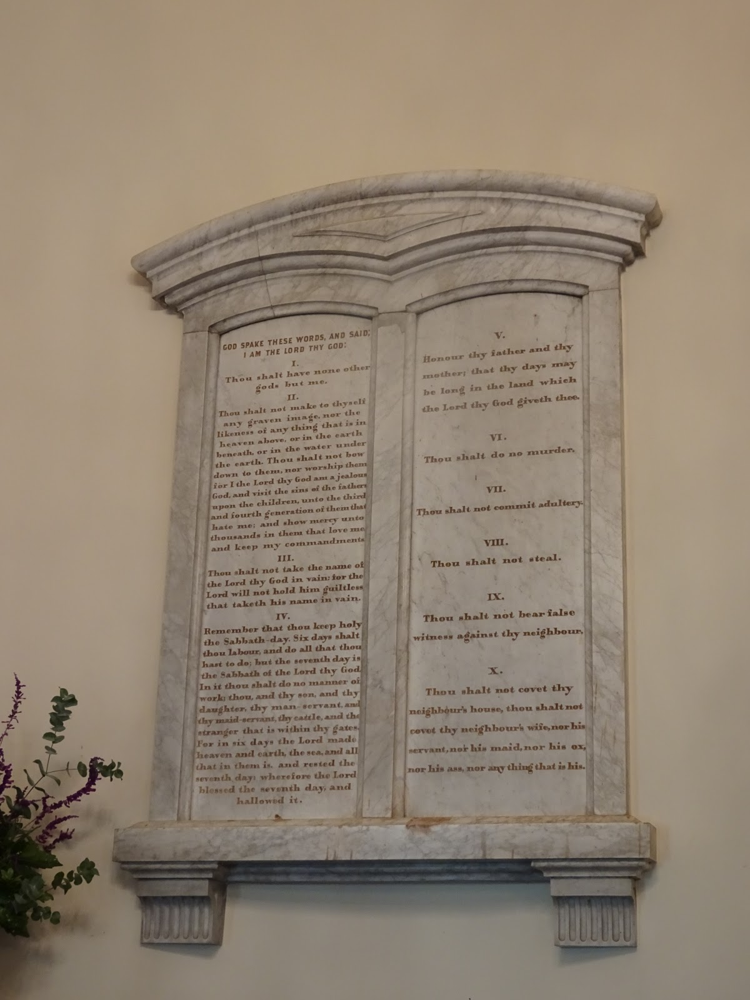
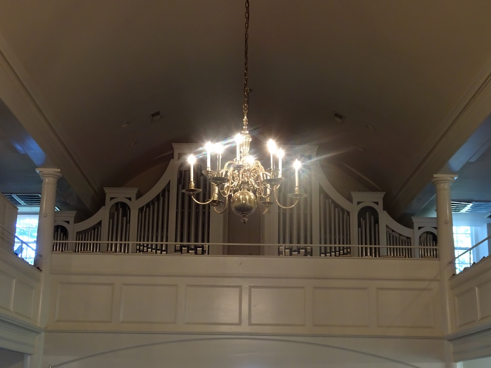
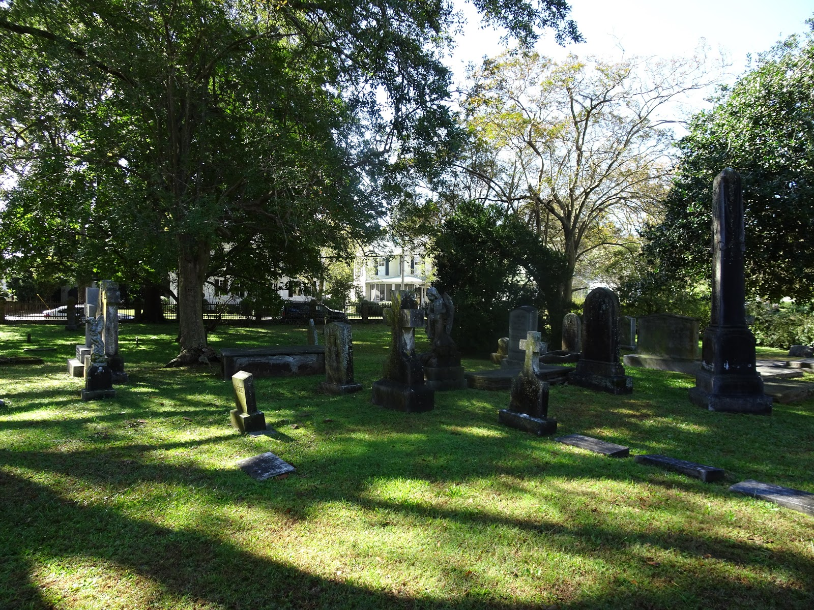

We went to St. Paul’s Episcopal Church in Edenton to get some blessing :) and listen to fantastic music performed by church organist and the choir in which Mimi sings. It's a beautiful and modest, tiny church. It's the second oldest one in North Carolina from 1736.

We enjoyed the service very much and even though we were not members we could sing and pray from the books provided. Another priceless experience :)

```grid|2


```
```grid|4




```