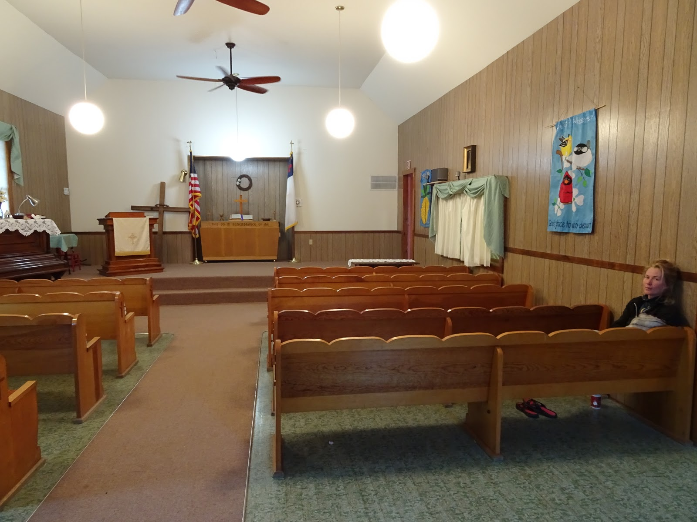
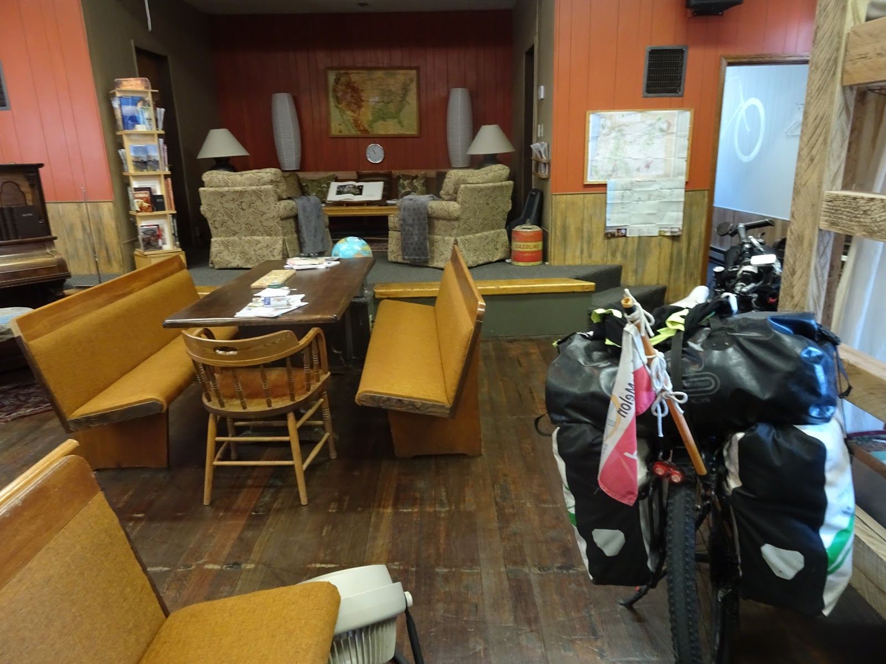
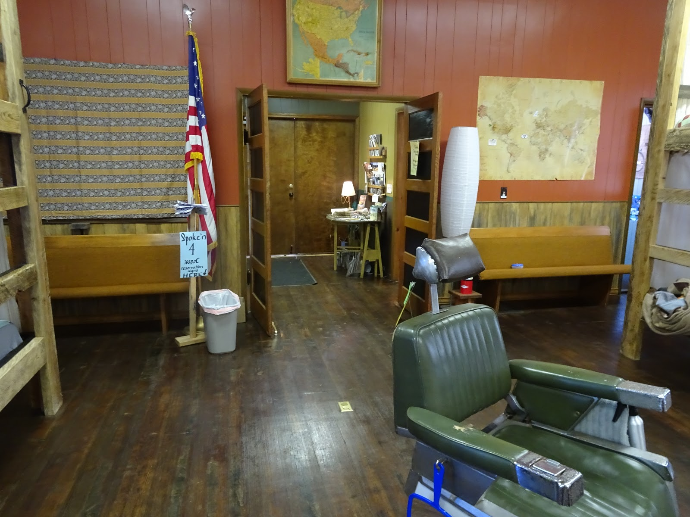
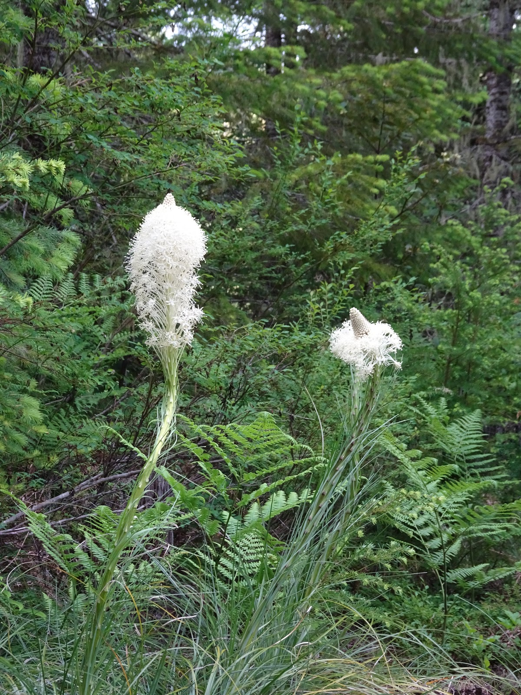

We followed some roads of Trans America Trail in Oregon and it was awesome.There is even a church of holy cyclists ;) Enormous trees, mountains, rivers, lakes and waterfalls. Everything within one state.
As far as I remember the first cute, wild wild west, city was Prairie City. We followed route 26. Beautiful range of snowy mountains with the highest peak called Strawberry made our day as we rode through the city.

Then we stopped in Dayville where there is a church of holy bicyclists ;) A beautiful stained glass window is showing that cycling is something more than sport. I love it.

Tired cyclist is resting :)

This church was our shelter when it was raining heavily. It had a shower but no beds. You can donate some money to this place and thanks to previous travelers the kitchen was equipped.
Next day, after long climbing and quick downhill we got to Mitchell where we slept in cool Spoke'n Hostel. It used to be a church but instead of pews there are bulk beds :) In the basement you can find kitchen and a lot of place to relax. Warm shower is also guaranteed :) 

Our host took us to explore Painted Hills that remember different geologic eras. This place is magical and is one of the seven wonders of Oregon. 

Then we climbed once again going towards Prineville it was steep but quick climb. We met there wonderful people and had local beer tasting evening :) Yummy ! We had a great time.

Our next destination was visible on the horizon- Three Sisters. 

When we got city Sisters we decided to take Santiam pass because, although Mc Kenzie Hwy had been opened recently, there was a lot of snow around. So we climbed Santiam pass 4817 feet and slept at the very top in closed Snow Park (no snow there). On our way we saw outstanding Mt. Washington.

Our treat in this trip was to soak in one of the hot springs so we turned to Mc Kenzie Hwy anyway and looked for Bigelow Hot Springs. Sahalie waterfalls made our day ...

... but the hot springs did not. Because of high level in the rivers there were only cold springs :( With sour faces we headed back to Santiam Pass climbing... sweating... but we found cool spot for a night in the forest.  

<youtube>IY51UgSC_2g</youtube>

At the end of our trip in Oregon Paul's spoke broke and we had to hitchhike to Salem. We found a nice bike shop, The Northwest Hub Bicycles, where there is plenty of room and tools so he could fix it by himself. 
Our route you'll find here: [Our route](./america-map).

<grid>

</grid>
<grid>

</grid>

<grid>

</grid>