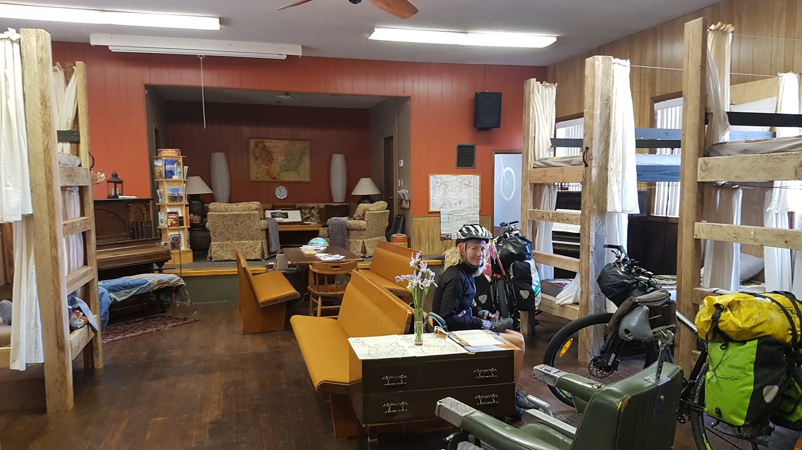
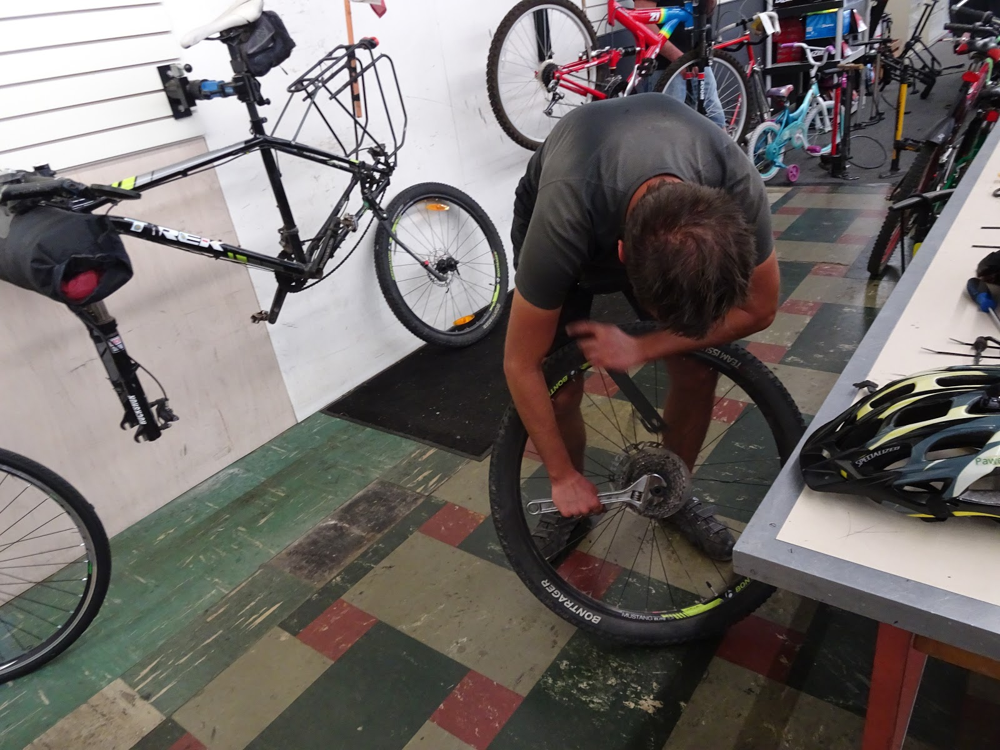

Co za trasa! Wielkie góry i gęste lasy śnią mi się po nocach. Wróciłabym tam jeszcze raz. Nie można było się znudzić tymi krajobrazami. Rzeki, jeziora i wodospady dodawały uroku każdemu miejscu. Droga 26 wiodła przez urocze miasteczka dzikiego zachodu. Wycieczka odbyła się w maju i pierwsze miasto do którego sięgam pamięcią jest Prairie City leżące na ok. 1 000 m n.p.m. Na południowym horyzoncie wyrosła góra Truskawka pokryta lukrem.

Kilka kilometrów dalej, w Dayville, natrafiliśmy na kościół, w którym wierzono w dobrych sakwiarzy. Można było się tam przespać, wykąpać i coś ugotować. Świętość rowerowych podróży przedstawiał piękny witraż.

Zmęczona cyklistka odpoczywała w kościelnej ławie :)

Rocznie przez ten kościółek przewijają się setki rowerzystów, którzy pokonują trasę, Trans America Trail, liczącą 4228,5 mil. Spanie za 'co łaska' bardzo dobrze się sprawdza, ponieważ za te dotacje została wyposażona kuchnia w kościelnej salce. Cóż za wspaniała idea!
W kolejnej miejscowości Mitchell również stał kościół, ale jego właściciele przerobili go na super hostel. Zamiast ław stały piętrowe łóżka, a na ołtarzu mieściła się sofa i wygodne fotele. W piwnicy znajdowała się ogromna kuchnia i jadalnia.

Anielski nastrój opanował nas, gdy gospodyni zaproponowała wycieczkę po przepięknych Painted Hills. Są to takie kolorowe górki, które pamiętają różne ery geologiczne, stąd te warstwy. Ponadto krajobraz zdobiły pięknie kwitnące pustynne kwiaty. To miejsce zalicza się do siedmiu cudów Oregonu. Bez dwóch zdań, jest cudowne! Widoki nie z tej ziemi.

Potem zachciało się nam gorących źródeł i ruszyliśmy w stronę McKenzie Pass, ale jak tam dotarliśmy źródła były zalane przez rzekę, więc woda była lodowata. Wodospady Sahalie też nas orzeźwiły.

<youtube>IY51UgSC_2g</youtube>

Na koniec oregońskiej podróży złamała się szprycha i łapaliśmy stopa do Salem. Tam w ogromnym sklepie rowerowym Paweł sam naprawił koło. Zdolniacha :)

## Album

<grid>
  -./dsc04523.jpg -./dsc04526.jpg -./dsc04528.jpg -./dsc04531.jpg
  -./dsc04532.jpg -./dsc04533.jpg -./20170601_175852.jpg -./dsc04544.jpg
  -./dsc04548.jpg -./dsc04559.jpg -./dsc04560.jpg -./dsc04561.jpg
  -./dsc04563.jpg -./dsc04564.jpg -./dsc04568.jpg -./20170601_190640.jpg
  -./dsc04582.jpg -./dsc04583.jpg -./dsc04585.jpg -./20170602_105537.jpg
  -./dsc04595.jpg -./dsc04596.jpg -./dsc04599.jpg
</grid>

<grid>-./dsc04600.jpg -./dsc04613.jpg</grid>

<grid>
  -./dsc04630.jpg -./dsc04629.jpg -./dsc04634.jpg -./dsc04638.jpg
  -./dsc04636.jpg -./20170606_191148.jpg -./20170606_191419.jpg
</grid>
