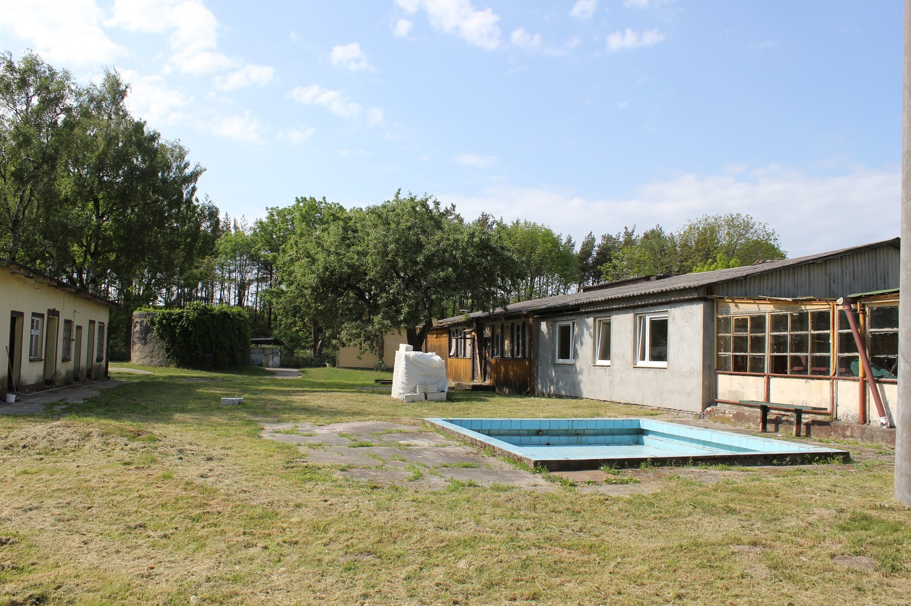
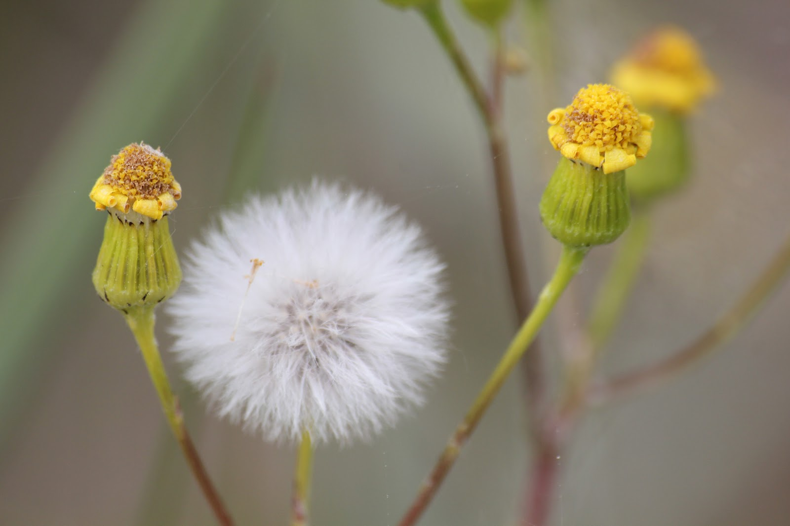

W 2016 roku można powiedzieć, że były dwie majówki. Tym razem postanowiliśmy się wybrać nad morze do jednych z piękniejszych okolic wybrzeża bałtyckiego. Trasa rowerowa bardzo ciekawa, startowaliśmy z Unieścia i kierowaliśmy się do Dąbek od południowej strony jeziora Bukowo. Zaraz za Unieściem można zwiedzić falochron oraz wrota sztormowe. Pamiętam cudowne lata dzieciństwa, gdy spływałam tam cieplutkim kanałem jamneńskim wprost do lodowatego morza;) Teraz, miejsce nie do poznania. Dojechaliśmy do Dąbek, gdzie na bezludnej plaży urządziliśmy sobie piknik i odkopaliśmy ukrytą beczkę rumu;) "Kiedy rum zaszumi w głowie..." chcieliśmy przejechać przez Dąbkowice i do Łazów, ale niestety droga jest zamknięta przez wlk. Urząd Morski i nie ma możliwości przejazdu... Co? Ja nie przejadę plażą? No to sru na rower i bam! w fale. Jakoś nie dało rady jechać, więc trzeba była pchać jakieś 5 km, a co tam.. Rowerki dostały w kość, nie ma nic gorszego niż pioch.
Na zachód od Unieścia leży fajna wioska Chłopy do której jedzie się pełną wrażeń nawierzchniowych trasą rowerową R10, choć ten odcinek można uznać za ok. W Chłopach chce się zjeść eko gofra lub eko rybkę prosto z kutra i udać się do latarni w Gąskach. Pod latarnią hmmm niezbyt przyjemnie, zaparkowane auta i wuchta wiary, ogólnie pełno wszystkiego, a gęsi brak tylko pieją koguty.
Unieście to też niezła miejscćówka, żeby się wyluzować... tym bardziej jak znudzi Ci się morze to można przejść ulice i jest się nad jeziorkiem. Ogromnym atutem miejscowości jest świeża ryba dostępna przy porcie min. dorsz i flądra.
A Wy jakie nadmorskie miejsca polecacie do przejażdżki rowerem i nie tylko?

```grid|3


```
```grid|4




```
```grid|2


```
```grid|3


```
```grid|5


```
```grid|4


```
```grid|2


```
```grid|4


```
```grid|3


```
```grid|7



```
```grid|4


```
```grid|3


```
```grid|2


```
```grid|4


```
```grid|3


```
```grid|2


```
```grid|3


```