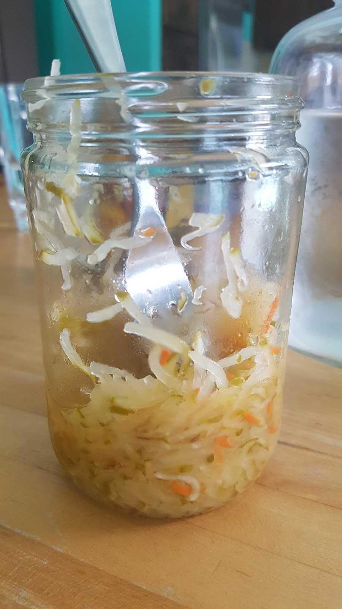

Is it possible to grow fruit and vegetables in the winter? In Florida everything is possible. It is the sunshine state :) Since we are chasing the summer, we are riding in sunny days all the time and we usually do not realize that actually it is fall and it is going to be winter time soon. In Poland we would be shuffling snow but in Diane's garden is the best season to grow delicious organic food. In spite of hard condition she and her husband Tom made a beautiful garden full of healthy goods. We have already seen a garden in the farm before but here, in the coastal city of Sarasota, Florida, the soil is mostly made of sand and seashells and it is really difficult to grow things. However, they did not give up and we had a chance to taste their home grown food. 


```grid|2


```

People are usually not aware that there are many kinds of plants that are edible. I am one of them :) I did not know that I can grow and eat a cactus which has a sour taste and it is juicy, perfect for salad or on BBQ :) 
Watch the video to see this amazing work. 

<youtube>2600uShMwQE</youtube>