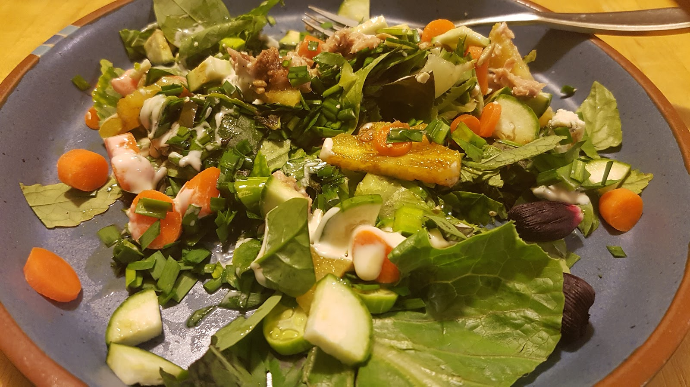

Czy zimą da się uprawiać warzywa i owoce? Na Florydzie wszystko jest możliwe :) Jest to przecież słoneczny stan :) Odkąd gonimy za latem, mamy dużo słonecznych dni i zapominamy, że to już jest jesień i niedługo nadejdzie zima. W Polsce byśmy ślizgali się po śniegu, ale w ogrodzie Diany jedliśmy świeże banany. Pomimo trudnych warunków, razem z mężem hodują wiele roślin. Ich gleba to głównie piasek i muszle, dlatego starają się zrobić własną rozrzucając kawałki drewna. Dobrze im idzie, bo wieczorem udało się z tego zrobić sałatkę :) Były w niej różne liście, kwiaty hibiskusa, kaktus i czerwone ogórki. Stwierdziłam, że jak to przeżyjemy to już wszystko możemy jeść ;) Tak wyglądała.


Najlepsze są z ogrodu były banany, słodkie i smaczne. Szkoda, że reszta owoców nie dojrzała.

 Gdy Diane zrobiła nam naleśniki z trukwy podała je z kwaśną kapustą to się bardzo zdziwiłam.


```grid|2


```


 Pomyślałam sobie, WoW! ma kapustę i nawet smakuje tak jak w Polsce. Po czym się okazało, że to wcale nie kapusta tylko zielona papaja :) 


Nigdy bym nie pomyślała, że można jeść tyle roślin, w tym kaktusa. Długo będziemy wspominać ten ogród, gdyż większość ludzi w USA nawet nie ma warzyw w domu. Czasami śnie o pomidorkach ;) Tylko ser, ser i ser. 

<youtube>2600uShMwQE</youtube>