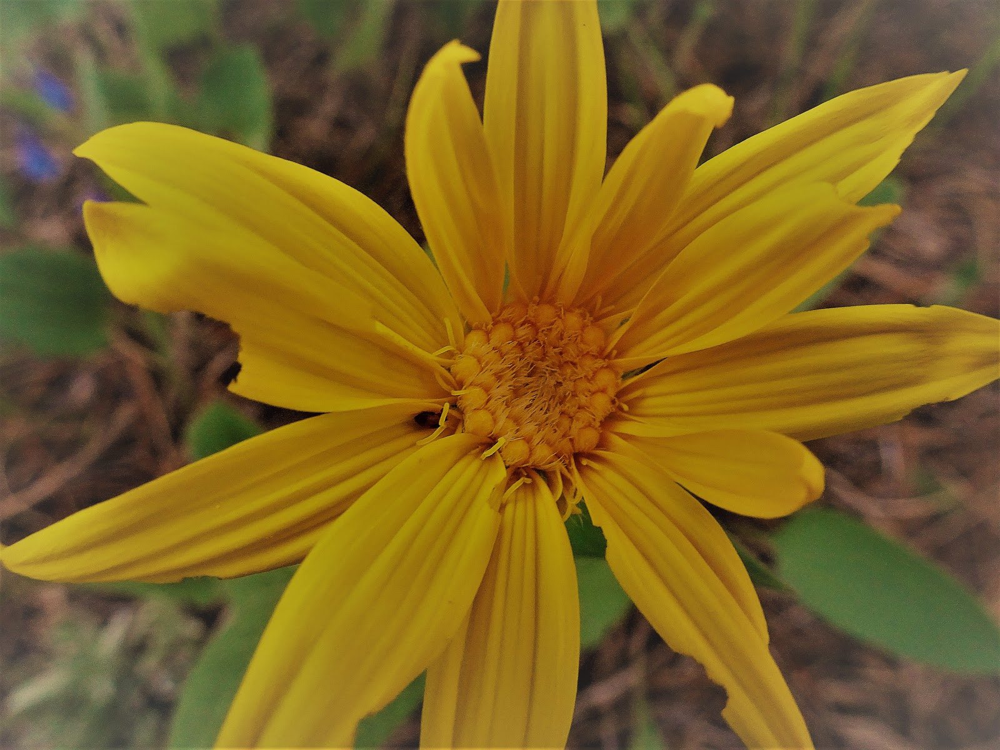

Z miejscowości Jackson ruszyliśmy w stronę parku Yellowstone na północ. Po drodze mieliśmy okazję zwiedzić Park Narodowy Grand Teton w którym króluje pasmo Teton i jego najwyższa góra Grand Teton (4,199 m), którą miejscowi tłumaczą jako wielki cycek :) Widok na pasmo ośnieżonych cycków ciągnęło się przez długi czas i super się jechało dzięki bezpiecznej ścieżce rowerowej. Jackson Lake, ogromne jezioro, towarzyszyło nam przez ok. 25 km i zatrzymało nas na kilka chwil odetchnienia. Cudowna, lecz mroźna kraina sprawiła, że zatęskniliśmy trochę do ciepełka pustyni Arizony.

<youtube>N5M5FcEBO2E</youtube>Z Teton Pass Hwy udaliśmy się drogą Moose Wilson Rd,
która była w miarę płaska i przez jakiś czas szutrowa. Następnie Teton Park Rd i
Hwy 89 zabrały nas do południowej bramy parku Yellowstone. Przed wjazdem rozbiliśmy
obóz na nieczynnym polu namiotowym. Zadowoleni z przebytej sprawnie drogi grzaliśmy
się przy ognisku, gdy nagle znikąd pojawiła się czarownica i wywaliła nas z kempingu.
O zmroku szukaliśmy miejsca na namiot, głęboko wierząc, że nie znajdziemy niedźwiedzia...{' '}

## Album

<grid>
  -./dsc04157.jpg -./dsc04159.jpg -./dsc04161.jpg -./dsc04162.jpg
  -./dsc04163.jpg -./dsc04165.jpg -./dsc04167.jpg -./dsc04168.jpg
  -./dsc04169.jpg -./dsc04170.jpg -./dsc04171.jpg -./dsc04172.jpg
  -./dsc04173.jpg -./dsc04174.jpg -./dsc04175.jpg -./dsc04176.jpg
  -./dsc04177.jpg
</grid>
