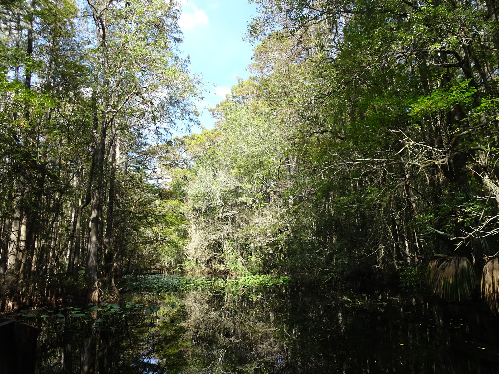

We visited a beautiful park in Florida where we saw otters playing in the swamp, birds on oaks and cypress trees and armadillos :) No alligators this time.

<youtube>nDtICbu8eNs</youtube>

It was a wanderful day to explore how Florida looked like a hundred years ago.

Extra 360 video!

<youtube>fEyTRqRWob0</youtube>

## Album

<grid>
  -./dsc01150.jpg -./dsc01158.jpg -./dsc01164.jpg -./dsc01161.jpg
  -./dsc01162.jpg -./dsc01163.jpg -./dsc01169.jpg -./dsc01168.jpg
  -./dsc01165.jpg -./dsc01170.jpg -./dsc01171.jpg -./dsc01172.jpg
  -./dsc01176.jpg -./dsc01178.jpg -./dsc01179.jpg -./dsc01180.jpg
  -./dsc01186.jpg
</grid>

<grid>
  -./dsc01183.jpg -./dsc01184.jpg -./dsc01188.jpg -./dsc01191.jpg
  -./dsc01190.jpg -./dsc01193.jpg -./dsc01194.jpg -./dsc01197.jpg
</grid>
