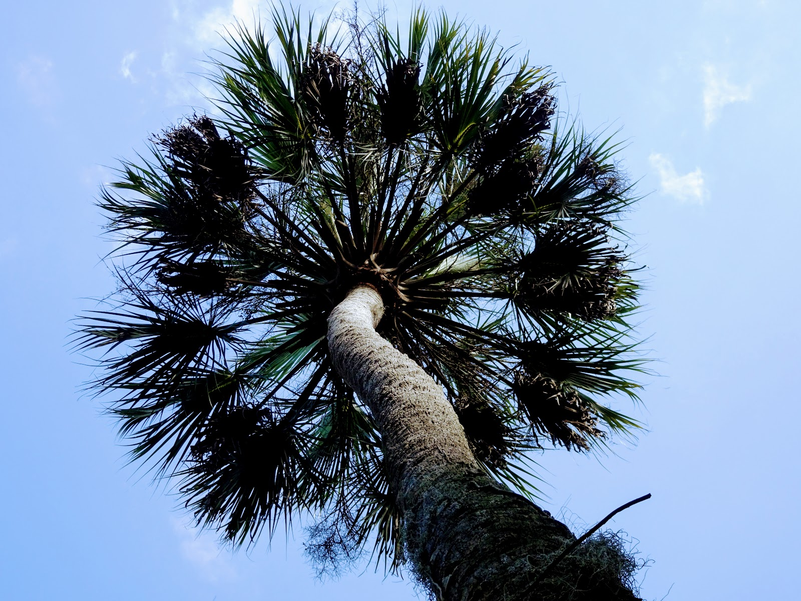
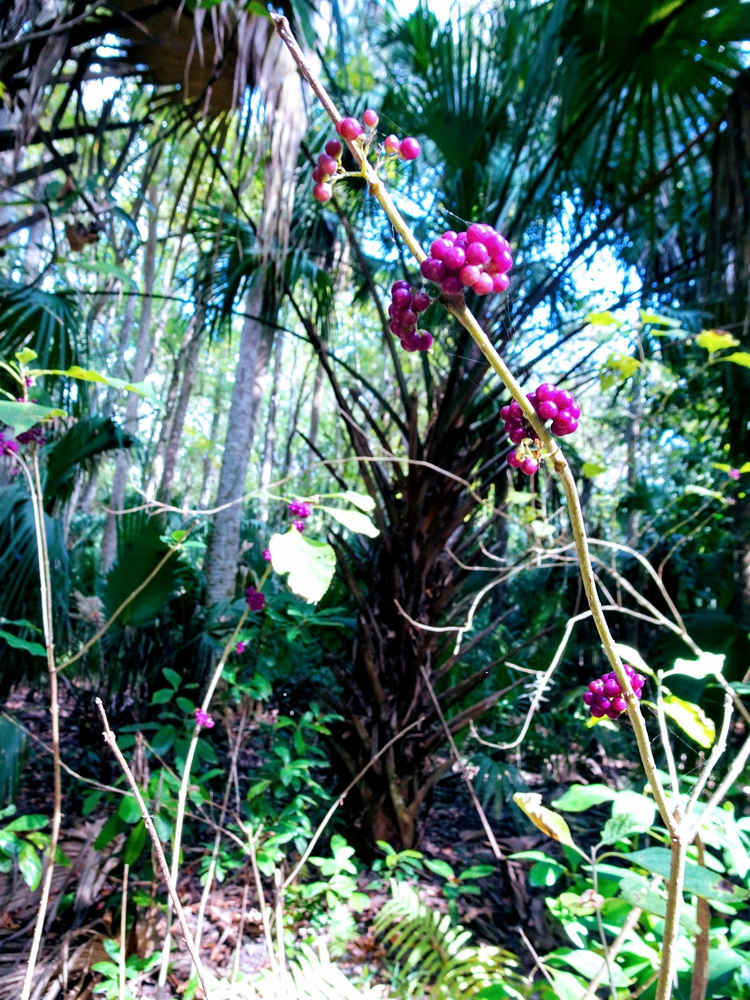
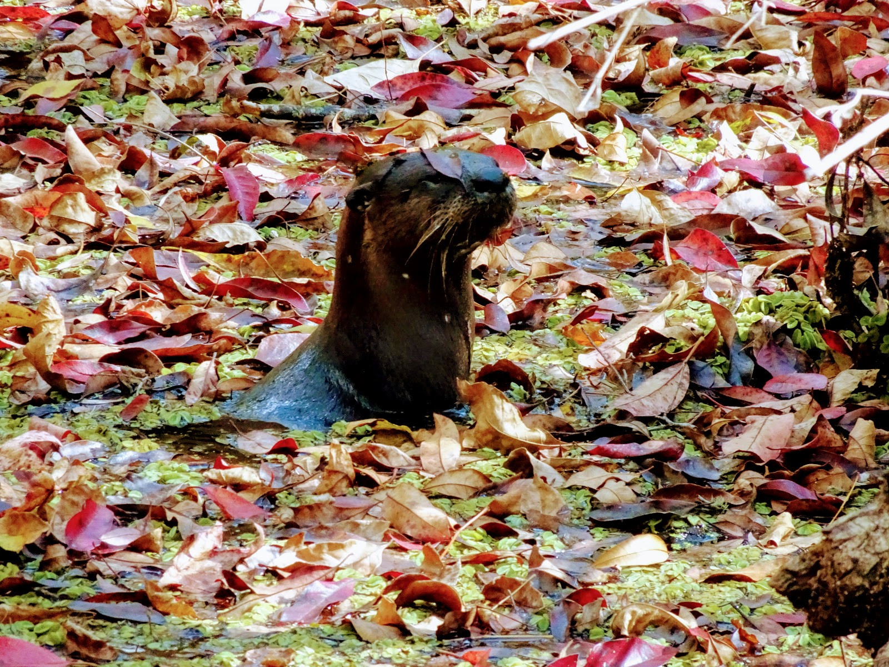

Hej Polsko!!! Przesyłamy trochę ciepełka i zieleni z Florydy !!! Z nad Zatoki Meksykańskiej udaliśmy się z powrotem na północ, żeby niedługo dotrzeć na lotnisko w Miami i polecieć do Argentyny. Zrobiliśmy 150 mil na drugie wybrzeże po stronie Atlantyku. Po drodze jechaliśmy przez totalne zadu... . Nie było nic prócz byków, sadów pomarańczy, kilka flaków i wiatru. Na jeden dzień zjechaliśmy z kursu i wybraliśmy się pieszo do parku, gdzie Amerykanie zachowali kilka szczątków prawdziwej florydzkiej ziemi (zanim zjechali wszyscy emeryci i wybudowali domy z basenami ;) Do parku można było wjechać samochodem i rowerem, ale na mokradła idzie się piechotą (nie zrobili jeszcze tam drogi ;) . Dziwi mnie to podejście. Tworzą park, aby chronić dziką przyrodę, a tak naprawdę wpuszczają do niego samochody i odbywają się w nim koncerty. Nie wiem jak te zwierzęta długo tam przeżyją. Z tego co się dowiedzieliśmy, jakieś 20 lat temu przechodząc przez mokradła na każdym kroku można było spotkać aligatora. Teraz nie zobaczyliśmy żadnego. Większa część mokradeł została wysuszona, aby uprawiać trzcinę cukrową, dlatego teraz aligatora prędzej spotkasz w kanale lub jeziorze. Jak ktoś oglądał Królestwo to wie o co chodzi...
<youtube>nDtICbu8eNs</youtube>
Tak czy inaczej, mogłabym tam spędzić cały dzień wpatrując się w stare powykrzywiane dęby, czy zatopione drzewa cyprysowe, było po prostu pięknie, zielono, cicho i dziko. 
Poniżej zdjęcia i filmiki z pobytu w tymże parku. 

a tu filmik 360 
<youtube>fEyTRqRWob0</youtube>


```grid|4


```
```grid|3


```
```grid|2


```
```grid|3



```
```grid|5


```

```grid|3


```
```grid|2


```
```grid|3



```