When we bought ticket to Argentina, we knew one thing only. Buenos Aires is in the middle of Argentina and we want to see things which are in the north and south of the country.
Argentina is a huge country, about 3000miles/4000km "height" and 800miles/1400km "width". We can stay in Argentina for maximum 3 months, so it is easy to say that visit everything is impossible with bike.
We were determined to see as much as we can so we decided we want to see Iguazu waterfalls as first big thing.
We checked prices of car rentals, buses, trains (not exists). About car, we changed our mind very quickly, because driving here is crazy - traffic light are on the opposite side of the street, everybody is driving on any side of the street etc.
Bus - costs about 200$ per person each direction. In USA we hitchhiked boat, plain, so this we decided now is time for traditional hitchhike! :).
In Buenos, we found a place who is keeping eye on our bikes.
On Friday, we started our journey, we had about 900 miles/1400km to make. We planned this trip for 3 days. To 5pm Friday we were pretty good on our plan - 1/3 of plan was done.
At 5pm we hitchiked truck and this guy took us to city Santo Tome, it is far far better than our plan - 600 miles in first day!
One bad thing - all the time we were out of phone service, Movistar Argentina has no carrier in that area at all (it look like they don't care about north east part of the country).
Anyway, we stopped at gas station for a night, security man adviced us to pitch the tent in a control station, so we will be dry (it was going to rain really hard).
We met two hitchhikers, one from Argentina, second one from Brazil. Next day we get a ride together on a rugby team bus! They offered us a ride! :) Thank you again from this place!
All day we hitchhiked a a few cars, buses etc. and in the end of the day we met truck driver from Brazil, we (Pati mostly) taught him little Polish and he was really good!
In this way we ended up in Wanda, where we have new friends from warmshowers :)
Wanda is somehow a Polish town in the middle of South America. In next post we will write something about this city!

```grid|3
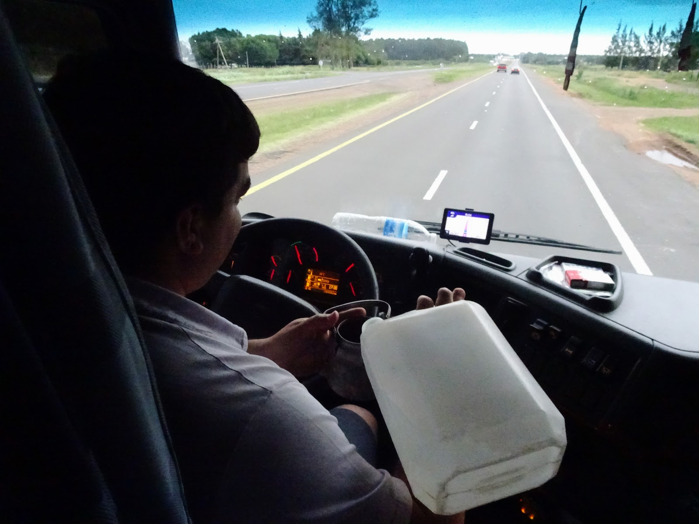
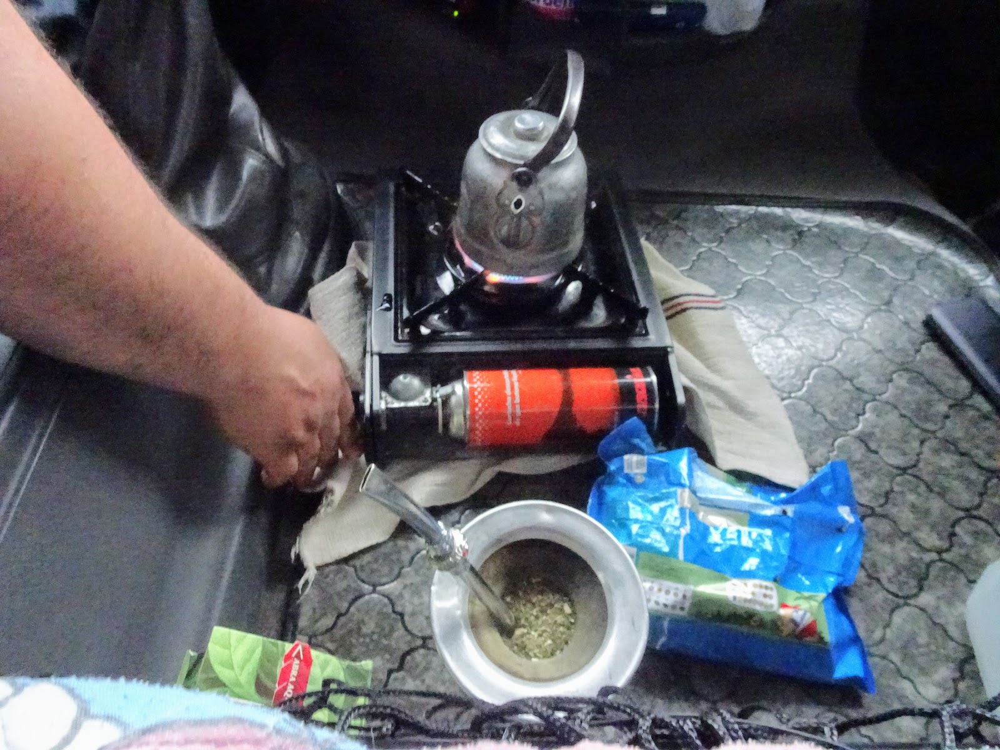
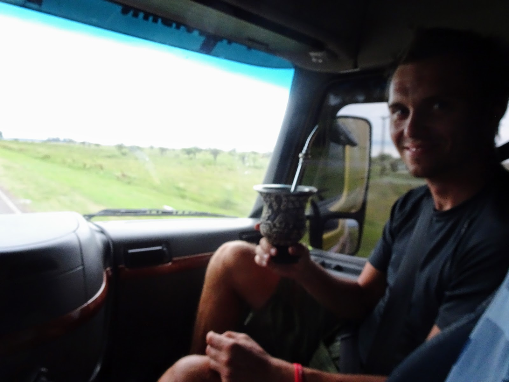
```
```grid|2
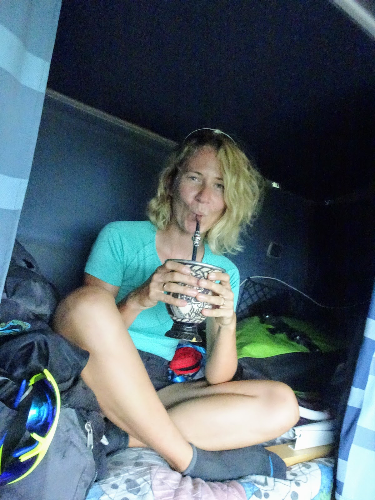
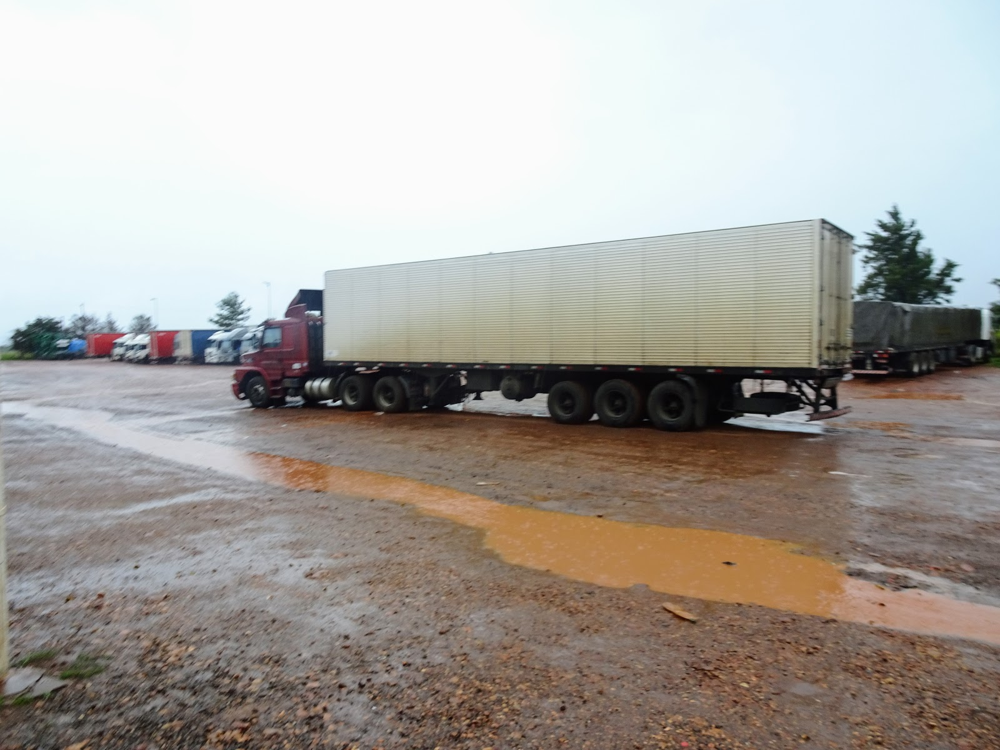
```
```grid|5
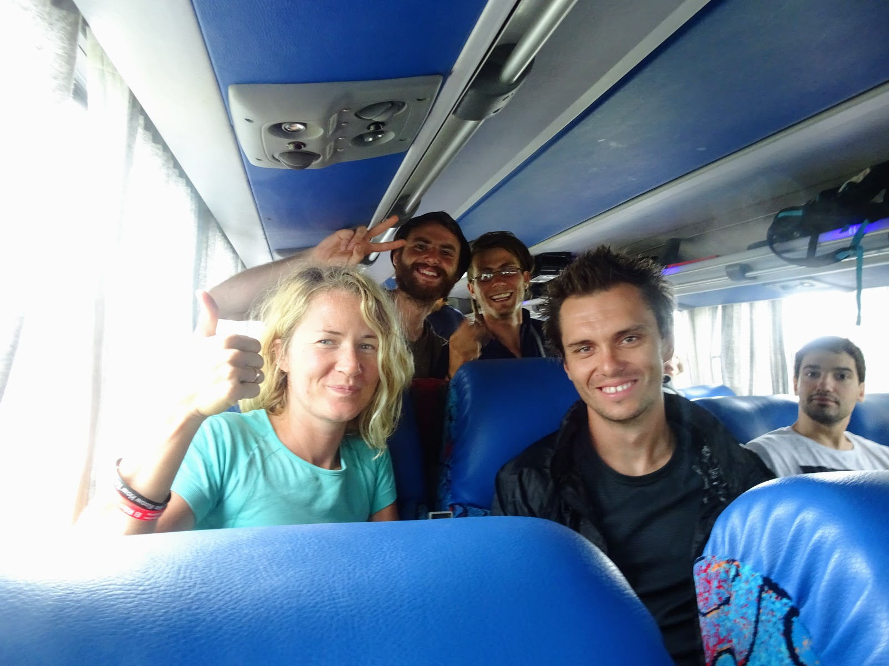
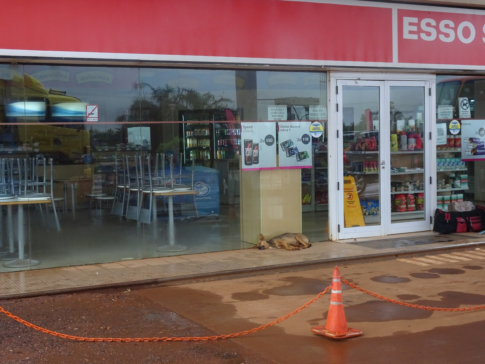
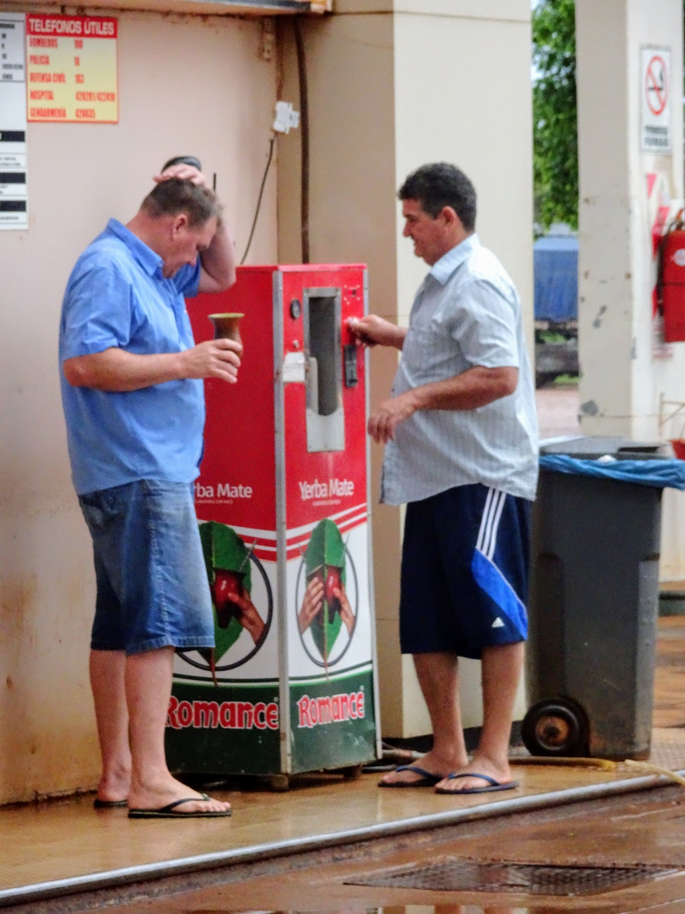
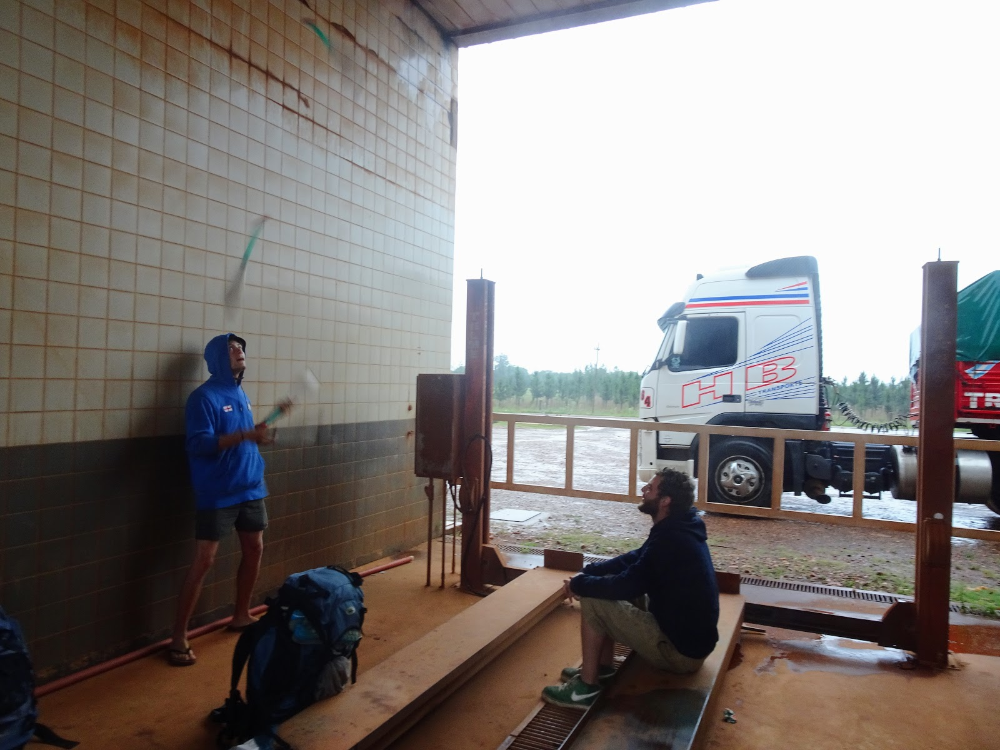
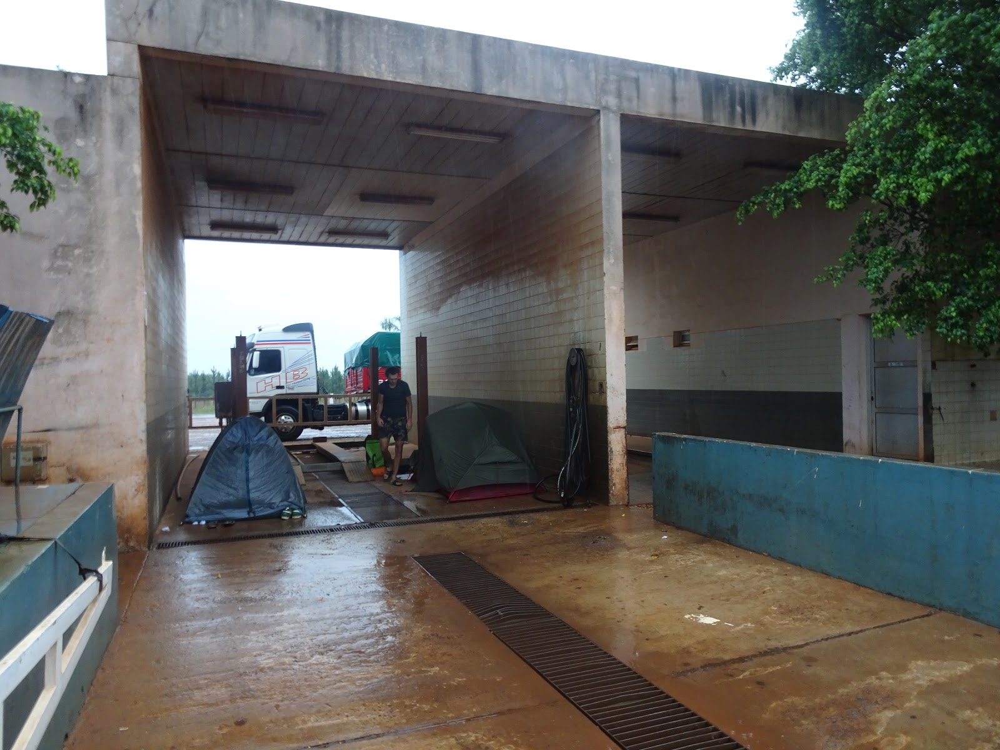
```
```grid|3
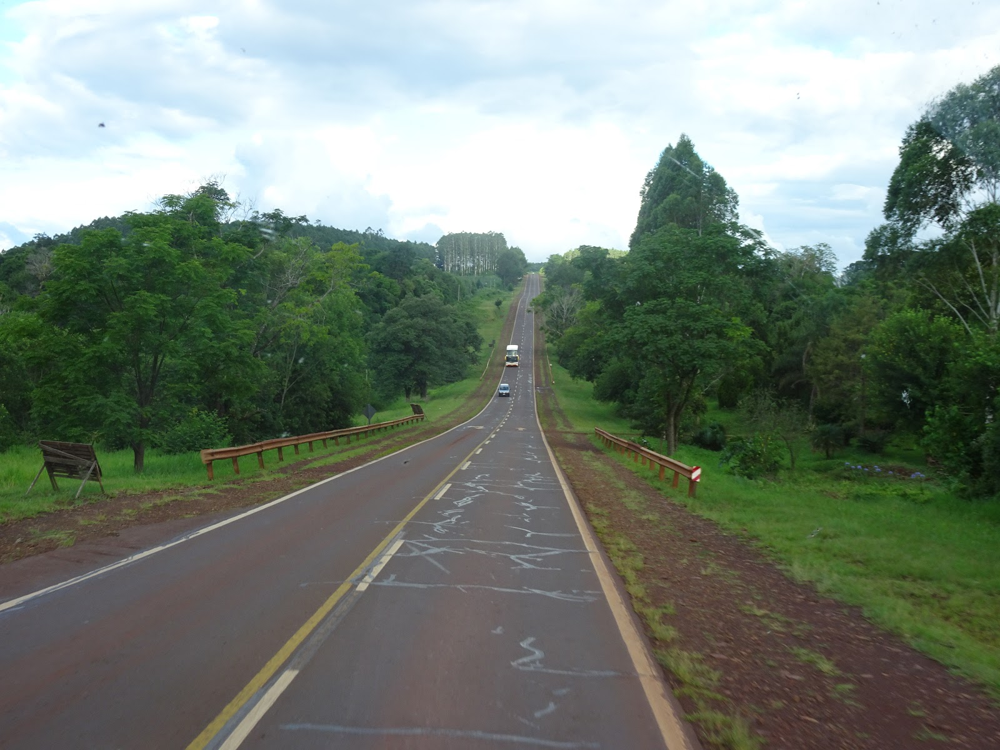
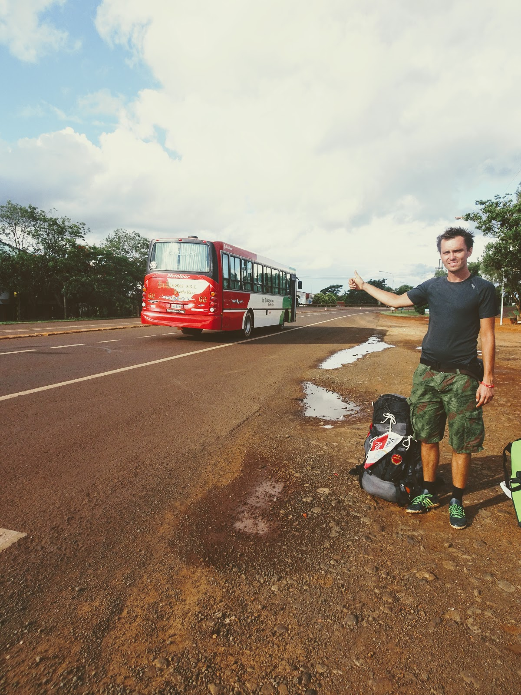
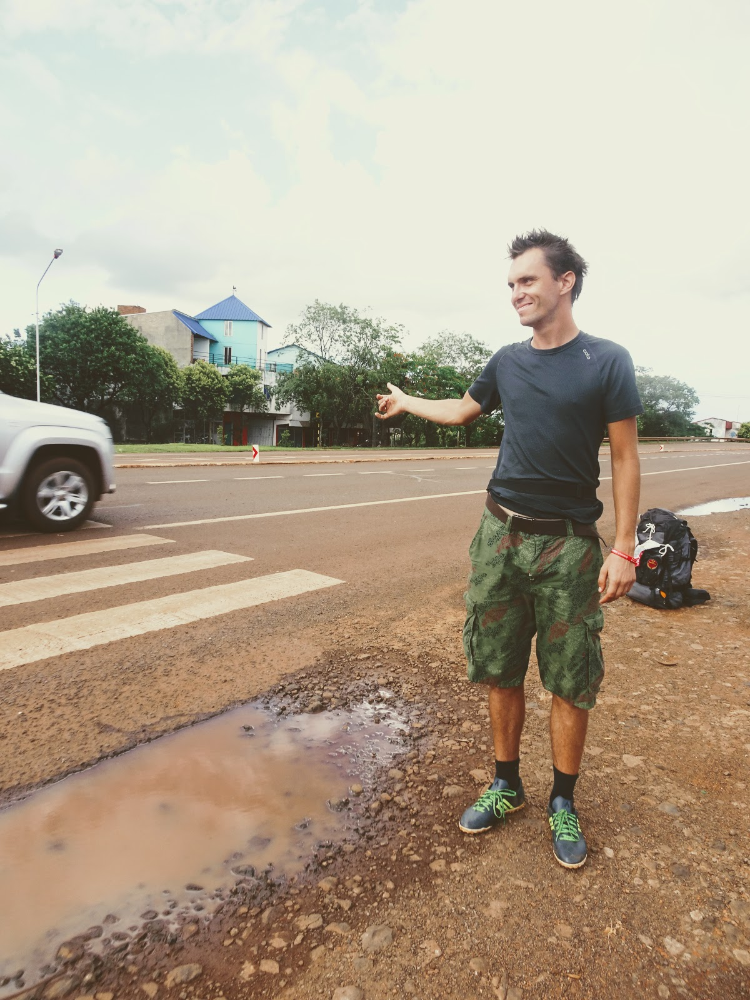
```
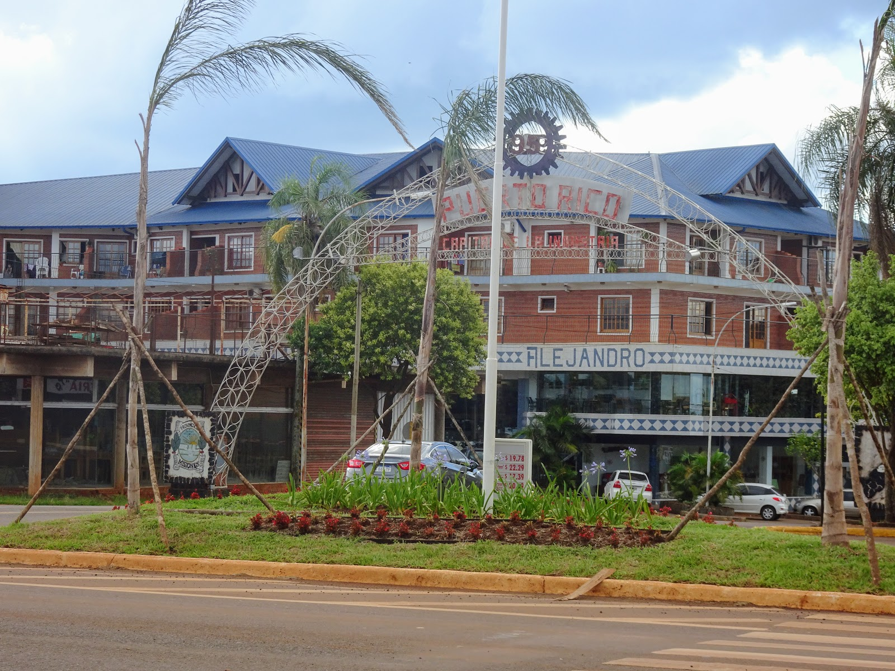