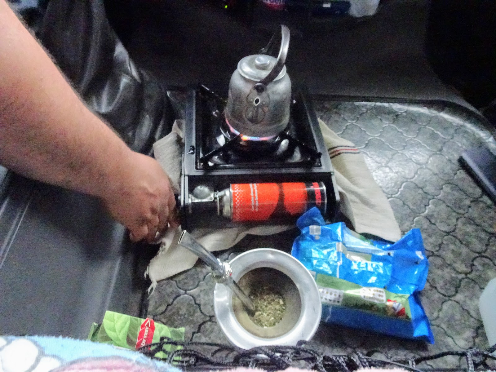
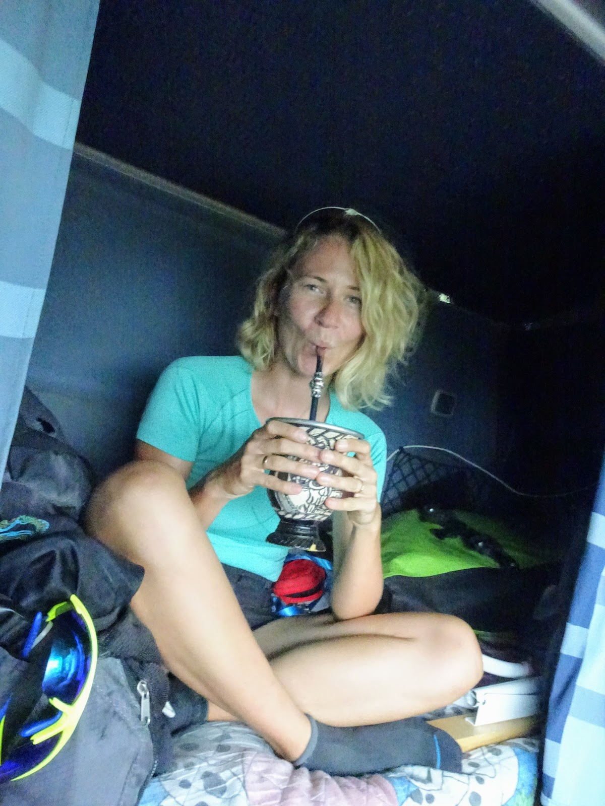
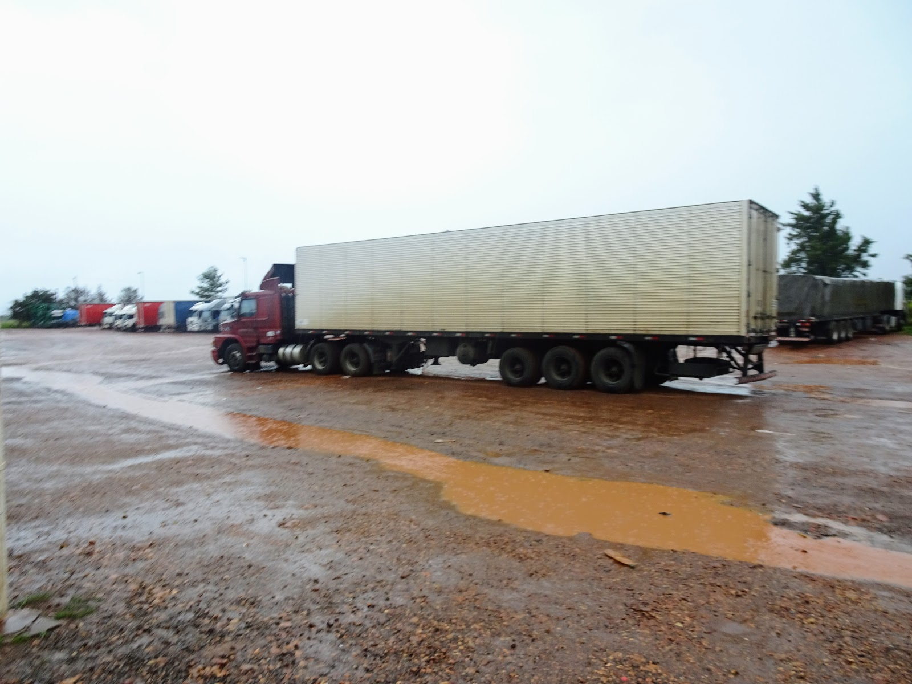
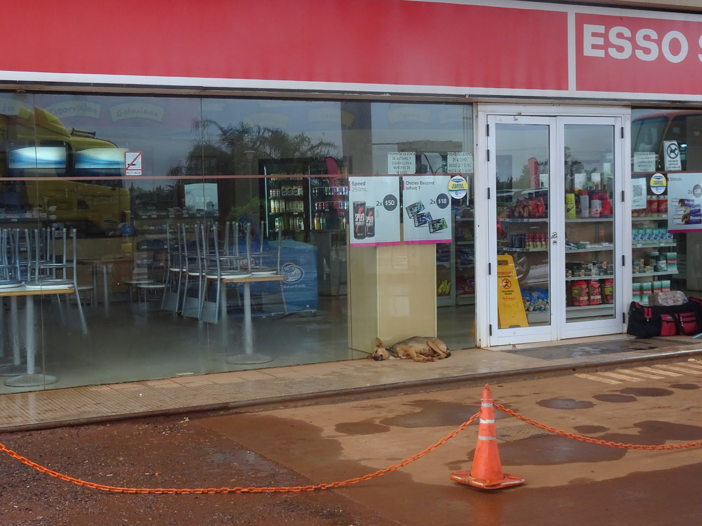
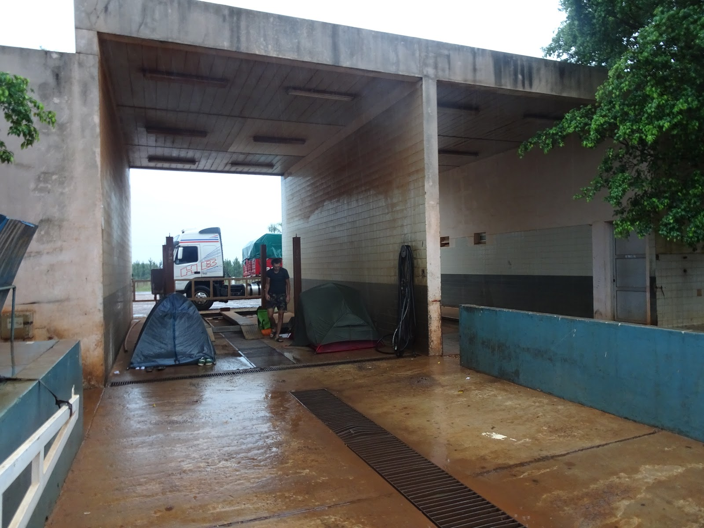
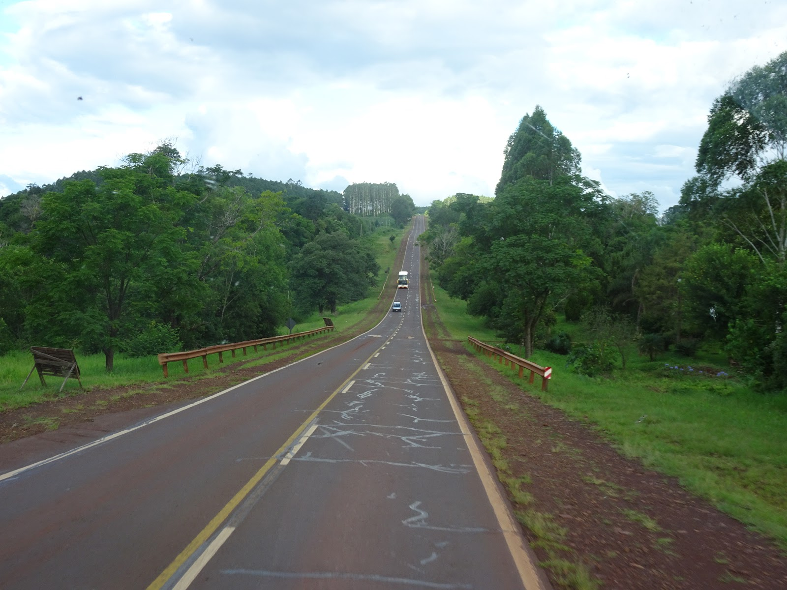
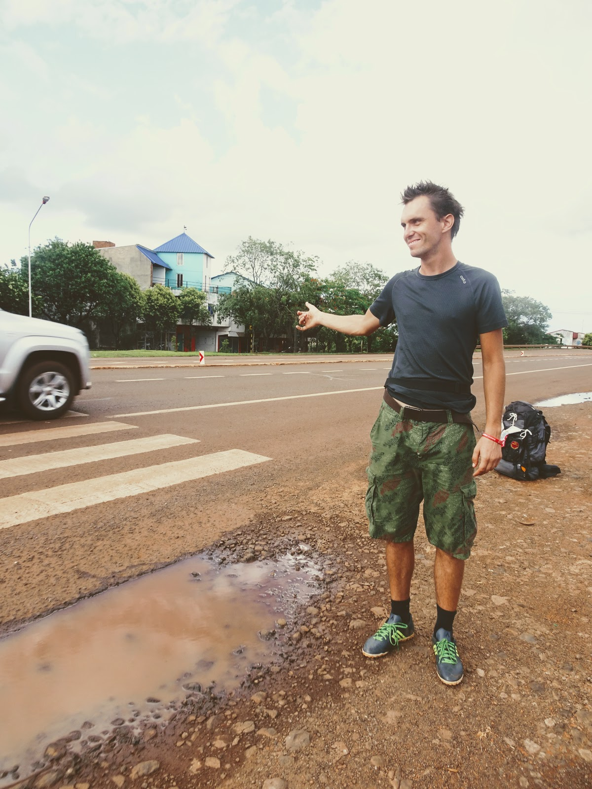
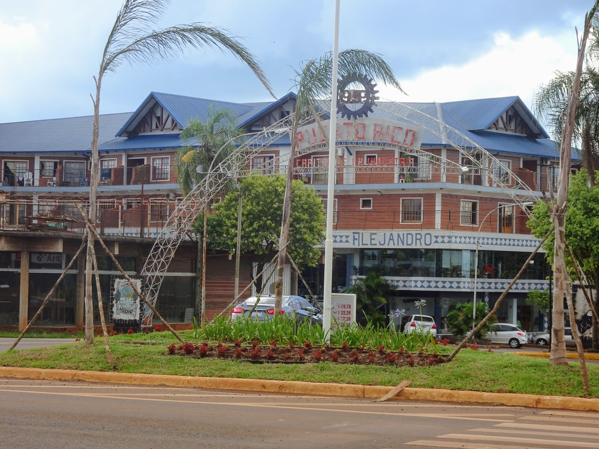

Gdy kupiliśmy bilet do Argentyny, wiedzieliśmy jedno, Buenos jest po środku Argentyny, a my chcemy zobaczyć to co jest na północy i na południu.
Argentyna jest przeogromna, 4000km długości i 1600km szerokości, mamy na to maksimum 3 miesiące - obliczenie, że rowerem jest to niewykonalne dość proste.
Postanowiliśmy, że chcemy zobaczyć wodospady Iguazu, więc szukamy, wypożyczenie auta, autobus, pociąg. Z myśli o samochodzie szybko zrezygnowaliśmy, 
sposób ich kierowania samochodami wzbudza w nas strach, każdy jeździ jak chce, ronda są czasem przedziwne, światła są za skrzyżowaniem
Bus - przeraził nas koszt. Najtańszy około 500 zł w jedną stronę. W USA jechaliśmy stopem na łódkę, stopem na samolot, to teraz czas na "zwykłego" stopa :); jak się nie uda to najwyżej skorzystamy z busa.
W Buenos znaleźliśmy osobę, która zgodziła się przechować nasze rowery na czas nieobecności.
W piątek 2. grudnia wyruszliśmy w trasę, 1400km do przejechania.  Założyliśmy, że zajmie nam ona 3 dni. 
I do godziny 17 szło nam nieźle, przejechaliśmy około 400km, czyli 1/3 trasy za nami. O godzinie 17 złapaliśmy tir'a na stopa i to niewarygodne, ale zawiózł nas aż do Santo Tome, miasta z którego do wodospadów jest "tylko" 400km.
1000 km w pierwszy dzień. Jeden minus wyjazdu na północ, totalny brak zasięgu przez 2 dni. Kupiliśmy prepaid Movistar, Argentyna i okazuje się, że na północy Argentyny nie dostarcza swoich usług...
Noc spędzamy w zajeździe przy stacji benzynowej, w Argentynie można się rozbić wszędzie, wystarczy zapytać. Miało padać, więc Pan policjant zaproponował byśmy rozbili się w stacji kontroli pojazdów, żebyśmy w nocy nie pływali.
Tego wieczoru poznaliśmy innych podróżników, jeden Argentyńczyk, drugi Brazylijczyk. 
Historia tak się potoczyła, że na następny dzień złapaliśmy wspólnego stopa (a raczej stop złapał nas) w postaci autobusu drużyny rugby.
Gdy zostało nam już tylko 150km złapaliśmy ostatniego stopa, tira z brazylijskim kierowcą, którego uczyliśmy języka polskiego, a on nas brazylijskiego :)
W ten sposób dotarliśmy do miasta Wanda. Zapewne nic Wam to nie mówi, ale jest to polskie miasto w Argentynie.
W następnym poście co nieco o nim napiszemy :)

```grid|3



```
```grid|2


```
```grid|5





```
```grid|3



```
