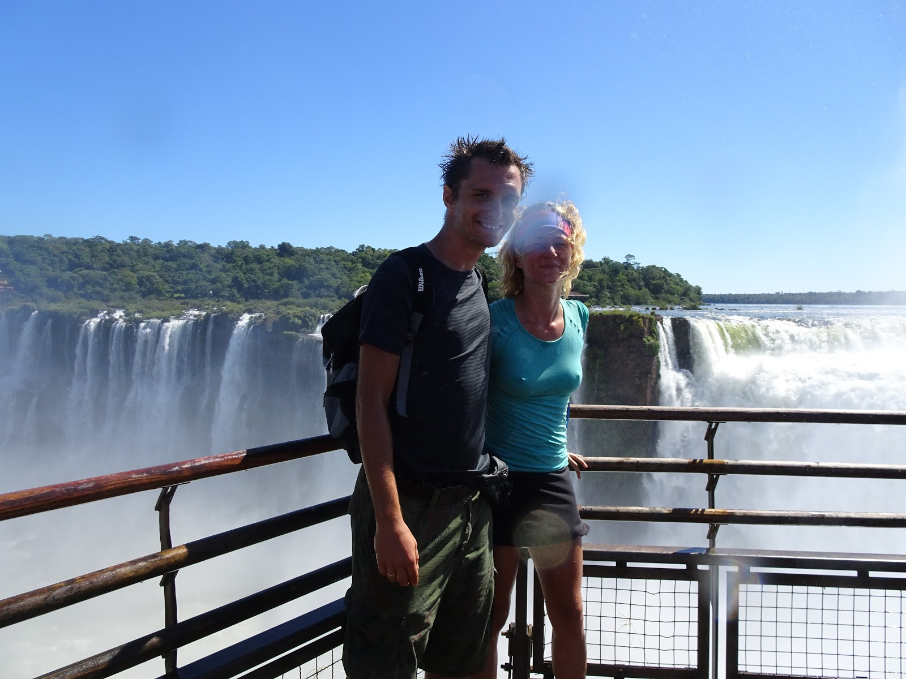
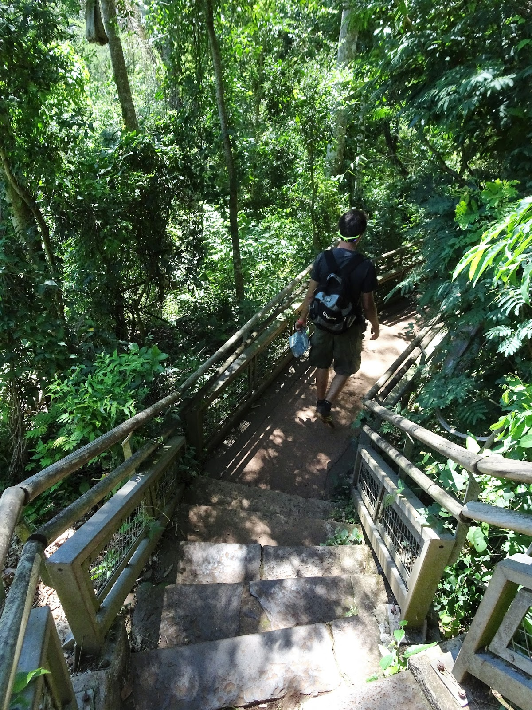
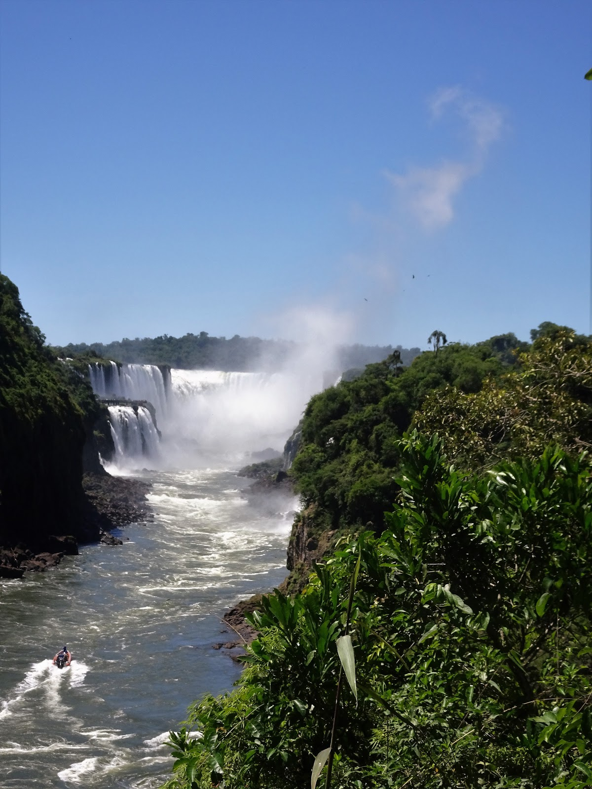
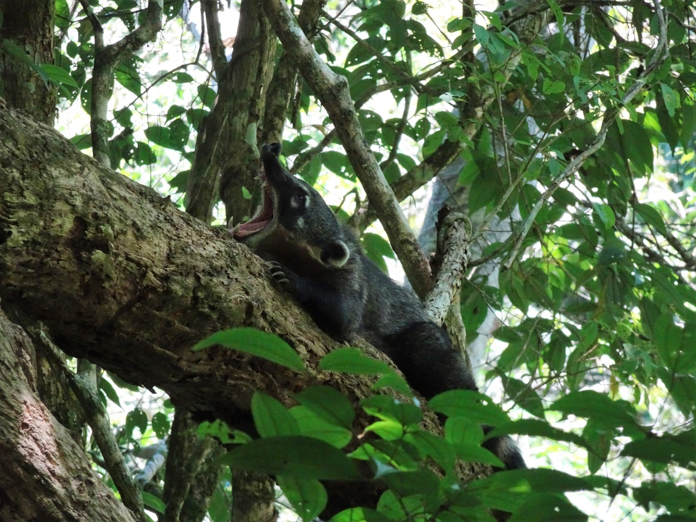
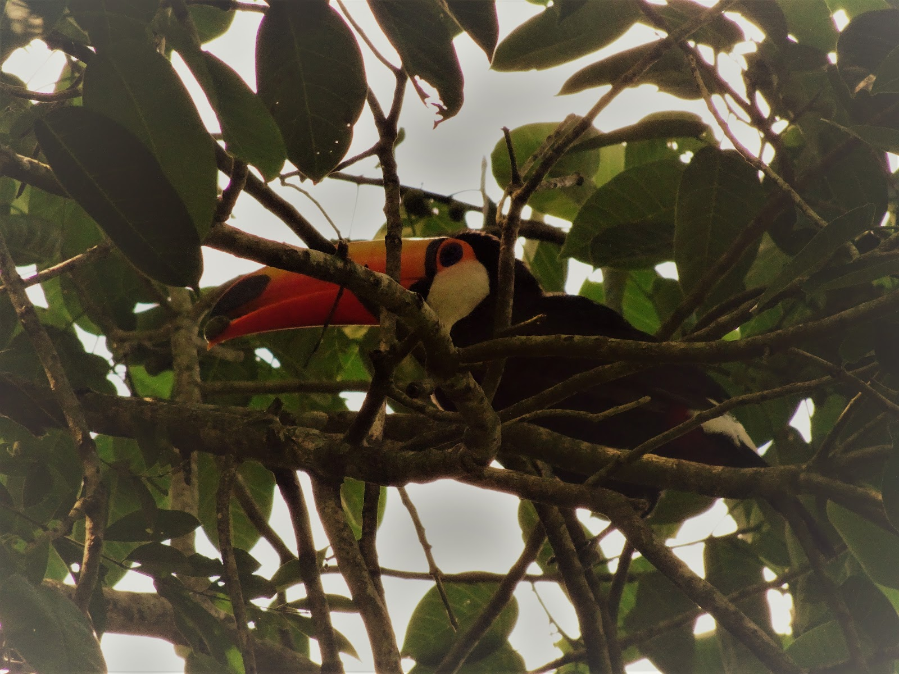
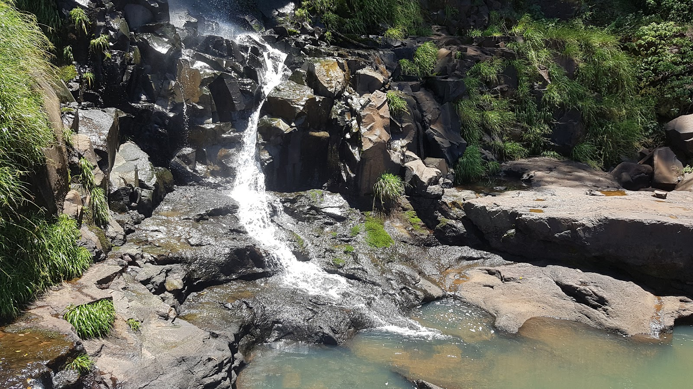

Iguazu waterfalls are the one of seven wonders of the world. Millions of people visit this place every year... why? because is so very beautiful that you can't actually believe in it. I thought this place is just over advertised but when I saw it I understand that I was wrong. Waterfalls are situated in the jungle and there are two national parks, one of the Argentinian and one of the Brazilian side. The Iguazu River divides these two countries. Our day started very early since we had like 40 km to the park an we had to catch a bus so at 6 o'clock we were yawing at the stations. We didn't get to waterfalls with that bus so we had to walk for 6 km to the entrance of the park. The cute toucan welcomed us flying above our heads. I got so excited that I wanted to run as fast as I could to this unknown jungle. There was a train to the biggest 82 m height waterfall called Diablo's Throat but it was full with tourists so we decided to walk there and we made it faster then the train. 

The rest of the trail goes over the Iguazu River where we spotted sunbathing turtles and crocodiles :)

When we got there we hold our breaths because the view was stunning. We couldn't take good photos of Diablo because the falling water was splashing so high than everybody here was wet and camera lens also :) like in the picture below...

Refreshed, we went towards San Martin Island. On our way we were chased by funny coaties and their sweet babies that like tourists' sandwiches and snacks :)

We took a ferry to the island to admire another waterfalls and their inhabitants, acrobatic birds called swifts. They were AWESOME :O

And on the way back three smiling toucans were waving goodbye with their wings :) Until this day we think this whole adventure was a dream. 

<grid>

</grid>
<grid>

</grid>
<grid>

</grid>

<grid columns="2">

</grid>
