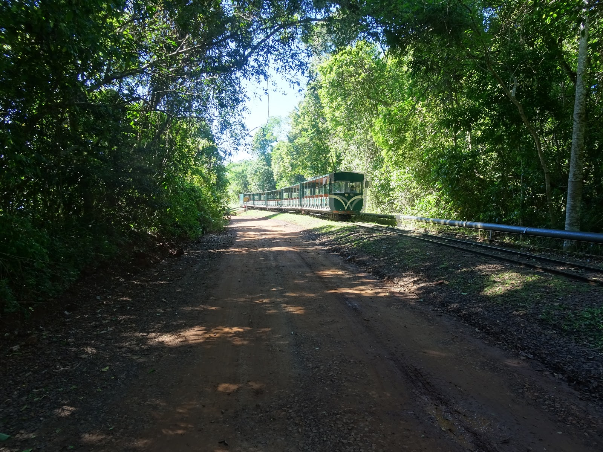
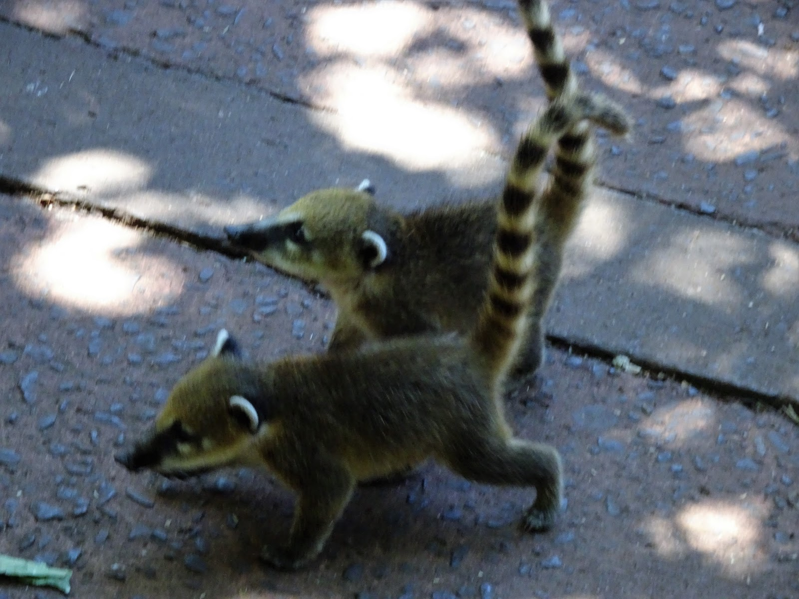
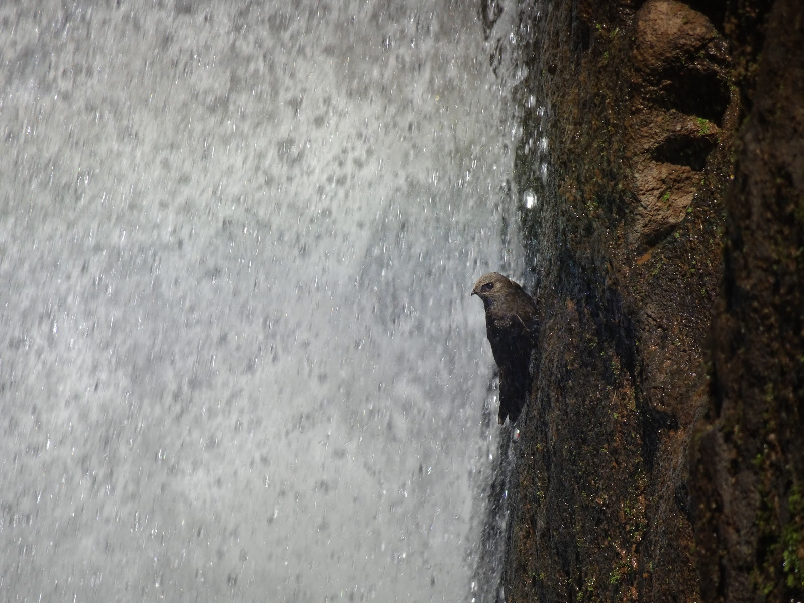

Wodospady Iguazu są jednym z 7 cudów świata. Miejsce to odwiedza miliony turystów rocznie. Wodospady znajdują się po środku dżungli, zaś rzeka Iguazu, w której się znajdują,
jest jednocześnie granicą między Argentyną, a Brazylią. Iguazu to tak naprawdę dwa parki narodowe, jeden po stronie brazylijskiej, drugi argentyńskiej. My zwiedziliśmy Argentyński park, który jest większy od jego "sąsiada". Tyle wiedzieliśmy o Iguazu przed wejściem.
Nasz dzień rozpoczął się bardzo wcześnie, bo o 5 rano, musieliśmy złapać autobus do miasteczka Puerto Iguazu, a następnie udać się w stronę Caracatas (wodospady po hiszpańsku).
Na wejściu do parku powitał nas przelatujący tukan, jeden z wielu symboli tutejszej dżungli.
Pierwszym naszym celem był wodospad Diablo, największy z tutejszych wodospadów. Z argentyńskiej strony podziwiać go można "jedynie" z góry, tzn. został utworzony tu most, który prowadzi prosto na szczyt wodospadu. Jego długość wynosi 1100 m. By się na niego dostać można wybrać kolejkę wąskotorową lub pieszą wycieczkę.

My pod górę zdecydowaliśmy się na drugą opcję, gdyż z samego rana kolejka do kolejki była bardzo długa, a czas oczekiwania niezadowalający. Po kilkunastu minutach docieramy do pierwszego szlaku, idziemy nim mijając setki turystów z całego świata i wielu siorbiących matę Argentyńczyków. Po kilometrze przemierzonym nad wodą pomiędzy wygrzewającymi się żółwiami i krokodylami,..

docieramy do największego wodospadu - Diabelskie Gardło. Woda spada z wysokości 82 metrów i unosi się w powietrzu. Widok zapiera dech w piersiach. Nie udało się zrobić zdjęcia, które by oddało ten widok, po za tym obiektyw był ciągle mokry, jak na zdjęciu poniżej :)

Orzeźwieni ruszyliśmy dalej w stronę Wyspy San Martin. Po drodze goniły nas ostronosy szukające turystycznych przekąsek. Tu na zdjęciu maleństwa :)

Udało się złapać ostatni kurs promem na wyspę i podziwiać kolejne wodospady oraz akrobacje tutejszych jerzyków, które są ikoną tego parku.

Wśród palm, bambusów i porastających skalne urwiska begonii latały kolorowe motylki i wyłaniały się kolejne wodospady, a na koniec pożegnały nas uśmiechnięte tukany :D Do dziś wydaje nam się, że ta cała wyprawa do Iguazu to był jakiś sen...

## Album

<grid>
  -./dsc01455.jpg -./dsc01457.jpg -./dsc01461.jpg -./dsc01463.jpg
  -./dsc01464.jpg -./dsc01465.jpg -./dsc01472.jpg -./dsc01471.jpg
  -./dsc01469.jpg -./dsc01468.jpg -./dsc01467.jpg -./dsc01466.jpg
  -./dsc01473.jpg -./dsc01477.jpg -./dsc01482.jpg -./dsc01483.jpg
  -./dsc01486.jpg -./dsc01487.jpg -./dsc01488.jpg -./dsc01489.jpg
  -./dsc01493.jpg -./dsc01494.jpg -./dsc01502.jpg -./dsc01506.jpg
  -./dsc01508.jpg -./dsc01511.jpg -./dsc01512.jpg
</grid>

<grid>-./dsc01516.jpg -./dsc01517.jpg</grid>

<grid>
  -./dsc01524.jpg -./dsc01525.jpg -./dsc01528.jpg -./dsc01533.jpg
  -./dsc01534.jpg -./dsc01535.jpg -./dsc01536.jpg -./dsc01537.jpg
  -./dsc01538.jpg -./dsc01539.jpg -./dsc01542.jpg -./dsc01543.jpg
  -./dsc01550.jpg -./dsc01549.jpg -./dsc01548.jpg -./dsc01547.jpg
  -./dsc01546.jpg -./dsc01544.jpg -./dsc01551.jpg -./dsc01552.jpg
  -./dsc01553.jpg -./dsc01554.jpg -./dsc01556.jpg -./dsc01557.jpg
  -./dsc01564.jpg -./dsc01563.jpg -./dsc01561.jpg -./dsc01560.jpg
  -./dsc01559.jpg -./dsc01558.jpg -./dsc01565.jpg -./dsc01566.jpg
  -./dsc01567.jpg -./dsc01569.jpg -./dsc01570.jpg -./dsc01572.jpg
  -./dsc01581.jpg -./dsc01580.jpg -./dsc01579.jpg -./dsc01578.jpg
  -./dsc01574.jpg -./dsc01573.jpg -./dsc01582.jpg -./dsc01583.jpg
  -./dsc01584.jpg -./dsc01585.jpg -./dsc01587.jpg -./dsc01588.jpg
  -./dsc01591.jpg -./dsc01590.jpg -./dsc01589.jpg
</grid>

<grid columns="2">
  -./20161205_093557.jpg -./20161205_093713.jpg -./20161205_093744.jpg
  -./20161205_094848.jpg -./20161205_104614.jpg -./20161205_104334.jpg
  -./20161205_104411.jpg -./20161205_110608.jpg -./20161205_111733.jpg
  -./20161205_111707.jpg -./20161205_111717.jpg -./20161205_114949.jpg
  -./20161205_123725.jpg -./20161205_124728.jpg -./20161205_124324.jpg
  -./screenshot_20161205-180426.png
</grid>
