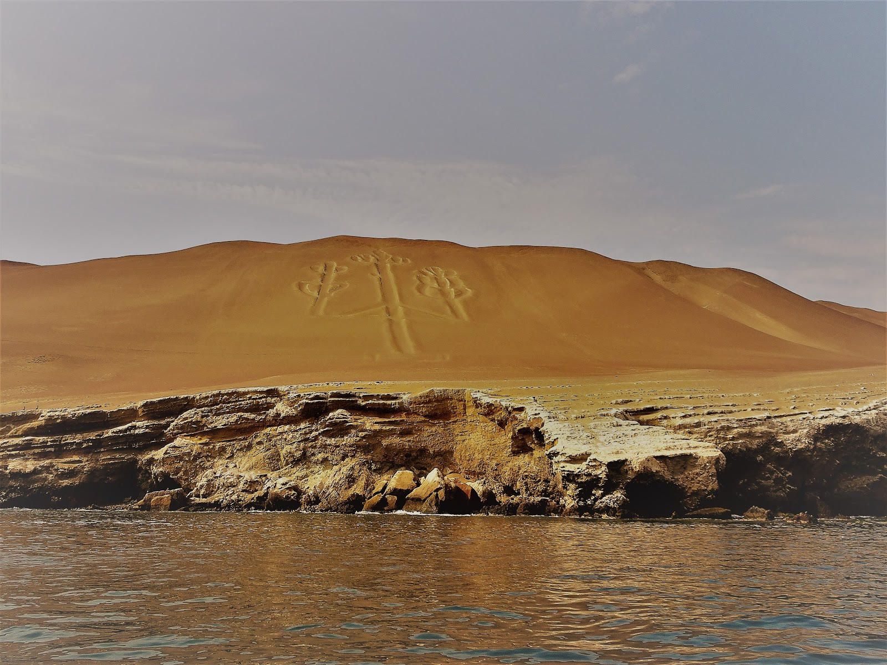

I'd like to share this short video of South American wildlife. We visited one of the Peruvian islands to feel more like tourists :) Islas Ballestas are located near Paracas or Pisco city. We took a boat from Paracas to see marine fauna far away from the land and it was amazing. Cormorants, pelicans and sea lions with their babies were fun to watch. It was our time to breath and relax out of the hot desert.

<youtube>uadkrDWB39M</youtube>

On the way to islands we saw a big geoglyph that resembles a candle tree -Paracas Candelabra- which is more then two thousand years old. One of the theory says that its functioned as a lighthouse for the sailors.

## Album

<grid>
  -./dsc02867.jpg -./dsc02868.jpg -./dsc02869.jpg -./dsc02870.jpg
  -./dsc02872.jpg -./dsc02873.jpg -./dsc02874.jpg -./dsc02876.jpg
  -./dsc02877.jpg -./dsc02878.jpg -./dsc02879.jpg -./dsc02880.jpg
  -./dsc02882.jpg -./dsc02887.jpg -./dsc02888.jpg -./dsc02889.jpg
  -./dsc02894.jpg -./dsc02895.jpg
</grid>

<grid>-./dsc02890.jpg -./dsc02891.jpg</grid>

<grid>
  -./dsc02896.jpg -./dsc02898.jpg -./dsc02899.jpg -./dsc02901.jpg
  -./dsc02903.jpg -./dsc02904.jpg -./dsc02905.jpg -./dsc02906.jpg
</grid>
