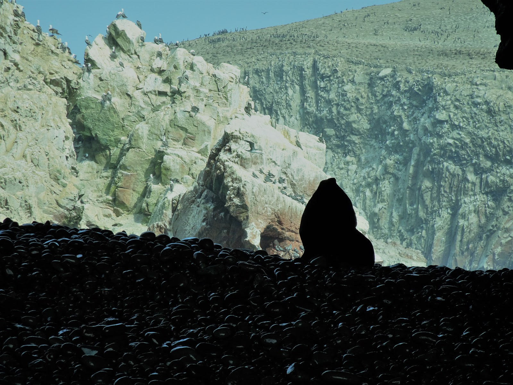

Aby przez chwile poczuć się jak turyści wybraliśmy się na krótki rejs, aby przez chwilkę podziwiać życie fauny morskiej na jednej z peruwiańskiej wysp. Islas Ballestas są zamieszkiwane przez kormorany, pelikany oraz milusińskie lwy morskie i ich potomstwo. To był mega relaksujący wypad. 

<youtube>uadkrDWB39M</youtube>

Po drodze na wyspy zobaczyliśmy ogromny geoglif przypominający widły ;) jednak był to kandelabr... olbrzymi świecznik -Paracas Candelabra- który ma ponad 2000 lat. Jedna z teorii mówi, że znak miał pełnić funkcję latarni morskiej. 

<grid>

</grid>
<grid>

</grid>
<grid>

</grid>