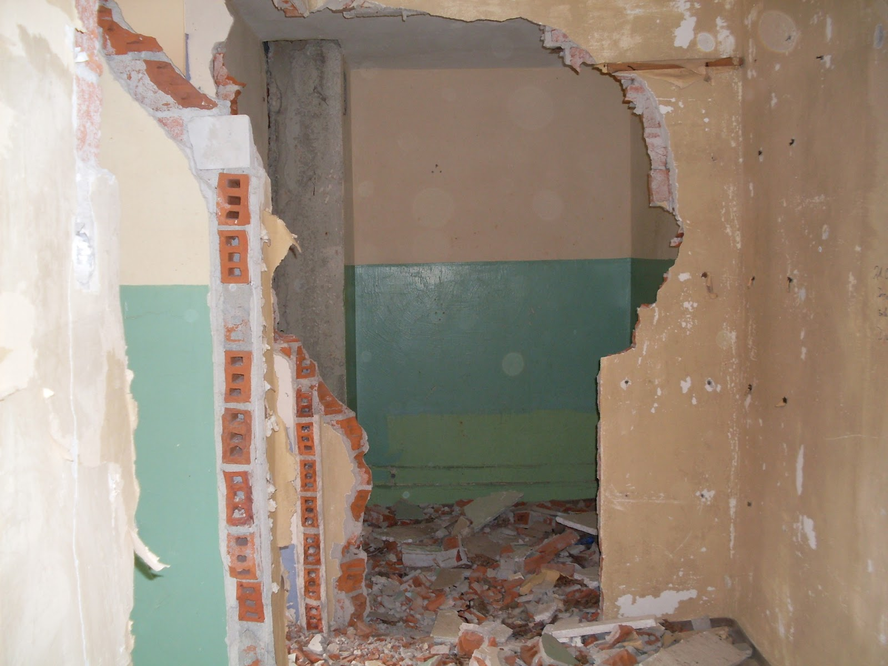

Let me introduce you an abandoned place that was a prison for Polish, German, Russian and French military prisoners. After the Second World War Russians built some blocks of flats, a hospital, shops and even a cinama:) In the early nineties they left leaving everything behind. I don't want to go into details but in this city could live about 5 000 people, however nowadays only twelve inhabitants live in one of those blocks. I was suprised that someone actually wants to live there among debris and ghosts. Bravo for them.

<youtube>doDLfKyDqog</youtube>

Not far away there is a spectacular Russian cementary with an eye-catching tommy-gun and teddies on the graves.

## Album

<grid columns="2">
  -./sdc10114.jpg -./sdc10167.jpg -./sdc10137.jpg -./sdc10146.jpg
</grid>

<grid>
  -./sdc10155.jpg -./sdc10165.jpg -./sdc10168.jpg -./sdc10175.jpg
  -./sdc10170.jpg
</grid>
