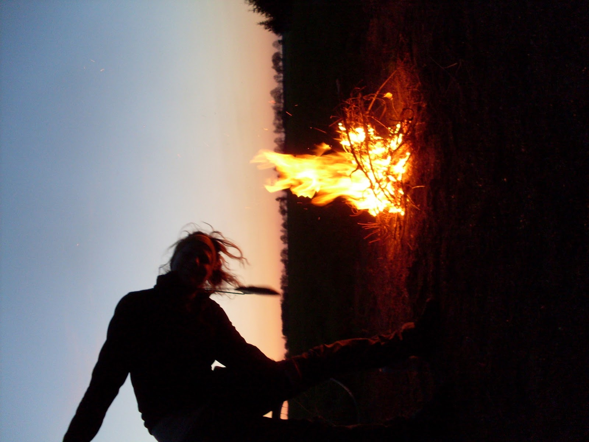

W 2013 roku wybraliśmy się na pierwszą wielką wyprawę rowerową (aż 5 dni;), która na zawsze pozostanie w naszej pamięci. Późnym popołudniem wylądowaliśmy w Jastrowiu i mieliśmy zamiar dotrzeć do legendarnego Kłomina (trasa ok. 20 km), ale ze strachu przespaliśmy się w przydrożnym lasku, żeby czasem nie utknąć TAM na noc.
Wczesnym pochmurnym rankiem udaliśmy się na poszukiwania. Troszkę błądziliśmy leśnymi ścieżkami, aż nagle wyłoniły się zza drzew dziurawe bezokienne bloki i góry gruzu. W latach trzydziestych XX wieku Niemcy zamieszkiwali te tereny, a około lat czterdziestych wyeksmitowali ich Rosjanie i rozbudowali to miejsce stawiając bloki, szkoły, garaże i Cinema Cłomino. Dobrze im się mieszkało, jak to w Polsce, do lat dziewięćdziesiątych.
Z daleka bloki z tzw. wielkiej płyty straszą wyglądem, a wewnątrz huczy i wrzeszczy historia. Zachowajcie szczególną ostrożność wchodząc do środka mieszkań grożących zawaleniem. Na zewnątrz znajduje się też wiele studzienek włazów i gruzu co nie sprzyja jeździe rowerowej.
Aby ucieszyć oko ładniejszym widokiem można się udać na wrzosowiska znajdujące się nieopodal opustoszałego miasta. Na dawniejszym poligonie hektarami rozrastają się przepięknie kwitnące jesienią wrzosy, jedne z największych w Europie.'

<youtube>doDLfKyDqog</youtube>

Z Kłomina warto wybrać się do pobliskiego miasta Borne Sulinowo. Po drodze natkniecie się na trzymetrową dłoń trzymającą pepeszę, która znajduje się na... cmentarzu. "Zdobią go" maskotki leżące na grobach niewinnych dzieci, również niemowląt.

```grid|2


```
```grid|2


```

```grid|3


```
```grid|2


```

