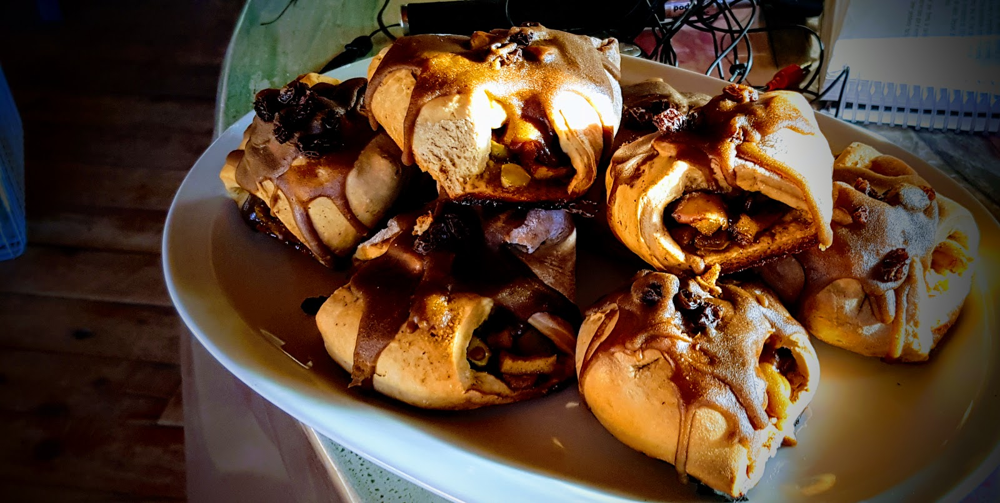
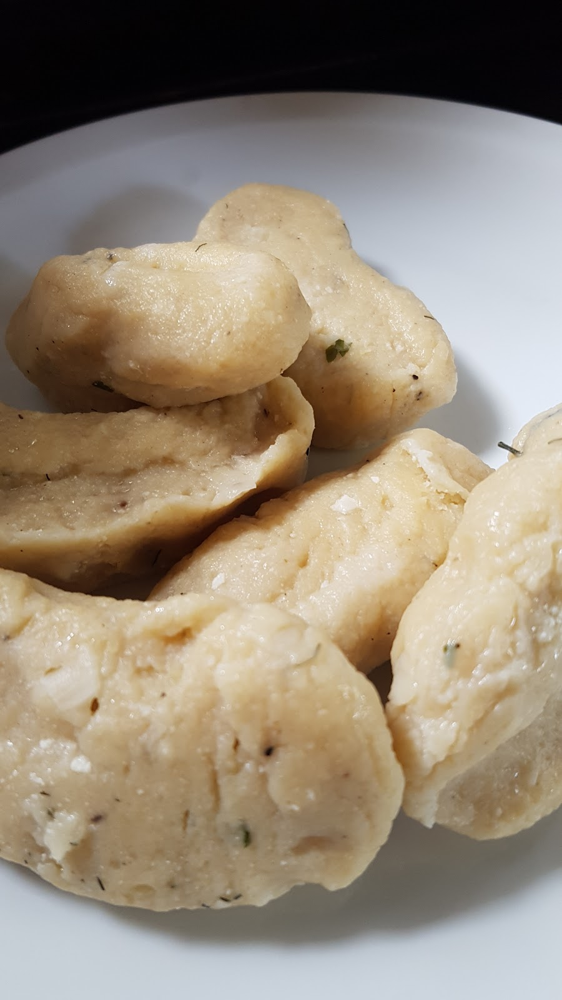

For Christmas we are staying in Bariloche, Argentina with Felicitas and her children. Christmas here are very different comparing to Poland and Europe. Few days ago here was first day of summer, so weather is pretty good, warm and all flowers are blooming. There are not many Christmas trees, discounts and special offers in all stores or Santa Claus on every corner.
alt=""

We wanted to have a little bit of Polish Christmas and only way we could achieve this is by food.

We made Polish pierogi: 

then we started to making home made cookies:

and after all work, there were a lot of stuffing for our pierogi, so we made another pierogi called lazy pierogi (those are sweet)

And in this way, we imported some of Polish Christmas to Argentina.
We wish you all Merry Christmas. Hope you can spend this time with your families and people you love!
In next few days we have plans to show you some of Patagonia, so check our site from time to time!

<youtube>WC2G3ijLoGQ</youtube>