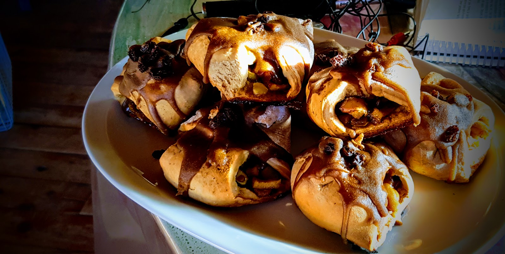

Na święta zatrzymaliśmy się koło Bariloche w Argentynie u Felicitas i jej dzieci. Zupełnie inaczej są tu obchodzone święta. Parę dni temu był pierwszy dzień lata, więc jest ciepło i wszystko dookoła kwitnie jak u nas na wiosnę. Rzadko gdzie można dostrzec w oknie ubraną choinkę, stroik czy grubaska ubranego na czerwono ;).
Trochę polskich świąt jednak chcieliśmy poczuć, a jak jest się daleko od kraju najłatwiej poczuć go na podniebieniu.
Zaczęliśmy od zrobienia pierogów

Następnie jako, że odpaliliśmy już robota i mąkę to przyszła kolej na ciasteczka. Zrobiliśmy farsz z jabłek i miodu, proste ciasto i po godzinie wyszło takie cudo:

Po ulepieniu setki pierogów... zostało nam jeszcze farszu, to postanowiliśmy zrobić zmodyfikowaną wersję leniwych (ze szczypiorkiem) :)

I tak oto w Argentynie mamy swoje własne trochę polskie święta :)
Wszystkim, którzy to czytają przesyłamy świąteczne życzenia, pełne radości spokoju i odpoczynku. Równocześnie powoli zapowiadamy, że niedługo poczytacie o naszych przygodach w Patagonii.

<youtube>WC2G3ijLoGQ</youtube>