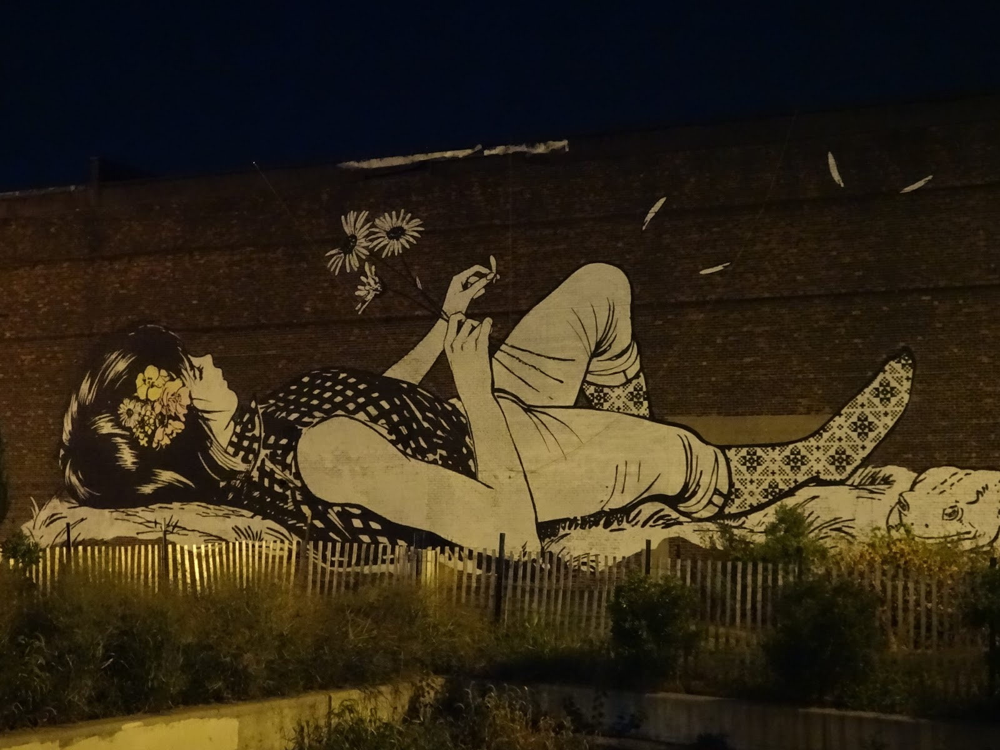
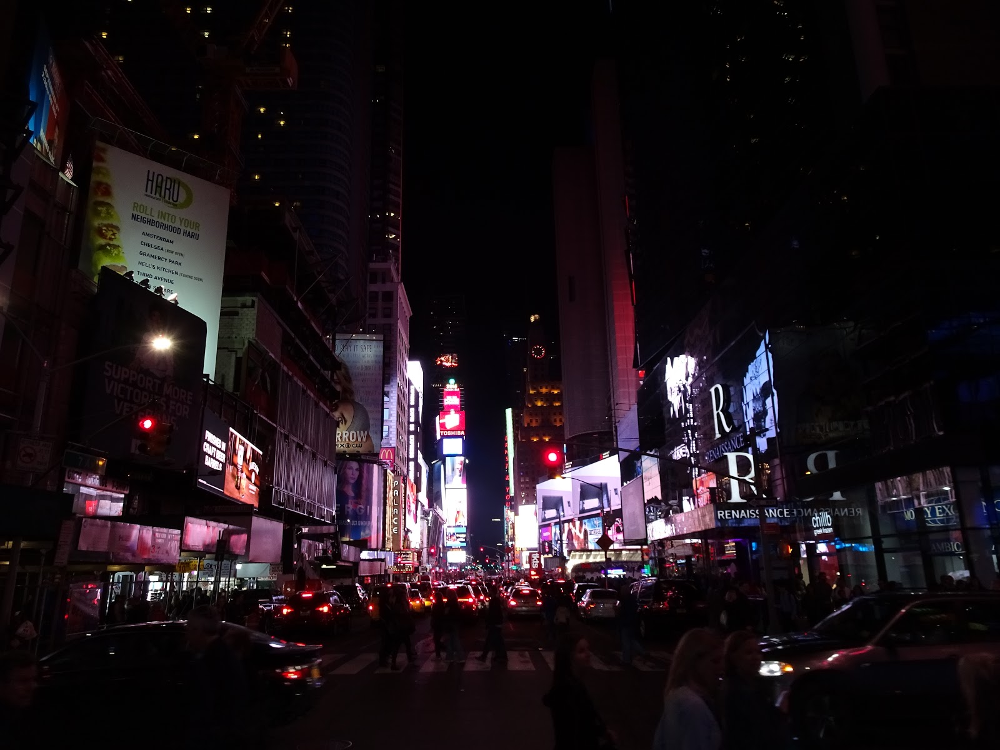
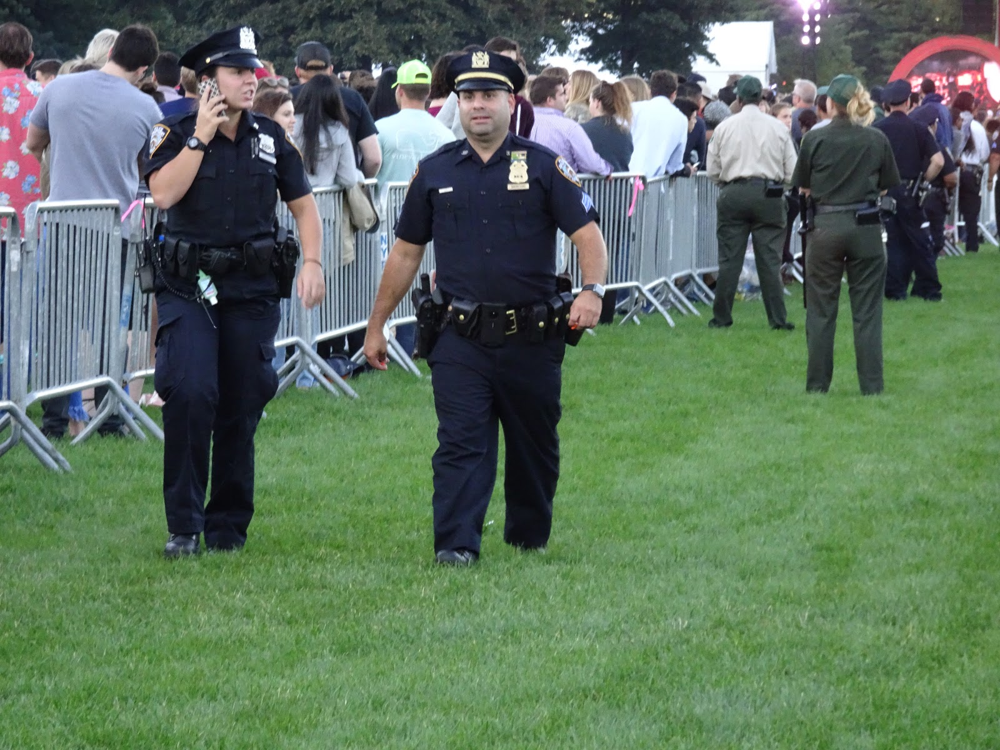
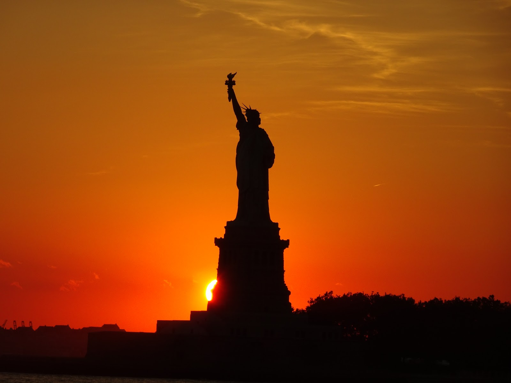
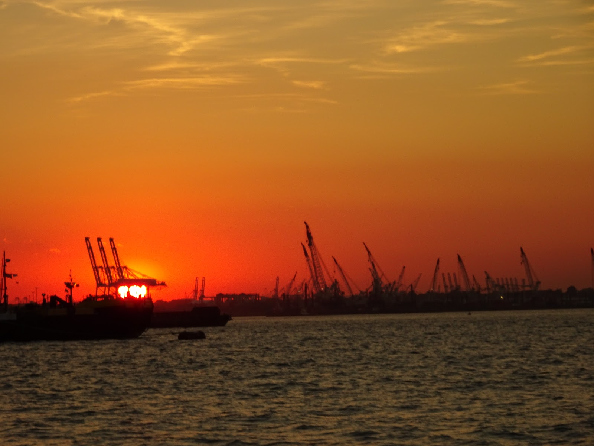
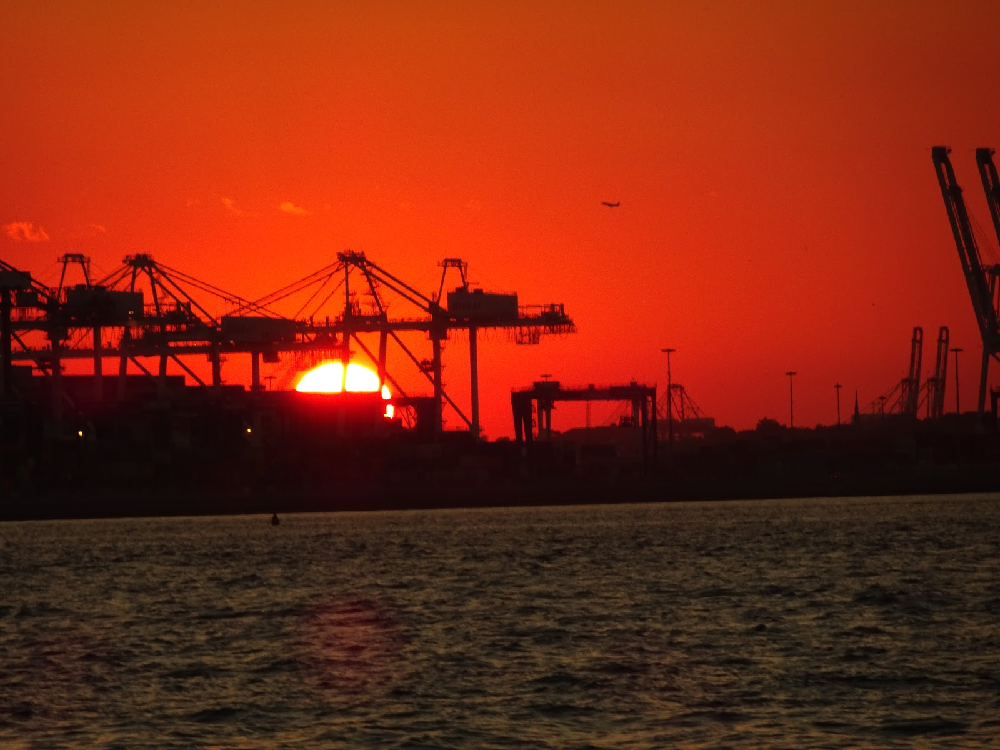
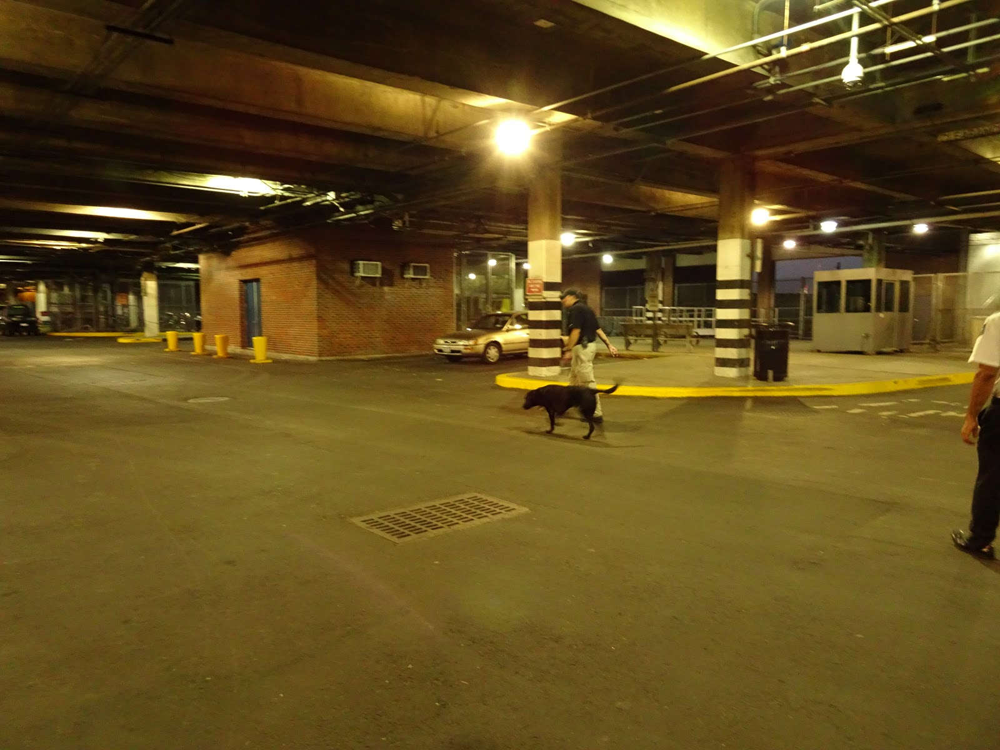
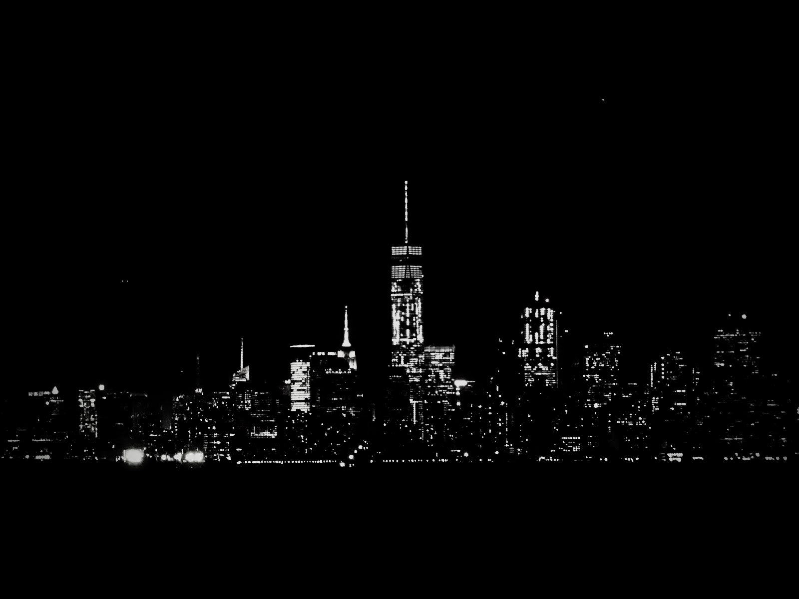
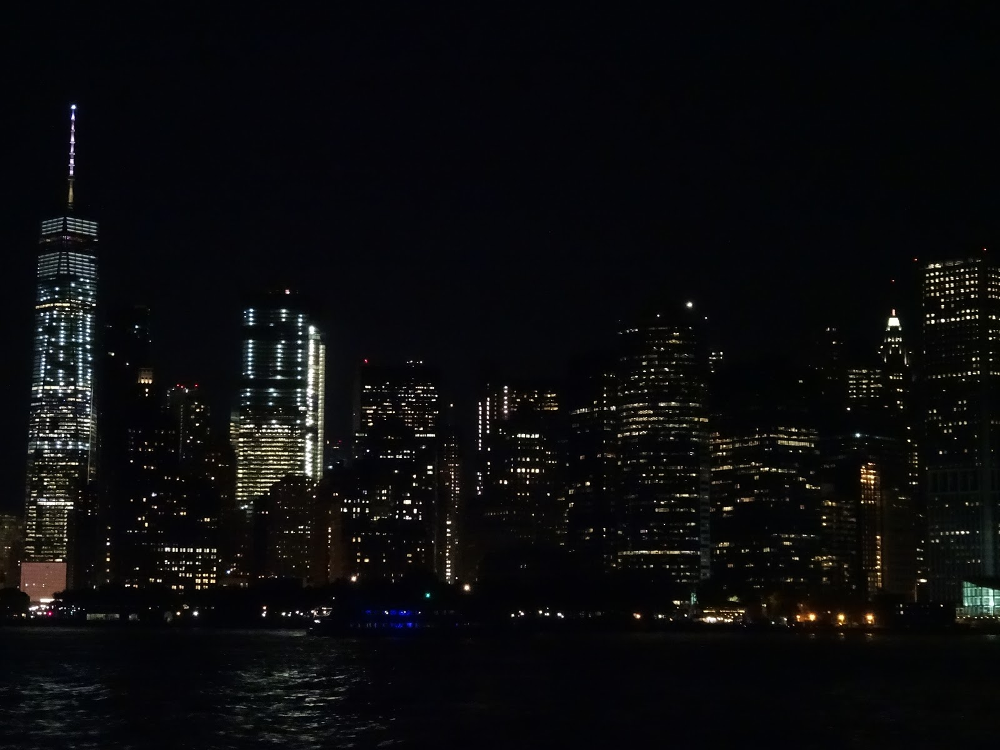

A few words about our staying in New York city. It's a really fascinating City of glass. Everybody will find something interesting in it. Undoubtedly it's worth visiting even if you don't like big cities. It's like a jungle but made of concrete. Many different people live here so I suppose. It must be a place of tolerance and equality. 4 buy cars the roads in New York are really friendly. As for such huge city the traffic allows bikers to ride very smoothly among the cars. Drivers are very careful and they treat bikers as an equal participant of the traffic. In the center they're more bike lanes usually on the left side of the road and they're great bike lanes on the bridges to Manhattan. Mostly cyclists do not care about red lights but they pass crossing carefully. That's amazing for me because in Poland we usually have bike lanes guitar situated next to the pavement are you have to share the pavement with pedestrians and you are not allowed to ride on the road. If you do drivers will stop and shout at you or curse. They will even try to scare you by driving really close to you. Riding on pavement means a really slow ride because pedestrians' noses are stuck in smartphones so you have to be very careful. 
People are very mannerly and friendly even if you are pink or blue, wearing trousers on your head ;) . Respond sometime on the streets of Brooklyn where many Polish people live. You can find many polish products there and stuff but the prices are really high so we decided to eat burgers instead of buying the proper food. In New York we spend 4 days but it wasn't enough to see everything. Of course bike helped us to be faster than walkers but we still missed some worth visiting places. Every street and building has its own individual look. At night there are amazing views on Manhattan from Brooklyn and Staten Island Ferry as you can see in the pictures below. We couldn't afford to go up the Empire State Building to see Panorama of the city because its costs $30 per person however we found free Staten Island Ferry that took us 2 Staten Island and during the cruise we watched the sunset in the background of the Statue of Liberty and on the way back we saw spectacular sparkling city. Central Park a disappointment because taxi cabs are allowed to drive through it so all the peace is destroyed. There aren't many plants or trees and most of the area fenced. However we have been to great concert on the Great Lawn in Central Park. Global citizen Festival took place on 24th September. We enjoyed the performances of Eddie Vedder and Metallica. On the way back we walked through Times Square but I think it's just a waste of energy and money especially I felt very sad when I saw poor homeless people lying on the ground underneath the super happy smiley faces in moving billboards.

```grid|4




```
```grid|2


```
```grid|3



```
```grid|4




```
```grid|3



```
```grid|4




```
```grid|3



```
```grid|4



```

