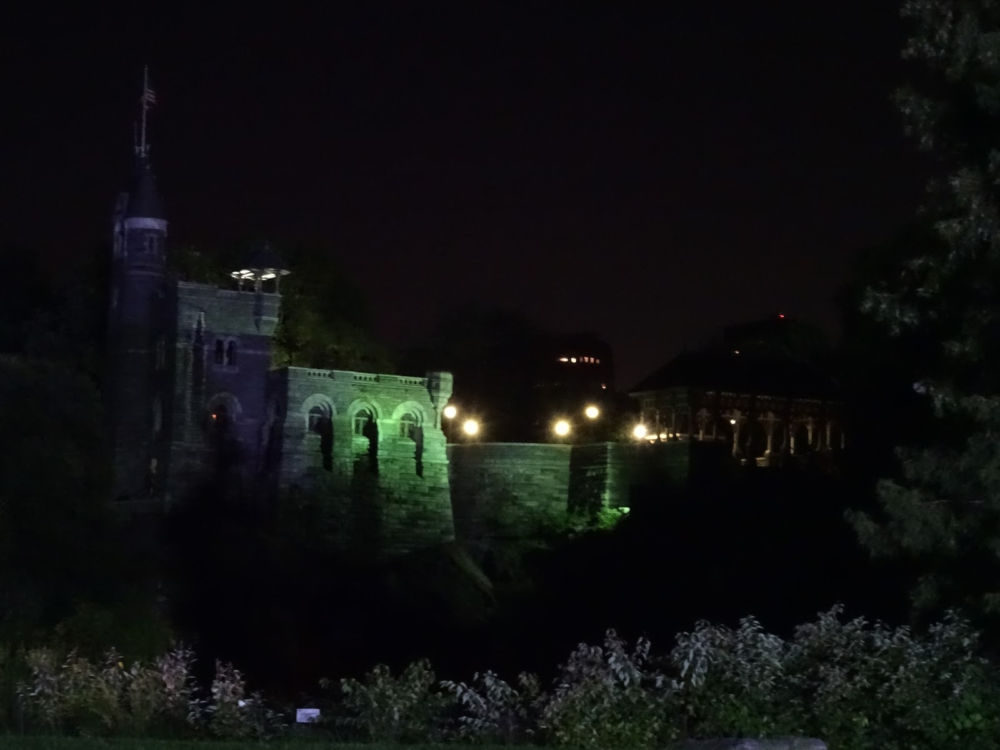

Wpis o kilku chwilach życia w Nowym Jorku. To fascynujące szklane miasto jest stworzone dla wszystkich, każdy znajdzie tu swój kąt, black or white, pink or blue i jest bardzo przyjazne rowerzystom od samego lotniska JFK. Po pierwszych kilometrach można poczuć ten zew istnienia w takim pełnym wszystkiego i wszystkich miejscu, i ten pęd jak najdalej najszybciej przed siebie. Wyjątkowo w Nowym Jorku można sobie pozwolić na przejazdy rowerem na czerwonym przez każde skrzyżowanie i nikt nie będzie buczał. Wiadomo, że jak police stoi obok Ciebie to nie wypada się pchać. Nigdy nie zrozumiem dlaczego w Polsce trzeba jeździć po chodniku, być może dlatego, że kierowcy aut na naszych drogach są bardzo mało przyjaźni rowerzystom, jeżdżą za szybko i nie potrafią wymijać, a w NYC samochody są bardzo ostrożne i cały ruch uliczny sprawnie działa pomimo wielu uczestników.
Ludzie są bardzo uprzejmi i życzliwi dla każdego koloru skóry i wyznania, nawet jakbyś ubrał beret i podkolanówki. Każdy chętnie pogada, doradzi, pomoże. Tak jak Natalia mieszkaliśmy w Brooklinie, gdzie jest bardzo dużo Polaków i polskich różności w sklepach, a gołąbki i schabowy w restauracjach. Ceny jak zwykle powalają dopóki nie przestaniesz przeliczać na złotówki, a przy kasie doliczany jest jeszcze podatek :/ .Stwierdziliśmy, że odpowiednikiem baru mlecznego jest mak. Niestety taniej było zjeść hamburgera niż gołębia. Hamburgery i frytki to w US takie jedzenie dla biednych. ;) Woda z kranu pitna i nawet dobra. 
Kilka cen z pamięci:

|Co|Cena
|---|---|
|piwo 0,7 | $2
|chleb | $2
|banany | 0,59/lbs (0,5kg)
|2 hamburgery | $3
|puszka sardynek | $1
|ryż | $1
|tuńczyk | $3
|warzywa mrożone | $2.19
|dwa średnie pomidory | $1.82
|żel do mycia | $2

Do zwiedzania  jest wuchta miejsc. Każda ulica, budynek ma swój urok. Najbardziej podobał mi się prom płynący na Staten Island, z którego widać w oddali samotną Statue Wolności i Manhattan, tym bardziej, że można na niego zabrać rower :) W drodze do Central Parku można przejść przez szalony mrygający Times Square. Aby popodziwiać panoramę NYC można wybrać się na jeden z manhattańskich wieżowców. 30 dolców kosztuje przejazd windą na szczyt Empire State Building, dlatego obejrzeliśmy tylko jego parter. Od drapaczy chmur może zakręcić się w głowie i człowiek traci całkiem orientacje. Tak się też stało jak szukaliśmy dziur po world trade center. 

<grid columns="2">

</grid>
<grid>

</grid>

