Po męczącej podróży dotarliśmy do serca argentyńskiej Patagonii, miasta San Carlos De Bariloche, była 3 w nocy, więc rozbiliśmy się tuż przed miastem. Nawet w środku nocy, gwieździste niebo, światła miasta, a pośrodku piękne jezioro zrobiły na nas wielkie wrażenie.
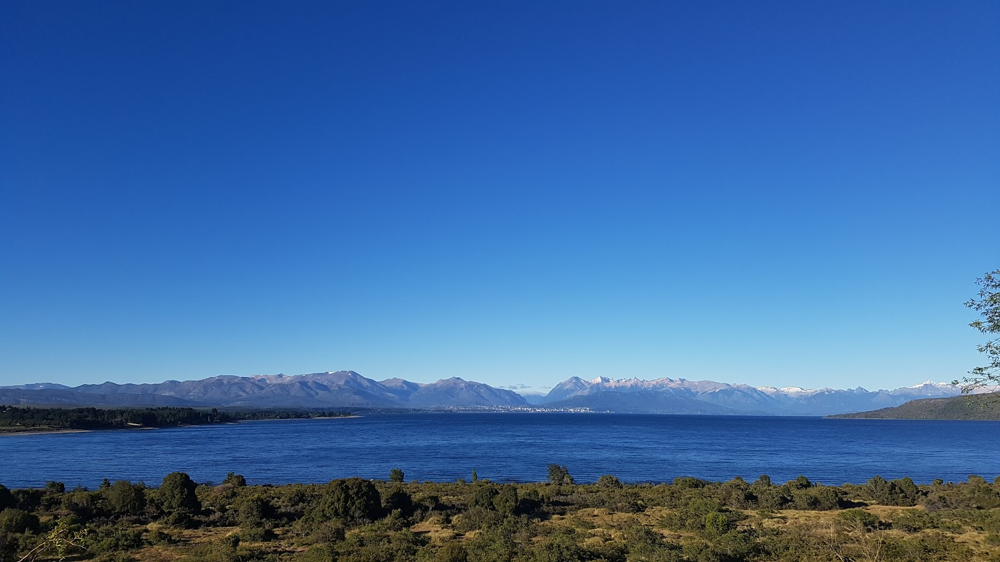
Na następny dzień zdecydowaliśmy się ruszyć na północ, szlakiem 7 jezior, który standardowo prowadzi od Villa La Angostura do San Martin de Los Andes. Chcieliśmy znaleźć miejsce na ognisko, więc zdecydowaliśmy się przejechać około 50-60 km na trasie Bariloche - Villa La Angostura, tak by zatrzymać się przed miastem.
Po kilku kilometrach zrozumieliśmy czemu nazywa się ten region świata najbardziej wietrznym. Jechaliśmy pod wiatr (wiatr wieje prawie zawsze z Chile), suchy piasek okalający te góry unosił się w powietrzu i męczył nas bezlitośnie. Kilometry dłużyły się niemiłosiernie, nasza średnia pierwszego dnia wyniosła ledwo 12km/h (w USA mieliśmy średnią 21 km/h).
Przejechaliśmy około 55km i zobaczyliśmy naszą nagrodę. Pusta, piaszczysta plaża tuż przy jeziorze, z pięknym widokiem na góry. Nie mogliśmy uwierzyć w to co widzimy. Udało się, czas na ognisko, czas na świętowanie Pati urodzin :). Wino, chorizo, chlebek z pasztetem, serek, niezapomniane widoki i piękna pogoda!
```grid|2
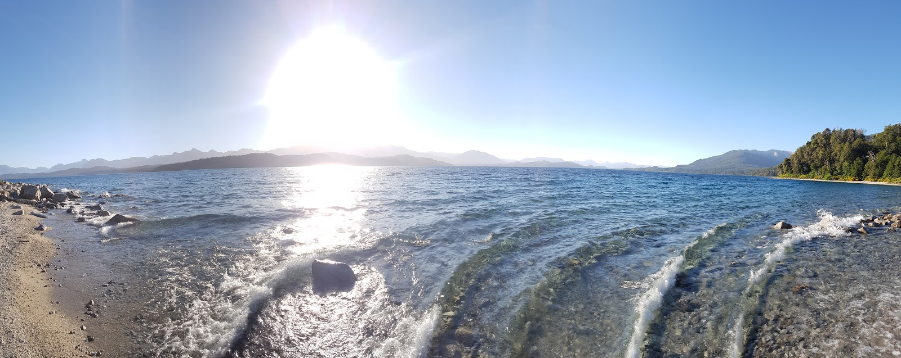
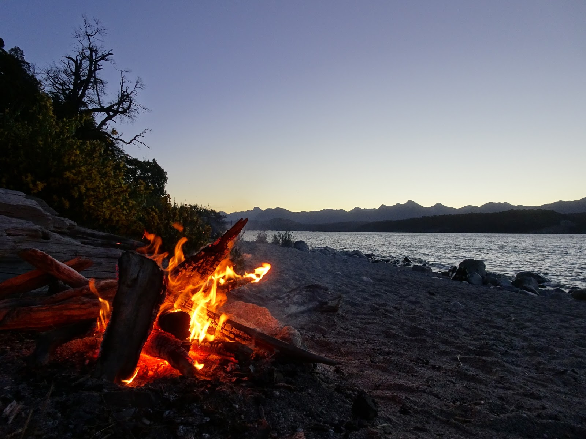
```
Drugi dzień objazdu po Patagonii rozpoczęliśmy tuż przed południem, zmęczeni wczorajszą podróżą. Trasa górzysta, ale zaczęła się kraina 7 jezior. Góry pokryte lasami, my osłonęci od strug wiatru, jechało się dużo, dużo lepiej. Dotarliśmy do Villa La Angostura, prognoza pogody mówiła, że niedługo ma padać, więc po przejechaniu 25km decydujemy szukać miejsca na nocleg. Znów znajdujemy plażę, rozbijamy namiot, robimy ognisko, a na nim pyrki. Gdy deszcz zaczyna padać my już jesteśmy najedzeni i gotowi do schowania się w namiocie.

```grid|2


```
Kolejnego ranka, około południa, widzimy pierwsze przebłyski słońca, jesteśmy gotowi do drogi. Tego dnia na naszej trasie znalazły się 4 górskie jeziora, a w każdej z tafli wody odbijały się, zapierające dech w piersiach, potężne góry.
W połowie drogi zjechaliśmy z "oficjalnej" trasy 7 jezior i zdecydowaliśmy się ruszyć ku innemu jezioru, by zrobić mniejsze okrążenie. Zmusiła nas do tego prognoza pogody, wedle której za kilka dni pogoda miała się diametralnie zmienić, zimno i deszcz.
Skończyła się asfaltowa droga, trasa teraz była wykuta w górze, pokryta kamieniami i piachem.

Jechało się ciężko, ale w zamian za to otrzymaliśmy kolejną porcję pięknych widoków i brak sterty wyprzedzających nas aut. Ten pewnego rodzaju żużel miał trwać zaledwie 30km, jednak w wietrznych górach, z sakwami, 30 km, to dystans spory. Ten dzień zakończyliśmy pokonując 60 kilometrów.
```grid|2
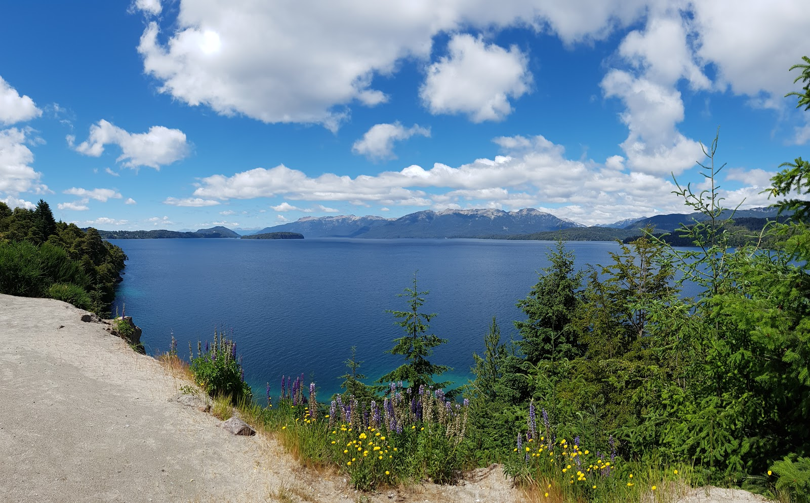
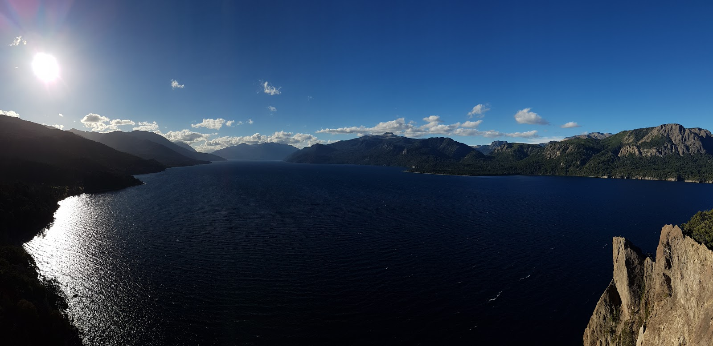
```
O poranku rozpaliliśmy kolejne ognisko, by przygotować sobie pyszną kawkę, zjeść ciepłą bułkę i owsiankę. Pierwszą połową dnia pokonaliśmy przełęczą wzdłuż rzeki. Po prawej stronie góry, po lewej góry, a my po środku, 700m niżej.
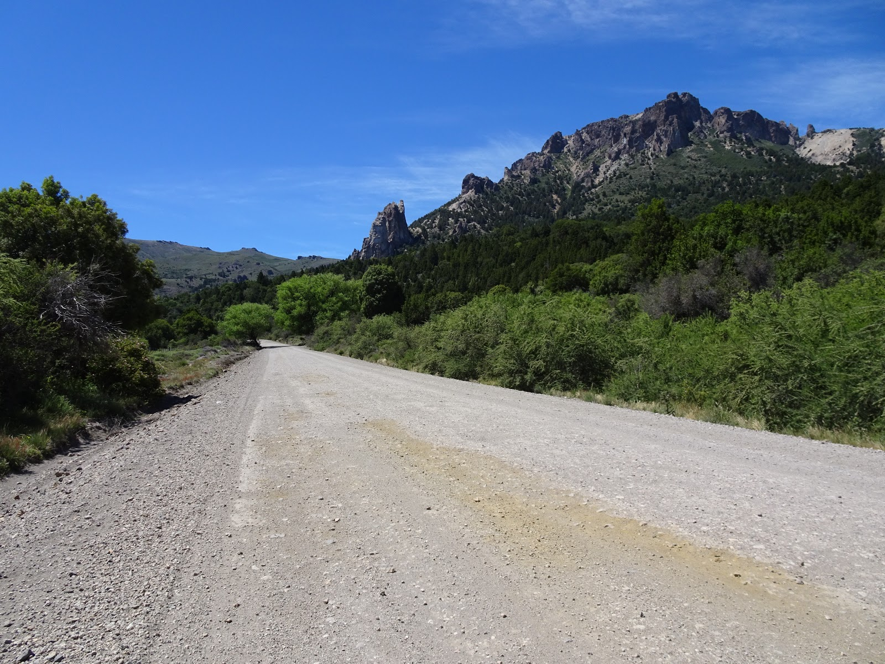
Dzień zakończyliśmy tym razem śpiąc nad rwącym potokiem, kolejnego ranka ruszyliśmy do Bariloche, by odwiedzić Felicitas, która zaoferowała nam swoją pomoc i schronienie na kilka dni, tak by przeczekać gorszą pogodę.

Na koniec zapraszamy do oglądania zdjęć.
Filmy, hmmm, mamy nadzieję, że niedługo, jak tylko znajdziemy łącze internetową, poprzez które będziemy w stanie je przesłać!
Pozdrawiamy!

```grid|4

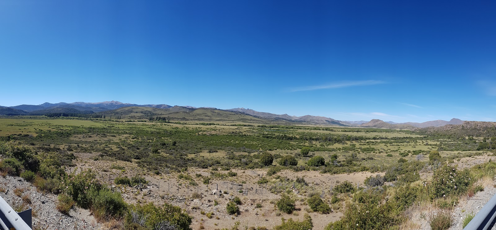


```
```grid|2

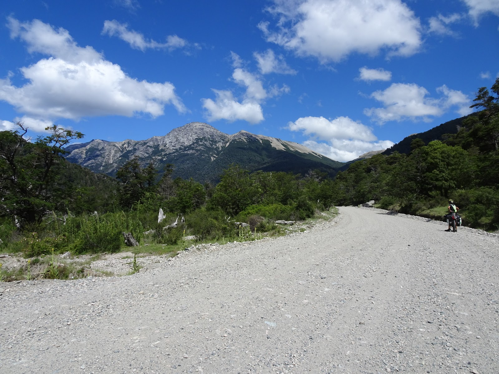
```
```grid|2
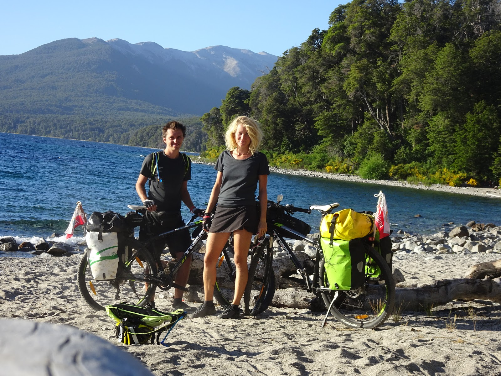
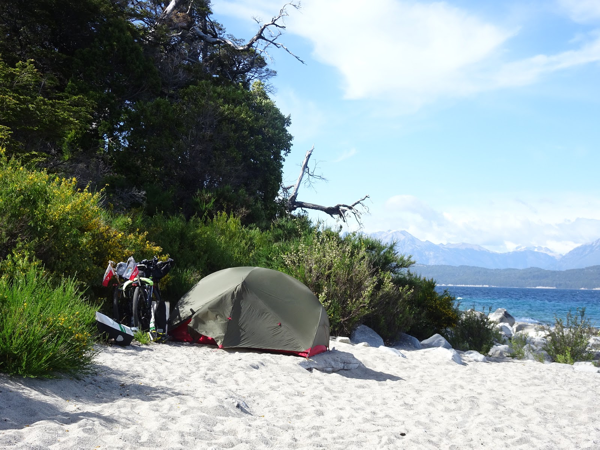
```
```grid|3


```
<sphere>img_20161217_142410.vr.jpg</sphere>

```grid|3


```
```grid|2

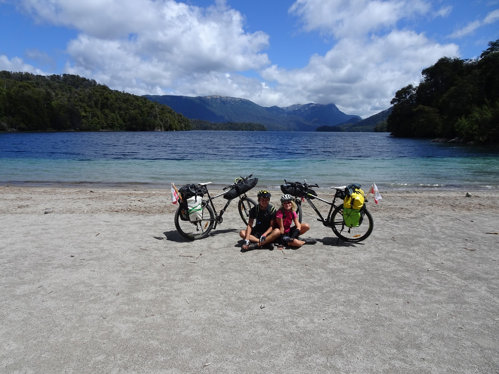
```
```grid|3
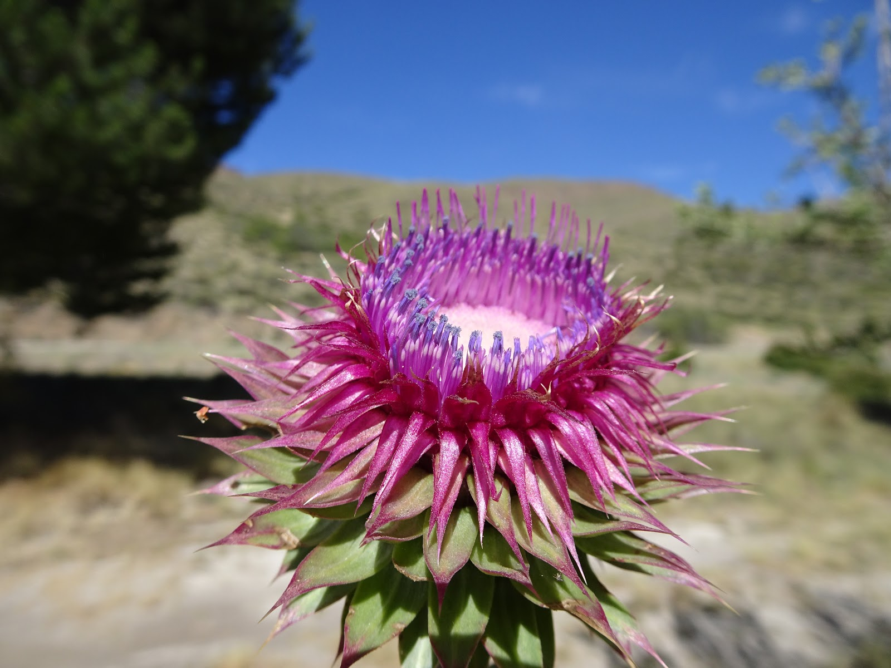


```


<gpx>
2016-12-15-09-49-52.geojson_bike;
2016-12-15-14-43-21.geojson_bike;
2016-12-16-12-49-48.geojson_bike;
2016-12-16-15-05-04.geojson_bike;
2016-12-17-11-42-14.geojson_bike;
2016-12-18-10-59-46.geojson_bike;
2016-12-19-10-52-51.geojson_bike;
</gpx>
