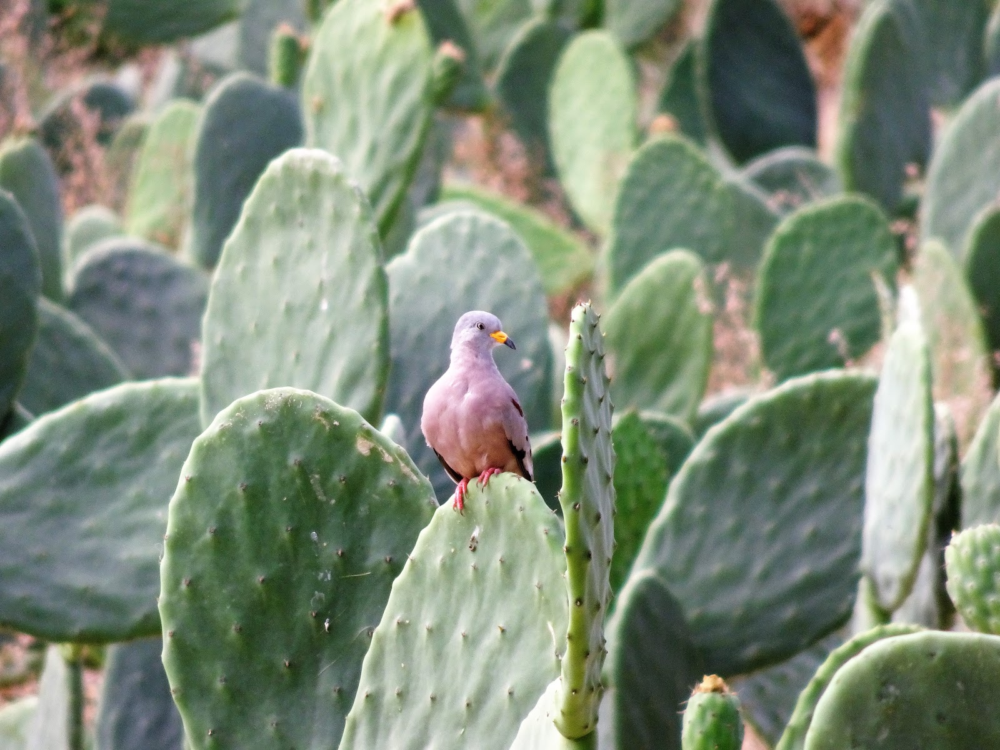
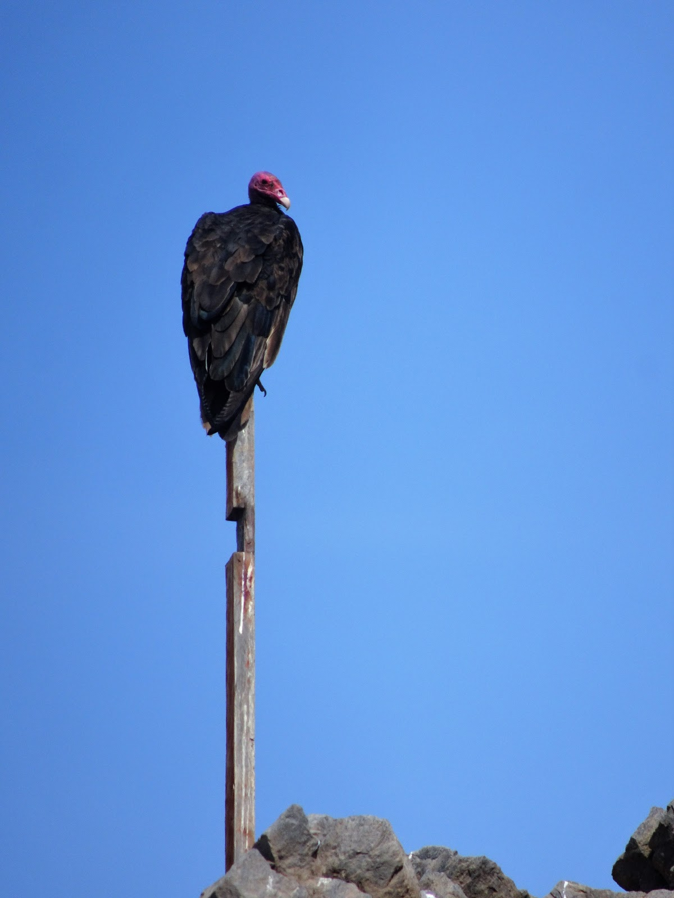
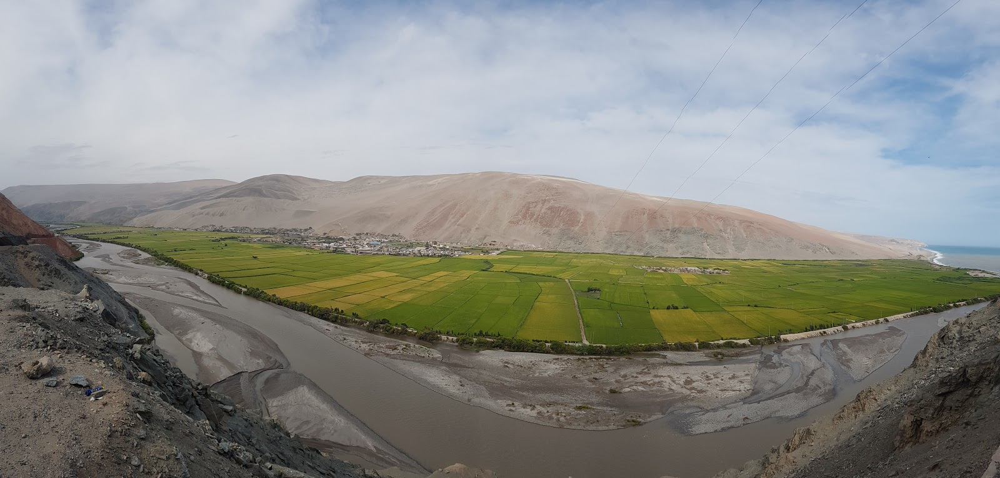
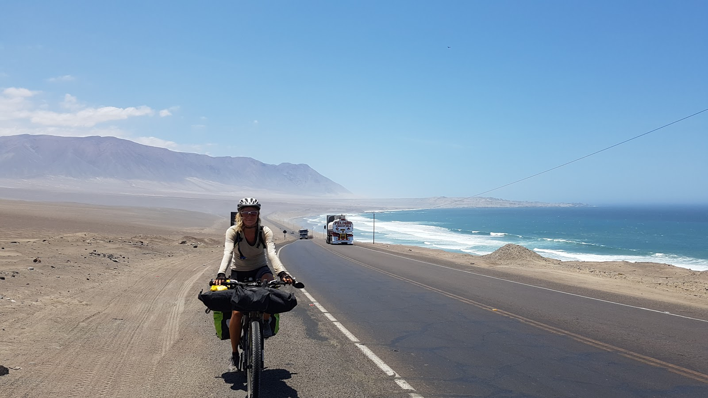

Jak się żyło i jeździło w Peru? Zapraszamy do obejrzenia video oraz zdjęć z wycieczki wzdłuż Pacyfiku :) Mała historyjka poniżej.


Na granicy Chile-Peru zobaczyliśmy sznur stojących, trąbiących aut... "Zamknęli przejście, czy co?"- pomyślałam, widząc ten bezruch. Gdy minęliśmy wszystkie auta i dojechaliśmy do owego budynku celnego przestraszył nas kolejny długi wąż ludzi czekających w kolejce na niezbędny papierek i pieczątkę pozwalającą na wyjazd z Chile. 


Jedni cierpliwie stali, a drudzy siedzieli sobie na murkach jedząc i rozmawiając...  "O co kaman?"- pomyślałam ... a my na tych rowerach nawet nie wiedzieliśmy, gdzie i jak stanąć w tej kolejce. "Ja czekać nie będę" - pomyślałam idąc w stronę strażnika porządku w zielonym kubraczku. Uśmiechając się, pełna optymizmu podchodzę do gościa i bablam po hiszpańsku, że mamy długą drogę przed nami, a rowerem się dłużej jedzie niż samochodem i proszę o pomoc w przejściu tej kolejki i przyśpieszenie procedury. A on na to, że nie mam co się martwić o czas, bo wkraczając do Peru zyskam dwie godziny. Zgasił mnie jak piwo pragnienie ;) "Zyskam dwie godziny? Ha! Podróż w czasie." Załamana pomyślałam, że ta zmiana czasu jest zupełnie bez sensu, bo ok. 18 zaczynie się robić ciemno i to latem... o 19 już nic nie widać. 
Wracając do problemu kolejki i ludzi bezradnych zupełnie jak ja, obserwowałam tych biedaków ze smutaśną miną i zmarszczoną twarzą. "Jak to wszystko może tak długo trwać?" Nagle jakiś pan podszedł do mnie i powiedział, żebym udała się do okienka nr 5 i pogadała z urzędnikiem. Szybko się zawinęłam i zamieniłam zmartwiony grymas w słodki uśmiech. Grzecznie się przywitałam z panem urzędnikiem. Miły pan zapytał o kartę pojazdu, którą się wypełnia przed podejściem do okienka, a ja na to, że nie mamy takiej karty, bo jesteśmy na rowerach, a to nie jakiś wielki pojazd tylko... no rowerek, dwa kółka, siodełko, kierownica, nic skomplikowanego, żeby musiało mieć kartę pojazdu. Pan jednak pokazał nam, gdzie mamy ją załatwić. Dla upewnienia jeszcze raz zapytałam i podkreśliłam, że musimy w tamtym budynku załatwić kartę pojazdu dla rowerów. Po chwili stwierdził, że jednak nam podbije paszporty i ta karta w sumie nie jest nam potrzebna i nas przepchnął przez granice :) . Chyba ustanowił nowe prawo dla rowerzystów, bo w kolejnych stadiach przejścia przez granicę każdy robił duże oczy, kiedy mówiłam, że taka karta nie jest potrzebna. I jak powiedziałam, że nie mamy żadnych produktów spożywczych to też uwierzyli i nie sprawdzili naszego bagażu, co by pewnie zajęło godzinę.  
Już nie mogłam się doczekać jak zobaczę peruwiańskie domy i ludzi. Zastanawiałam się, jak bardzo się różnią od Argentyńczyków lub Chilijczyków. Po kilku kilometrach pustynnej pustki pojawiały się dziwne małe wolnostojące domki, a raczej klocki murowane bez dachu. "Czy ktoś tu w ogóle może mieszkać na takim za!#$%& ?"

```grid|3


```

Jak mi później wyjaśniono, taki budyneczek świadczy o tym, że ziemia na której stoi należy do kogoś. Czasami widziałam same wybudowane narożniki. Przez całą drogę zastanawiałam się na co komu te betonowe okropne budynki i ten suchy pioch...
Po kilkudziesięciu kilometrach dotarliśmy do Tacny, (miasteczka opisanego<a href="http://velomelon.com/2017/03/09/nasza-peruwianska-mamuska/"> TUTAJ</a> )
Będąc tam mieliśmy zdecydować, gdzie dalej jechać. W wiadomościach z TV dowiedzieliśmy się o deszczu i powodziach w górach, zatem zdecydowaliśmy się ruszyć wzdłuż wybrzeża oceanu, biwakując od plaży do plaży. Na zdjęciu jedna z najpiękniesych plaż w Peru Playa Arena Blaca :) 


Miesiąc w Peru zapowiadał się świetnie, codziennie plaża, kąpiel w oceanie, piękne zachody słońca... :) 
Jednak ten odcinek Tacna-Lima, 1 400 km, zaliczam do najbardziej wymagającego etapu naszej wyprawy, który nas wykończył fizycznie i psychicznie (nasze rowery również; całe zardzewiały) Palące słońce, górzysta droga, dużo wspinaczek i zjazdów po serpentynach, curvy peligrosy, bezustannie trąbiący kierowcy...  wszyscy trąbią na siebie, na ciebie, więc co chwila słyszysz beeep beeep i masz ochotę też zatrąbić, ale komuś w łeb ;)...
... ale widoki były przepiękne.


Po ilości przydrożnych nagrobków można było stwierdzić, że ludzie zbyt szybko tu jeżdżą, a przecież Peruwiańczycy nie mają we krwi takiego pośpiechu co my. Są leniwi, na luzie i na wszystko mają czas. Większość zakrętów była ozdobiona krzyżami lub nawet czaszkami, a po ilości wysypanej na drodze cebuli widać było, że tiry też nie lubią zwalniać przed zakrętem. 

```grid|3


```

Na ostatnim zdjęciu można przyuważyć pepsi nalaną w kubeczku. Nikt nie był mi wstanie wyjaśnić tej tradycji. Sama sobie wymyśliłam, że nawet trup może odczuwać pragnienie na takiej pustyni. Koło jednego nagrobka w Chile leżało ze sto butelek. 


<sphere>img_20170208_123151.vr.jpg</sphere>

Jak tu ochłonąć na pustyni po wspinaczce, gdy nie ma nawet cienia. Zatrzymując się na odpoczynek, wiatr ustaje i piasek staje się żarzącym się węglem. Piliśmy bardzo dużo wody, smarowaliśmy się filtrami przeciwsłonecznymi, ale i tak nie udało się uniknąć bólu głowy, gorączki, oparzeń słonecznych, czy odwodnienia. Codziennie potrzebowaliśmy ok. 14 litrów wody, do picia, gotowania itd. Aby zaoszczędzić kasę, braliśmy wodę z kranów na stacjach benzynowych. Czasami była to konieczność, bo nie było sklepu. Nie każda woda była zdatna do picia, więc czasami kończyło się sprintem do toalety. Najbliższym miejscem do spoczynku była zazwyczaj plaża, bo na pustyni nie było, gdzie się schować. Zatem wybieraliśmy plaże w miasteczkach, aby coś jeszcze udało się kupić do jedzenia. Po ciężkim dniu pedałowania w upale i smrodzie wywalanych przy drodze śmieci, czy zwierząt dane mi było się targować o pomidory, chleb, piwo. Panie z targu (mercado) jak widzą, że przyszła biała blondyna to podają kosmiczne ceny. Mamy powiedzenie, że "wymyślasz jak Peruwiańczyk", bo pytając o cenę, Pani sprzedawczyni myślała chwilę i podawała zazwyczaj zawyżoną cenę produktu. Pytałam- "A dlaczego piwo za 6 soli skoro na plakacie jest za pięć?" a pani na to "Zimne piwo jest za 6 soli." A ja na to-"na plakacie jest piwo w lodzie pokazane, czyli zimne"-kombinowałam. Tylko raz wyszło na "moje". 


Jak ktoś mnie obudzi w środku nocy, potrafię wyrecytować cenę każdego produktu w Peru. W sklepach nie było etykiet z ceną, co dopiero na tych bazarach. Handlarze potrafili mi podać 5 różnych cen za tą samą wodę. Robienie zakupów było zatem bardzo czasochłonne. Czasami baby były tak uparte, że nie chciały zejść z ceny, chociaż była zawyżona.  
Na każdej plaży w mieście, czy w miasteczku dudniła muzyka Latino od zmroku do świtu. Zazwyczaj jak się rozbijaliśmy z dala od dyskotek, ludzie podjeżdżali autami z muzą, albo przynosili boom-box'y i puszczali muzykę na całą epę, najgłośniej jak się dało. Nie mogliśmy spać. Rano czułam się jakbym całą noc balowała. Nie mieliśmy szans odpocząć. Do tego ci ludzie, plażowicze = krzyki, śpiewy i wszelkie inne formy robienia hałasu doprowadzały nas do szału. Rozumieliśmy, że to ich wakacje, więc nie prosiliśmy o ciszę. Większość towarzystwa przyjeżdżała autobusami z gór. W pamięci zapadły mi babcie uczesnane na dwa warkocze, które na końcu były połączone pomponami, a ubrane były w tradycyjne spódnice, wełniane rajstopy.

```grid|2


```

 Były też rodziny co przyjeżdżały za dnia rozstawiały namioty, stoły, krzesła, rozpalali grilla i zwijali się o zmroku. Raz poznaliśmy taka rodzinkę, która do nas zagadała, bo spodobał im się nasz improwizowany daszek chroniący przed słońcem z plandeki. Starsza pani z towarzystwa przypomniała sobie dawne czasy jak razem z mężem spędzali czas na plaży tak jak my pod plandeka :) 
Czasami udawało się przespać na bezludnej plaży, ale też zdarzały się niespodzianki jak np. nagle w środku nocy naście psów zaczęło obszczekiwać nasz namiot, aż strach było wyjść, albo podjeżdżał tir i rąbał silnikiem. Do tego nie wszędzie mieliśmy okazję na kąpiel, bo ocean pomimo że nosi nazwę Spokojny był strasznie burzliwy i ogromne fale, które uderzały o brzeg mogły cię wciągnąć na zawsze. 


Po jakimś czasie nasz smród bił wszelkie zapachy po drodze :) Właśnie tu ów wątek śmieci należy podjąć. Szczerze mówiąc, Peru to najbrzydszy kraj w jakim byłam. Jest tylko ładne tam gdzie nie ma ludzi. Ludzie śmiecą na lewo i prawo, przed sobą i za sobą. Wyrzucają wszystko przez samochodowe okna, od butelek po płyty CD i pieluchy. Raz zapytałam, dlaczego tak robią, to uzyskałam odpowiedz, żeby uwolnić ręce. Na prawdę, straszny to widok i smród. Są też tacy śmieciarze co śmiecą z premedytacją i wyrzucają śmieci w rowach np. psa w worku albo mln butelek... Smród po drodze jest niewyobrażalny. Na dodatek palą wysypiska śmieci, plastik nie plastik, wszystko. 

```grid|3


```

Jedyne czyste miejsca na naszej drodze to były pola. Tak, pola uprawne na pustyni. Mijaliśmy pola ryżu, papryczki chili i kaktusów. To dzięki spływającym z dalekich gór rzekom można nawadniać te pola systemem kanałów i kanalików. Byłam bardzo mile zaskoczona jadąc przez pustkowie, gdy nagle za zakrętu wyłoniła mi się zielona szachownica.

```grid|2


```
```grid|3


```

Pojawiały się też zwierzątka :) Owieczki, konie i multum piesków :) Gdy jedliśmy owsiankę w przerwie przy polu kaktusowym, zobaczyłam, że w oddali na kaktusie siedzi jakiś fajny ptaszek (mam świra na punkcie ptaków od jakiegoś czasu) i pomyślałam, że to jakiś nie znany mi ptak pustelnik, który bez problemu znosi trudy życia w takim miejscu i do tego siedzi na kaktusie! Musi to być jakiś fajny gatunek. Sięgnęłam szybko po aparat, zrobiłam zoom'a i pstryk.



Mam gołębia ;) Po chwili pojawiło się miasteczko, gdzie było pełno stoisk z kaktusowymi owocami, które nazywają tuna ( to jak tuńczyk po angielsku ;) ) W smaku jest podobny do kiwi, ale ma tyle twardych pestek, że człowiek nie jest w stanie ich wypluć, więc pozostaje je połknąć... i tak wyrosły nam kaktusy na głowach ;)
Trochę długi ten post, więc kończę i resztę napiszę wkrótce :) 

```grid|3


```
```grid|4


```
```grid|2


```
```grid|5


```
```grid|3


```
```grid|2


```
```grid|6


```
```grid|4


```
```grid|3


```
```grid|5


```
```grid|3


```
```grid|2


```
```grid|3


```
```grid|6


```
```grid|4


```
```grid|2


```
```grid|3


```
```grid|3


```
```grid|2


```
```grid|5


```
```grid|4


```
```grid|6


```
```grid|3


```
```grid|5





```
```grid|2


```
```grid|4


```
```grid|3


```
```grid|5




```
```grid|3


```
```grid|5


```
```grid|2


```
```grid|4



```
```grid|6


```
```grid|3


```
```grid|2


```
