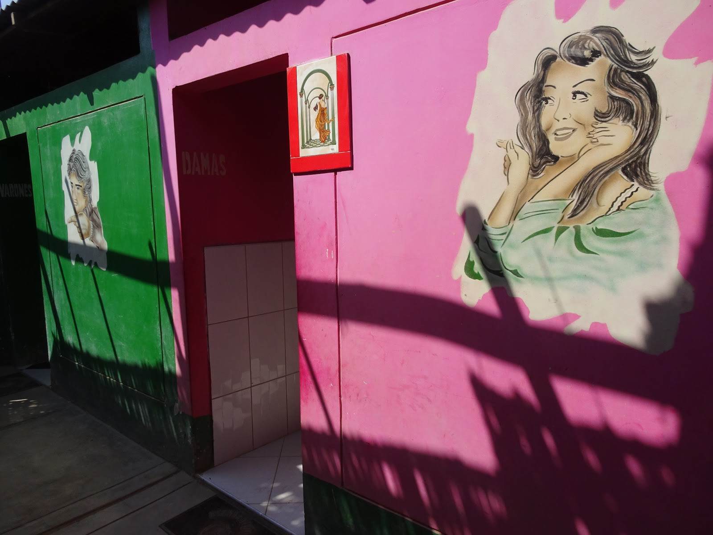

WARNING! DO NOT READ IF HUNGRY ;) This post contains delicious material. ;)

The first stop in Peru was a commercial city Tacna. Martin hosted us in his house where he lives with his mother and brother. Although there wasn't enough space for us inside the building, he invited us and we pitched the ten on the roof :)
 

In western Peru most of the houses have unique design because they are very narrow and long, and they look as they were unfinished because there is no roof and you can see pipes and wires on the top of the building. 

In this dry area people do not need a particular roof so they can build another floor whenever they want. 

Martin's mom welcomed us very kindly. She was hugging us and kissing as we were her children that had been gone for a long time and she was expecting us to be back. She said that we could stay as long as we want. We were very happy of this fact because we wanted to find out more about Peru and it was much easier with friendly people like Martin and his family. 
When we went to the city center to buy a sim-card and exchange money, we experienced unknown world. Tacna is a very busy city because of many duty-free shops. Even people from Chile come for shopping. There are many buses on the streets, people selling something and everything on sidewalks and foodbrellas (is my neologism ;) ) where you can eat something or drink famous chicha, a drink made of purple corn. It's very crowded, loud, and without Martin I would lose my mind ;)

<grid>

</grid>

Because of this shopping spree you have to be very careful walking around the city. Drivers do not pay attentions to pedestrians and all over the country you must give way to car or you can become a pancake. ;)

The next day our mom prepared delicious breakfast called MAJAO which is very simple but yummy!!! We were very surprised because it was a banana but a green one and not sweet. I wish we could have those in Poland. Fried banana with onion :) 

Then we went together to the city center to walk around a little bit and she took us to archaeological park :) On our way there we stopped for a lunch. I was happy when I found out that I don't have to eat the Peruvian fabulous dish that is a guinea pig CUY AL HORNO :)

Instead in the menu there were spicy intestines (I'm not fond of them and in Poland many people, including my dad, like soup made of pork intestines, yucky! ;) ) Luckily, on a plate there was also a piece of chicken and pork on a hill of green rice :) and a soup as a starter, Cazuela de Gallina, and my favorite snack, roasted corn, Canchita, that stole my heart ;) 

<grid>

</grid>

Good thing in Peruvian restaurants is that you are served with generosity. The portions are so huge that can satisfy a very hungry biker and they are relatively cheap. Once we found menu, that was fried fish with rice and veggies, only for 5 soles (1.5 dollar) which is the cost of canned tuna in the shop. No wonder that many families gather in the restaurants and they enjoy their free time together and the food is really tasty and fresh. Once I peeked into the kitchen and saw big pots on fire that impressed me. They won't serve you defrosted meat because they don't have freezer :) 

After eating we didn't take a nap (siesta) like some guy ;)

We went to the park Petroglifos de Miculla where many interesting petroglyphs, drawings on rocks, can be found. They are dated on the sixth century and show fights or wars, dancing, playing instruments and wild animals. 

<grid>

</grid>

A lot of fun brought us crossing the line bridge that lacked of some planks and it was shaking above the dry river called Caplina so no lannding in the water but smashing on rocks ;)
  

We survived and the next day we met Martin's dad that brought delicious TAMALES for breakfast that is a corn cake filled with meat. 

After a nice chat we went to the city for lunch and this time we ate chicken. We had great time!!! 

Before every meal we prayed and Martin's mom asked for safety for us and good trip, it was moving. In the evenings we sat together and watched our biking movies from Poland that you can see on our [YouTube channel](https://youtube.com/velomelon). The beauty of Polish land amazed her and we were very happy that she liked it. :)

On the last day when we were about to go she asked if we could stay longer because she was preparing a special Arequipian lunch Locro de Zapallo. Of course we stayed.

When we finished eating she made surprise to Paweł and took a big chocolate cake from a fridge. It was a day before his birthday but anyway we sang birthday song to him. He was very touched. We were strangers to her and she treated us like family.

<grid>

</grid>

As you can see the cake was delicious. Oh I forgot to mention Inka Cola that is unique drink that you can find only in Peru but actually in Poland too. The taste is exactly the same but we called Oranżada :) (try to read that ;) )

We didn't want to leave and when time to say goodbye came we were about to cry because we were so spoiled with Martin's mum kindness that we felt like we weren't prepared to be lone survivors again. We rode towards west coast where we started the hardest and the most challenging part of our journey (so far).

Got you hungry? Sorry ;)

<grid>

</grid>
<grid columns="2">

</grid>
<grid>

</grid>