UWAGA! NIE CZYTAĆ NA GŁODNEGO :) Post zawiera dużo smacznych obrazków. 
Gdy wjechaliśmy do Peru pierwszym przystankiem było miasteczko Tacna. Couchgiver Martin również odpowiedział Tak Na prośbę o przyjęcie nas do swego domku. Domek, bo w środku mały wąski pokój razem z kuchnia i małą łazienką, skromny i raczej nie było miejsca dla gości, bo mieszkał tam z mamą i bratem, dlatego namiot postawiliśmy piętro wyżej na dachu :)

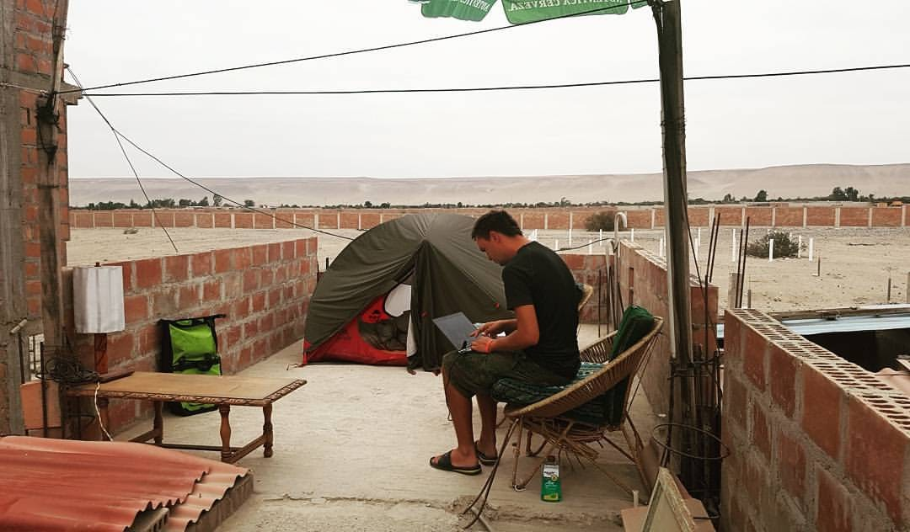

W Peru budownictwo jest dość specyficzne, ponieważ każdy buduje wąski parter i zostawia miejsce na kolejne pietra, jak będzie wypłata to się parę cegiełek dokupi ;) dlatego na wszystkich dachach jakie w Peru widzieliśmy wystają druty i rury gotowe do podłączenia w przyszłości. Do tego domy tynkowane są zazwyczaj tylko z przodu, bo po co tracić tynk i farbę na boki jak w przyszłości może się przybudować jakiś sąsiad. 

Mama Martina przywitała nas całusami i uściskami, jakbyśmy byli jej długo oczekiwanymi dziećmi, które wróciły z dalekiej podróży. Zapytała jak długo chcemy zostać, my na to dzień lub dwa, a ona zrobiła wielkie oczy i stwierdzila, że mamy możemy tydzień albo dłużej ? Rozbiliśmy się na górze i ruszyliśmy do centrum zakupić kartę sim, wymienić pieniądze itd.
Tacna to bardzo ładne miasteczko, ale bardzo głośne i zatłoczone ze względu na dużą ilość różnorodnych sklepów wolnych od cła. Po ulicach jeździ multum trąbiących busików, po chodnikach wędrują sprzedawczyki, a na miejscach parkingowych znajdują się foodbrellas, czyli coś do zjedzenia lub wypicia pod parasolem. Fenomenem jest kompot z purpurowej kukurydzy (chicha) z wiadra. Należy być bardzo ostrożnym przechodząc przez ulicę, bo niestety w całym Peru to samochód ma pierwszeństwo i jak tylko niechcący postawisz paluszki na drodze to wytrąbi cię, aż ogłuchniesz. 

<grid>

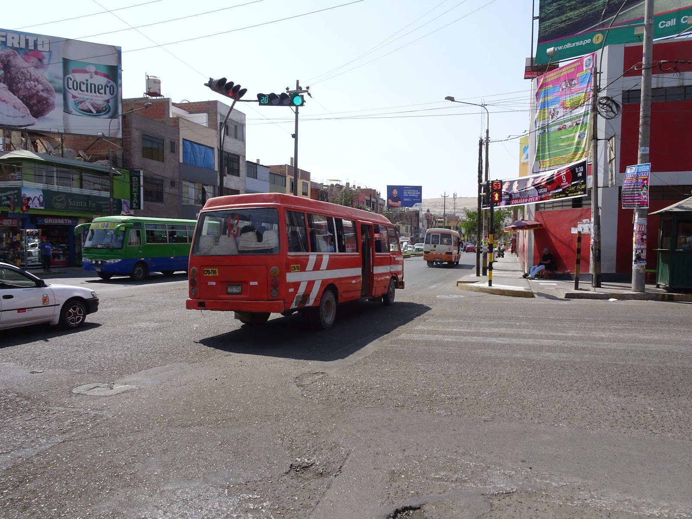
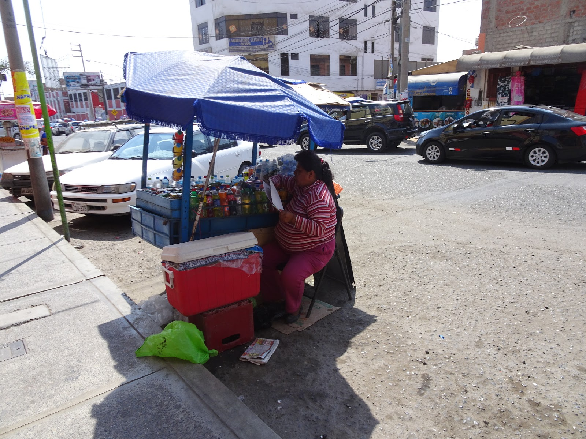

</grid>

 Na tani shopping przyjeżdża też dużo Chilijczyków w specjalnych fordach, które mieszczą 3 osoby z przodu i 10 z tyłu ? 

Nazajutrz o poranku, odszykowana w kwiecista kiece, mama przygotowała pyszne, ale proste śniadanie banan z jajkiem. Ku naszemu zaszkoczeniu banan wcale nie był słodki, gdyż to była inna odmiana banana, zielona. Danie nosi nazwę MAJAO (brakuje tam litery J i by było MAJAJO, BANAN MAJAJO ;) ) Smażony banan z ceebulką mmmmmm.

 po czym zabrała nas do centrum winszując naszej miłości i kazała nam zrobić sobie zdjęcie z tym kiczowatym sercem ;) 

a następnie wybraliśmy się do pobliskiego parku petroglifów. Po drodze zatrzymaliśmy się w restauracji na lunch :) Obawiałam się, że w menu będzie bardzo popularna pieczona świnka morska, CUY AL HORNO

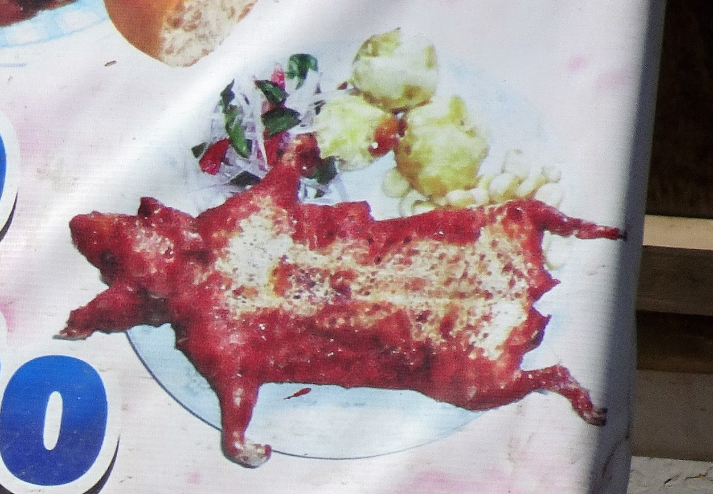

 ale na szczęście były flaki w sosie ?(yh) Picante a la Tacneña, kurczak i kawałek wieprzowiny i góra zielonego ryżu (zielony, bo z kolendrą, drugie yh ;) ).

<grid>

</grid>

Do tego, na pierwsze danie, talerz zupy, Cazuela de Gallina, i na zagrychę pyszna prażona kukurydza, Canchita, która podbiła moje serce i jest na drugim miejscu moich ulubionych przekąsek zaraz po popcornie :)  Nie dałam rady wszystkiego zmieścić i część jedzenia zabraliśmy ze sobą. Peruwiańskie porcje zadowolą największego głodomora, a tym bardziej głodnego cyklistę. Jedzenie w restauracji jest stosunkowo tanie i pyszne, dlatego też, gdy wybija pora lunchu wszyscy zbierają się do restauracji, rodziny, starsi, młodsi, robole i ci co roboty nie mają. Raz znaleźliśmy jadłodajnie, gdzie można było zjeść za 5 soli, czyli 6 złotych !!! i to pyszną świeżą rybę na górze ryżu i warzyw i kompot na popicie też dali. Dla porównania za 5 soli w sklepie kupowaliśmy puszkę tuńczyka.
A zaraz po posiłku siesta :)

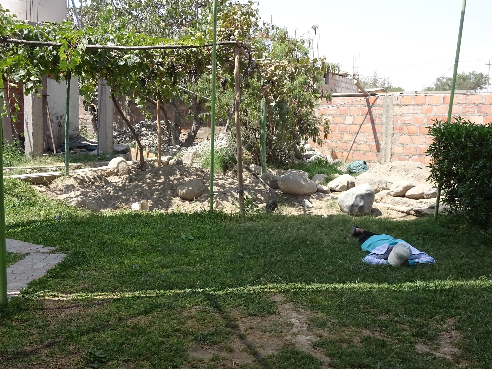

Chodząc po pustynnym parku, Petroglifos de Miculla, co krok odkrywaliśmy nowe rysunki na ogromnych kamieniach i skałach wyrzeźbione 1500 lat temu przez tutejsza ludność. Przedstawiały ich codzienne czynności, tańce, walki i zwierzęta. 

<grid>

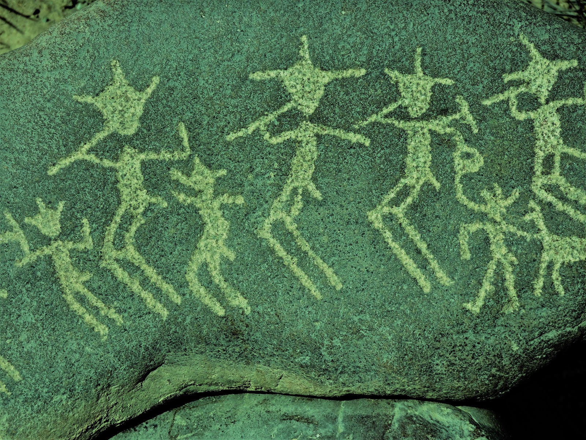
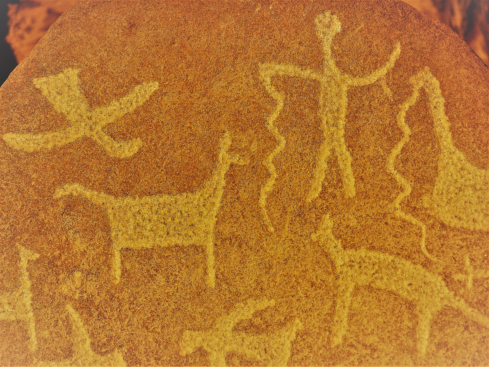

</grid>

 Wielką frajdą było przejście przez most, który składał się z całych desek i połamanych desek ;) i bujał się na wszystkie strony. 

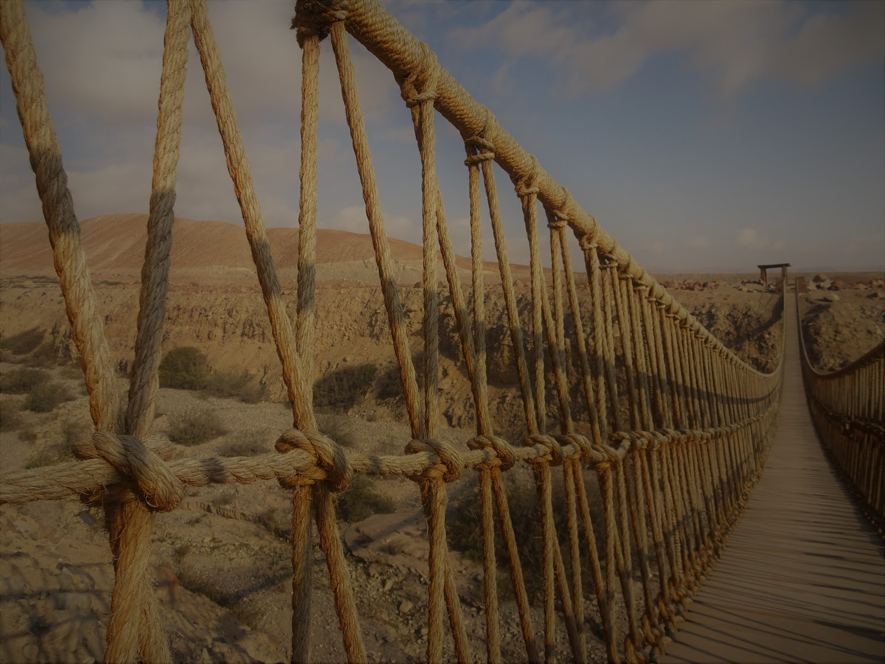

A kolejny dzień to już tak się objadłam że urwał mi się film ;) Tego dnia przyjechał postawny tatuś. I z samego rana zaczęła się uczta. Najpierw ciasto z kukurydzy wypełnione mięsem, TAMALE.

mała pogawędka i wypad do miasta na lunch. W Peru popularnym mięsem jest kurczak, pollo (czyt. pojo), więc był kurczak, frytki i sałatka. Było rodzinnie, smacznie i wesoło.

Przed każdym posiłkiem mama składa ręce dziękując za jedzenie i wymyślała wzruszające modlitwy w których prosiła o dużo sił dla nas oraz żebyśmy byli bezpieczni w niebezpiecznym Peru. Wieczorem zasiadaliśmy przed telewizorem i oglądaliśmy nasze filmiki z podroży. Mama zachwycała się piękną polską zielenią, jeziorami i górskimi krajobrazami. Bardzo interesowały ją nasze przygody i wypytywała o wszystko. Filmiki znajdziesz tu [kanał YouTube](https://youtube.com/velomelon)
W sobotę, dzień przed Pawła urodzinami, kiedy chcieliśmy ruszać dalej w drogę, poprosiła, żebyśmy poczekali do lunchu, ponieważ chciała żebyśmy spróbowali górskie danie z Arequipy, Locro de Zapallo.

Zaraz po lunchu wyskoczyła z wielkim czekoladowym tortem z napisem Happy Day Powell :) Paweł zaniemówił, a my śpiewaliśmy cumpleanos feliz :)

<grid>

</grid>

Był przepyszny! A i warto wspomnieć o Inka Cola, wyjątkowym napoju, który dostępny jest tylko w Peru ;) ale tak naprawdę i w Polsce, ponieważ smak ma identyczny jak nasza oranżada.

Gdy odjeżdżaliśmy łezki nam się kręciły w oczach. W ramach podziemi za jej wielkie serce wręczyliśmy pudełko czekoladek i pojechaliśmy w stronę oceanu, gdzie rozpoczął się kolejny, najcięższy jak dotąd, etap naszej podróży. 

Zrobiłam się głodna, a Ty?

<grid>

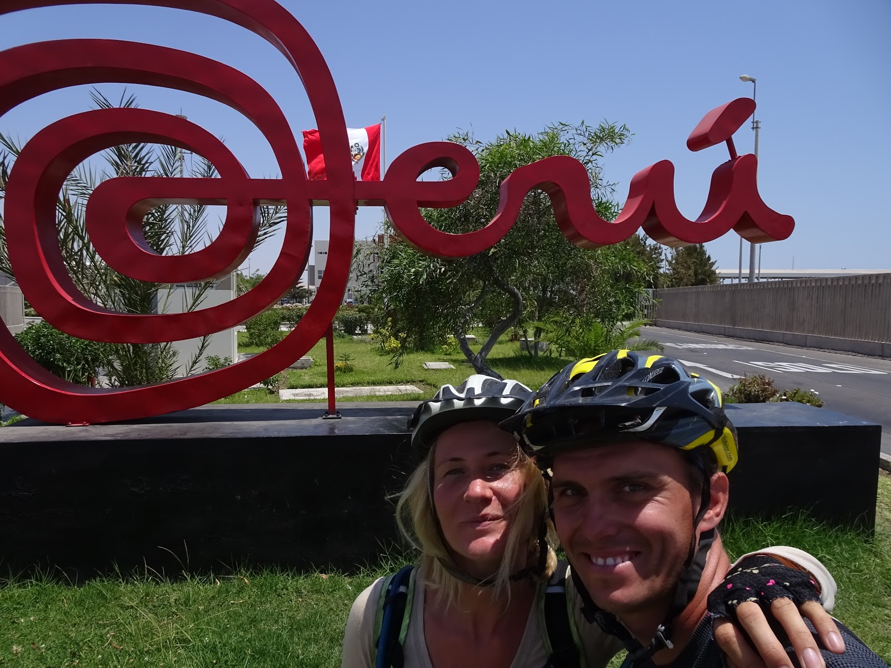

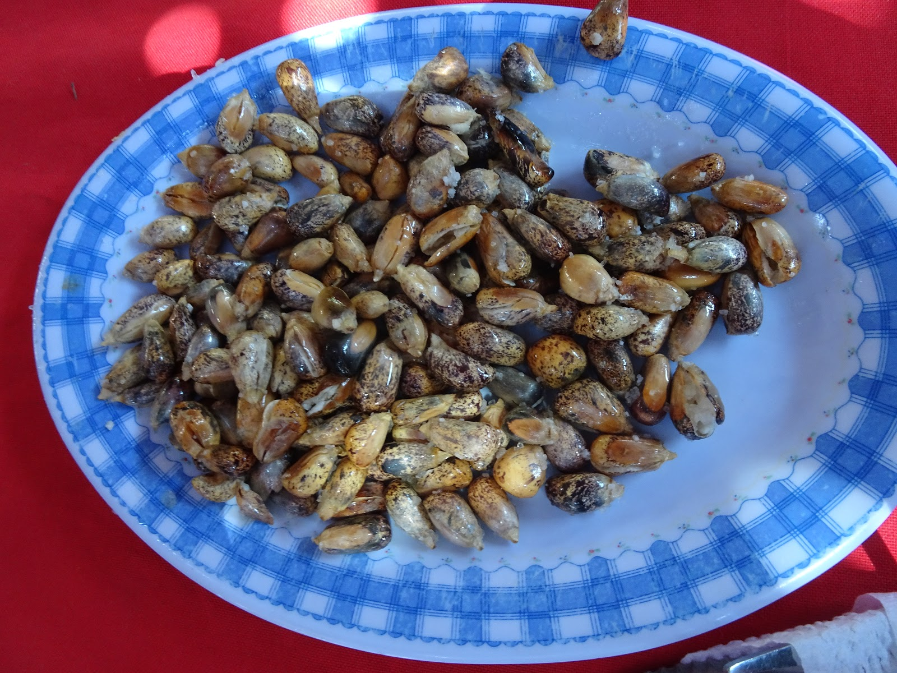

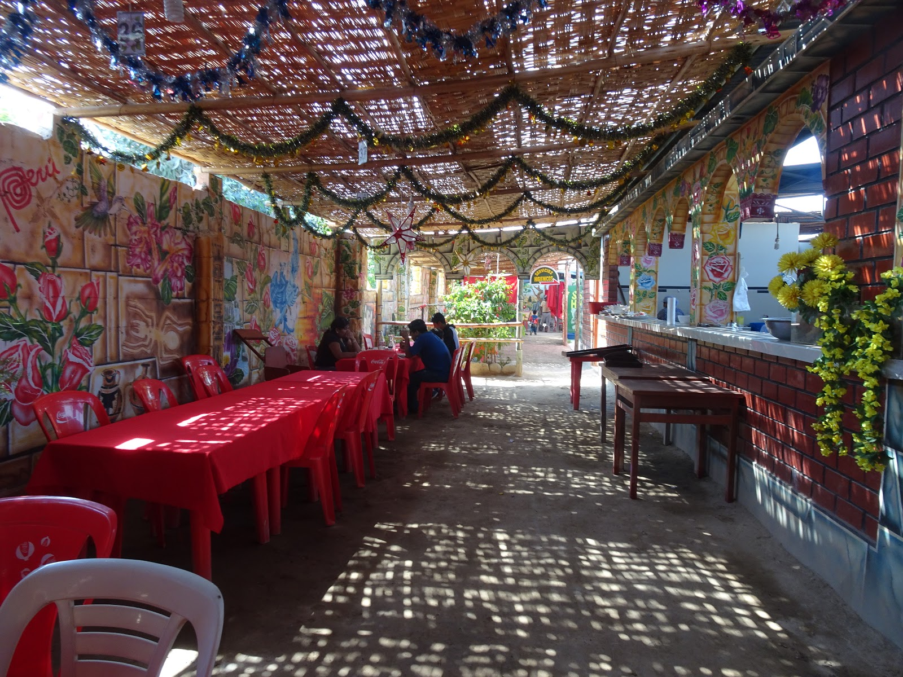

</grid>
<grid columns="2">

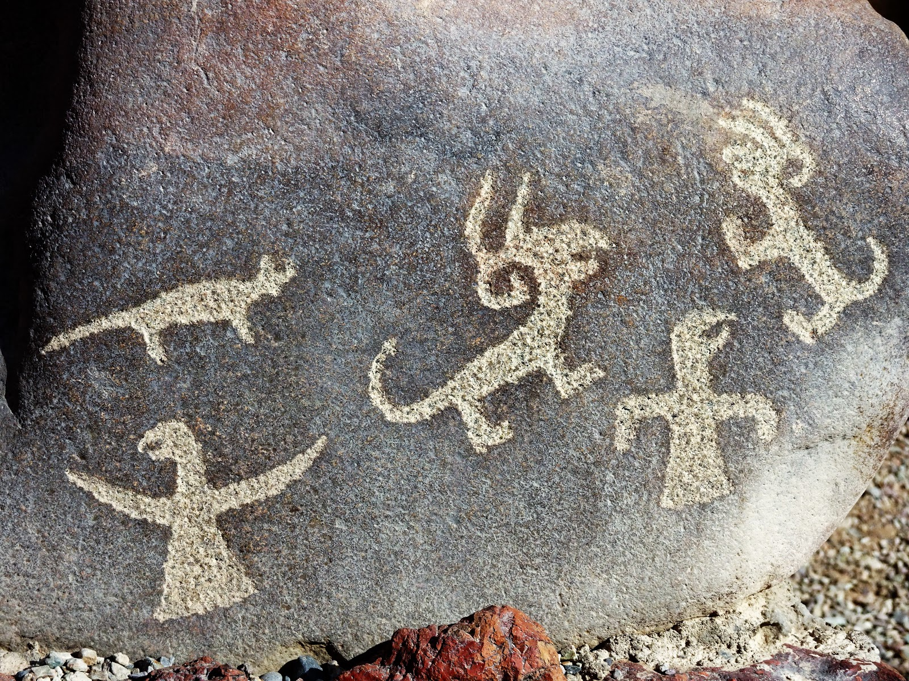

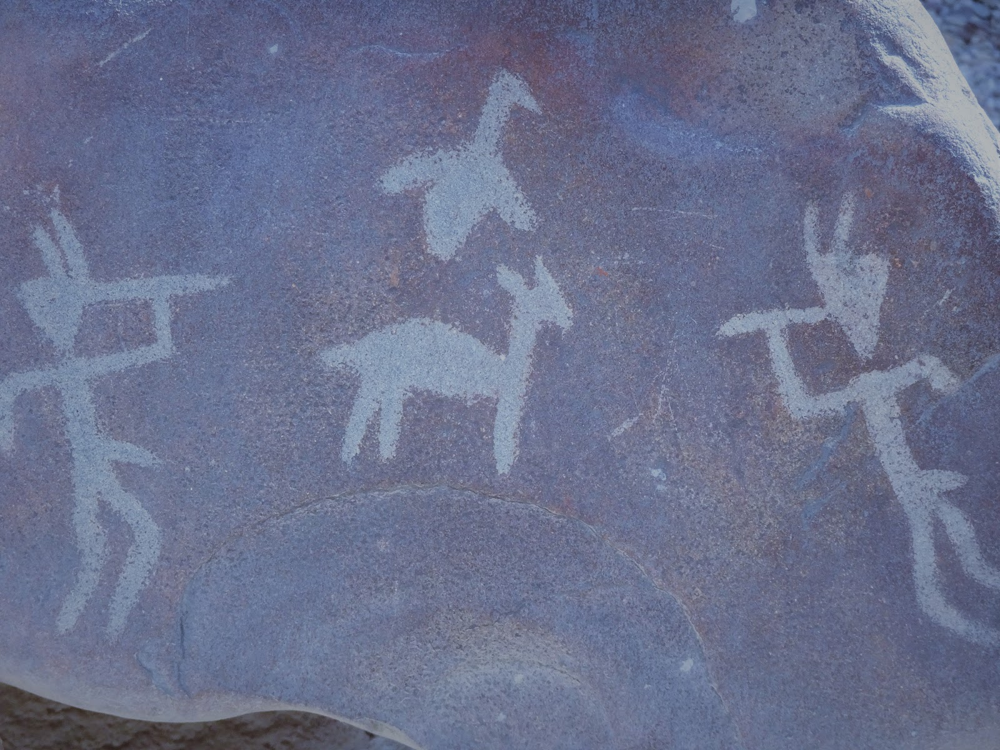
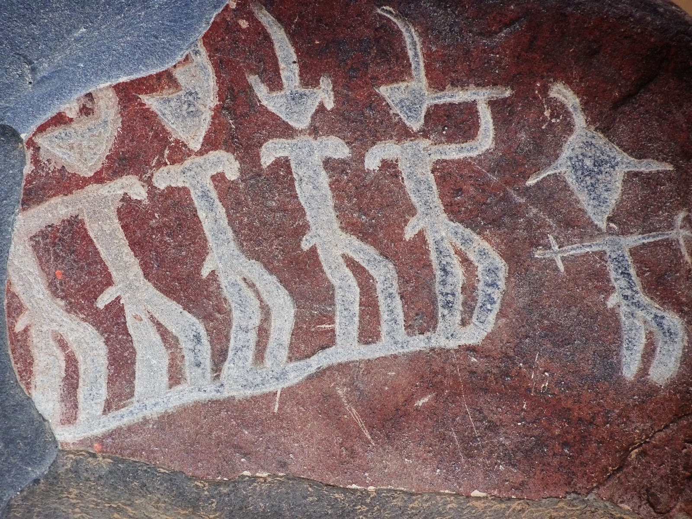

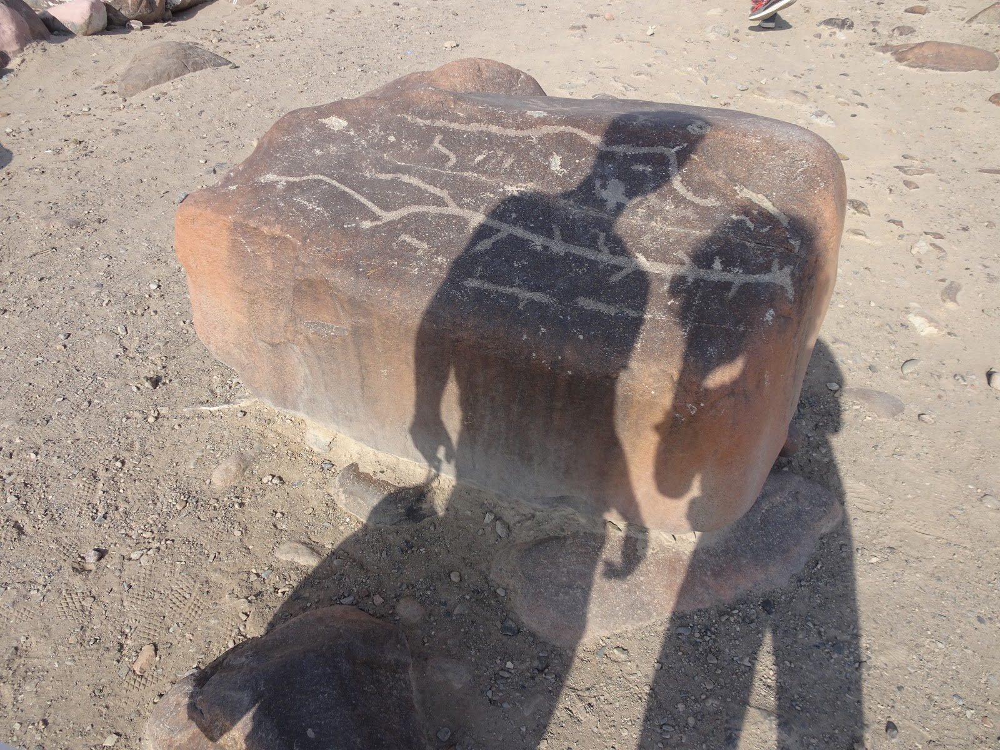

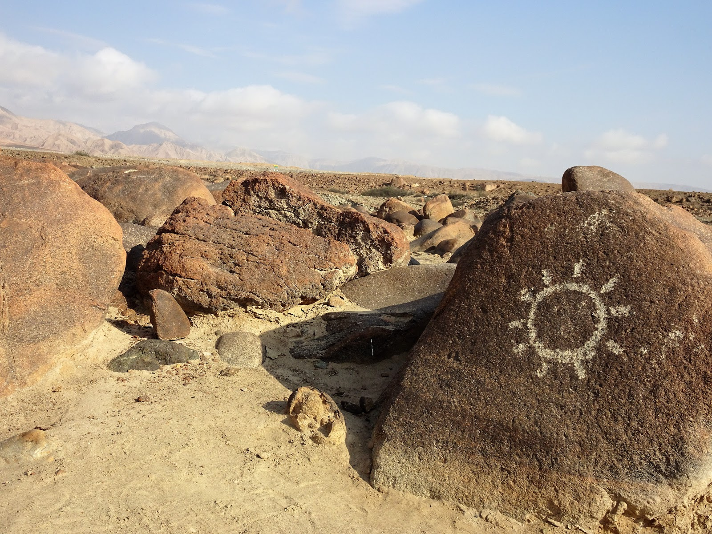

</grid>
<grid>

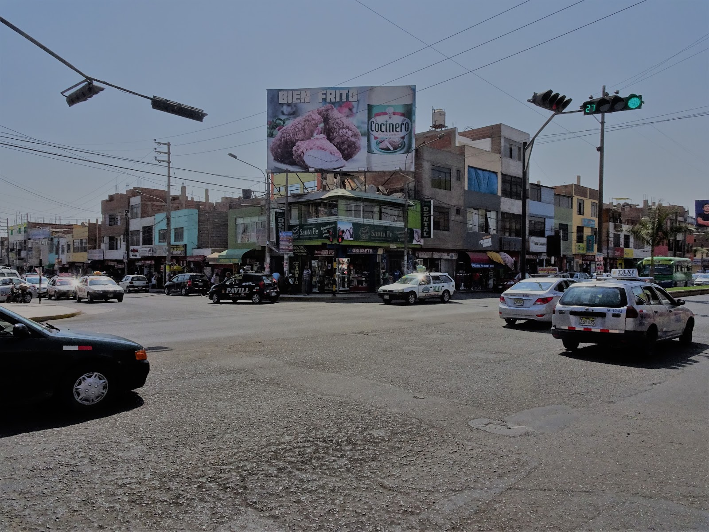

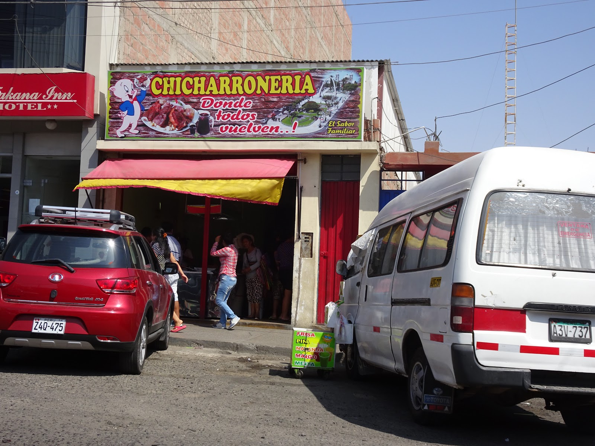

</grid>