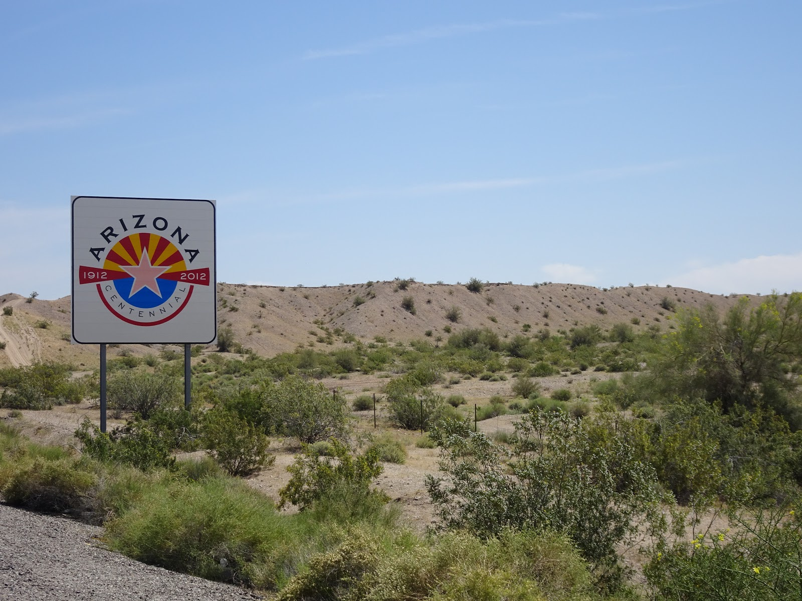

Route 66 was one of our favorite rides in California. We started in Barstow and finished in Needles. Sometimes we had to ride on her enemy road 40 because some parts of 66 were in terrible shape but before we got to Amboy we experienced the brand new road.

<youtube>Mp_qYNN3Pkk</youtube>

In Amboy we stopped for night next to the old-school Roy's Motel. The next day we had to deal with some road works but it was Sunday so we were sure there wouldn't be any workers there so we rode on the desert a little bit. Before Needles we took 40, got to the town and found nice spot to camp on golf course :) 

<grid>

</grid>