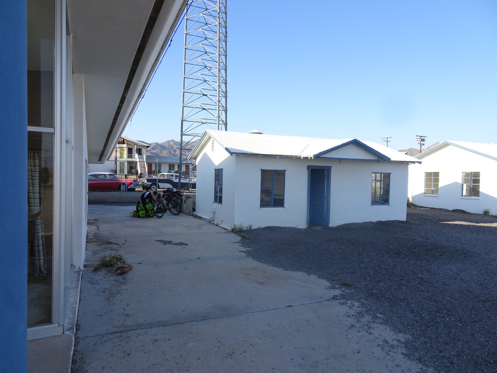
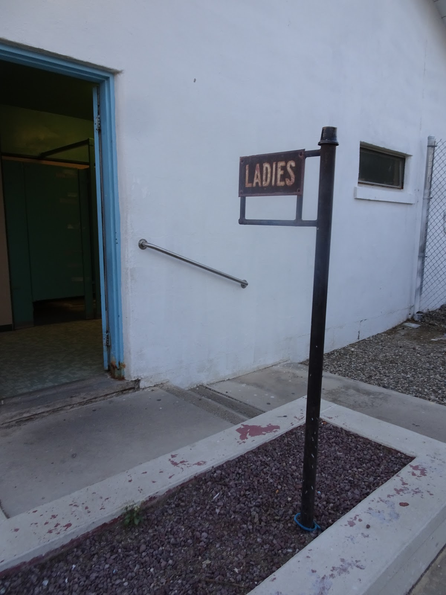
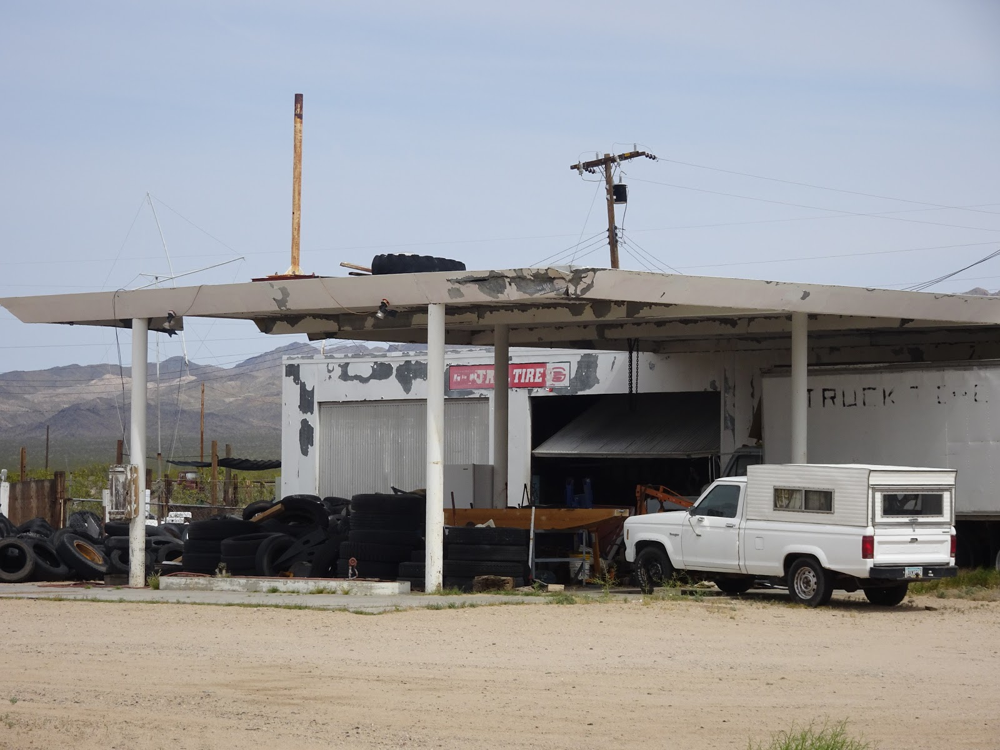
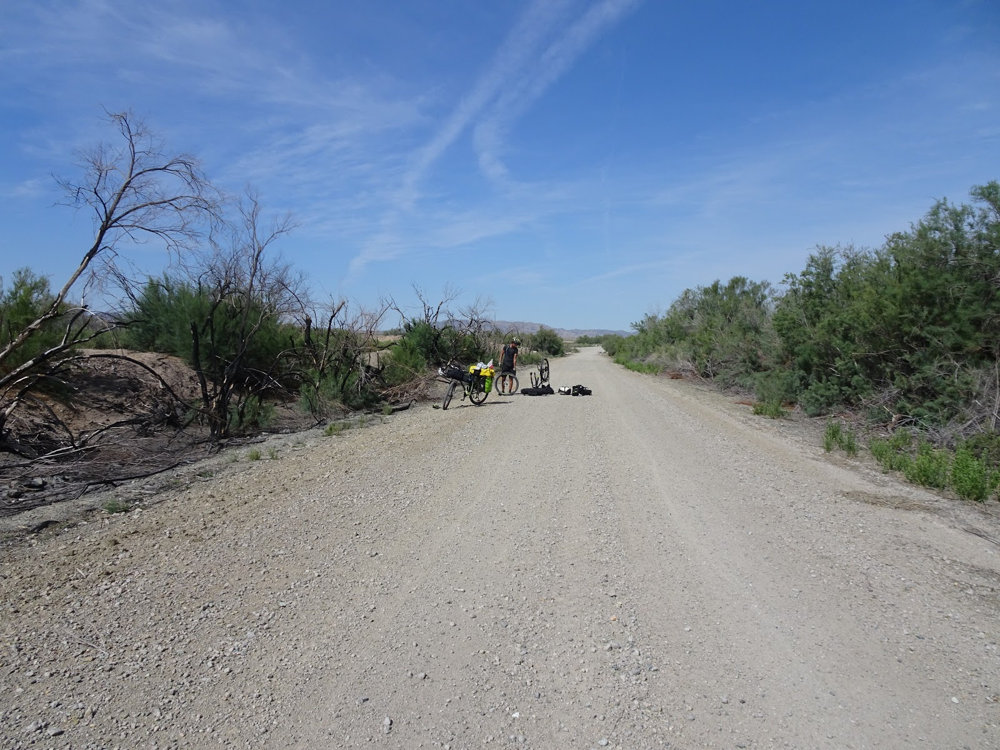
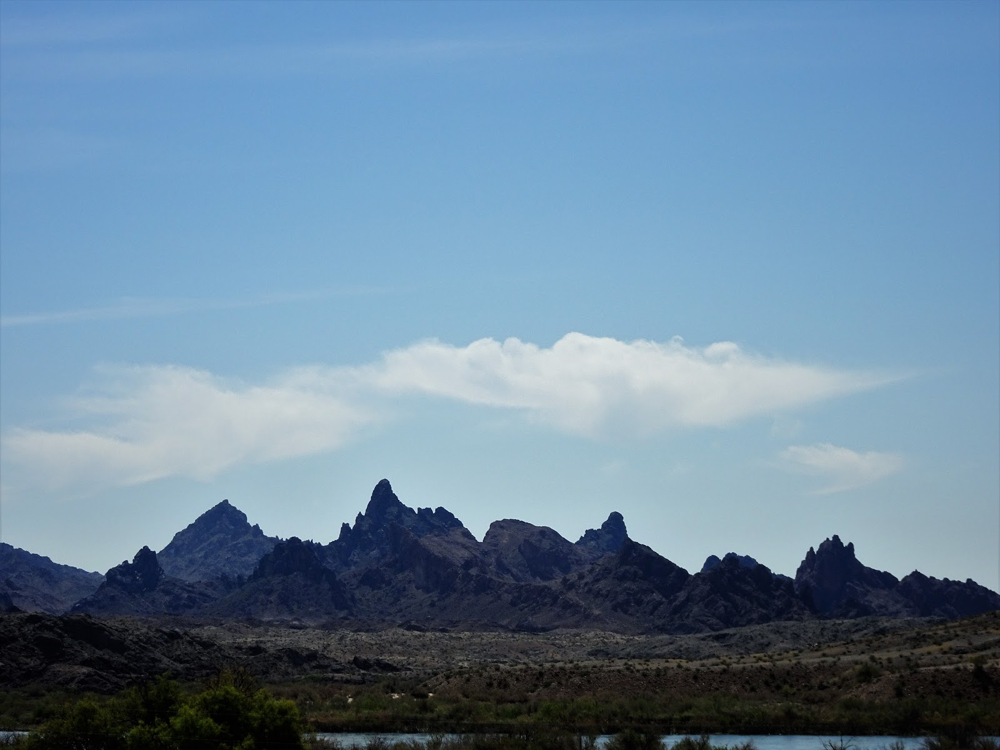

Droga nr 66 to jedna z lepszych tras, które zjechaliśmy w Kalifornii. Zwana także Główną Ulicą Ameryki, dawniej była to droga szybkiego ruchu, biegnąca od Santa Monica (niedaleko Los Angeles) do Chicago. W okół niej tętniło życie. Ludzie budowali hotele, stacje benzynowe, rozwijał się handel. W latach 50 odebrała jej życie droga międzystanowa nr 40 i wszystko co się działo przy drodze 66, także zanikło.
Droga jak droga, długa jest. Wjechaliśmy na nią w Barstow, a wyjechaliśmy w Needles w Kalifornii. Droga bywała dziurawa, ale też momentami leżał na niej świeży lepki asfalcik. Niektóre odcinki drogi były zamknięte i zgodnie z naszym instynktem udawało się je pokonać po pustyni.

<youtube>Mp_qYNN3Pkk</youtube> 

Ze spaniem na dziko też nie było by problemu, no prawie. Gdyby nie wiatr, który zwiewał namiot. Po 120 km dojechaliśmy do miasteczka widmo Amboy, gdzie stał motel i pomyśleliśmy, że pewnie nie pozwolą nam się rozbić przy motelu tylko będą nam kazać płacić za pokój. Okazało się, że ten motel to tylko wspomnienie i obecni właściciele zachowali budynek dla zwiedzających legendarną trasę 66...  


```grid|2


```
```grid|4


```
```grid|3



```
```grid|5





```
```grid|2


```
```grid|3


```