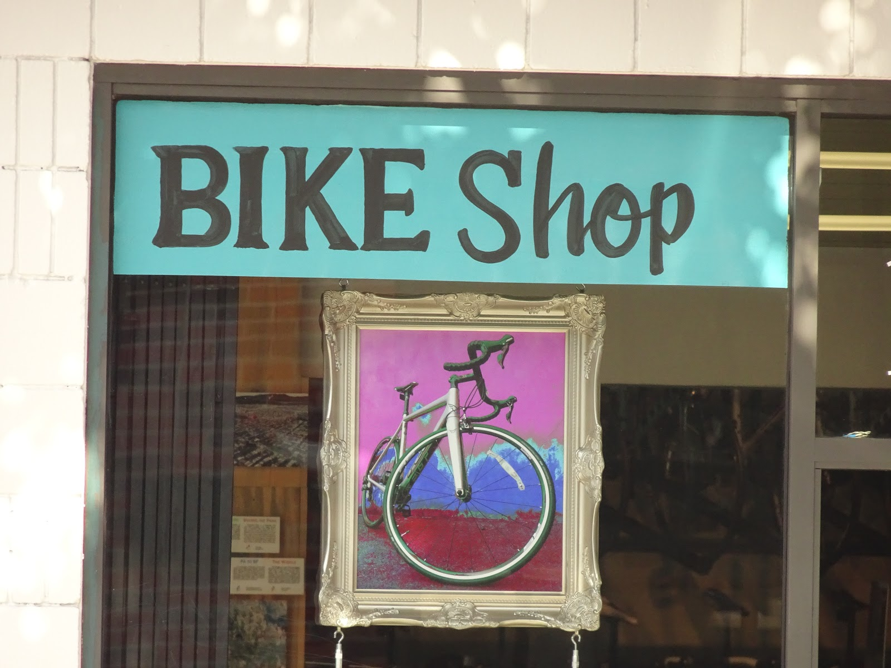
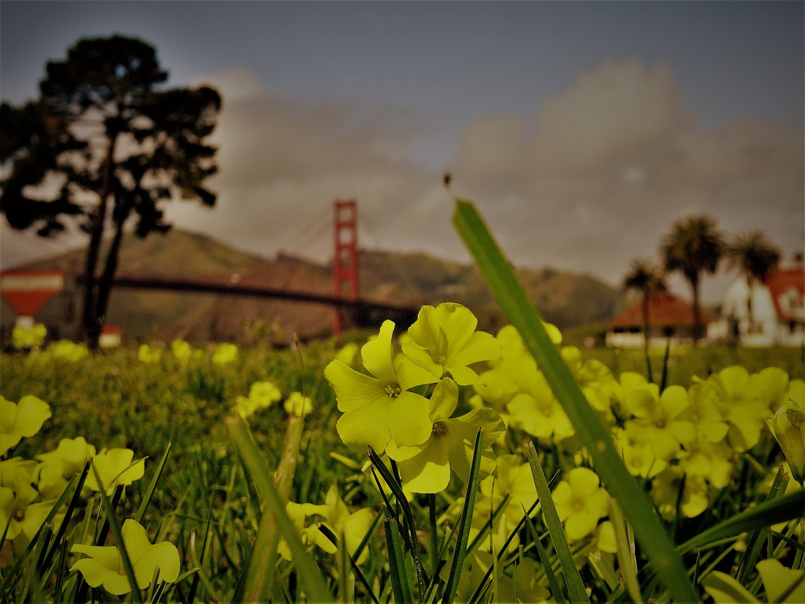

The most beautiful city in United States so far. We were inspired by its architecture and hilly roads :)  Sometimes it was so steep that I had to pedal verrry hard and it took my breath away. We didn't look look for tourists attractions, just rode along the bay admiring Golden Gate Bridge. It's really outstanding. 
<youtube>1tmRINP21n8</youtube>
It was a pleasant ride, not much traffic and many bike lanes. Than we got to Haight-Ashbury that used to be hippie district. 
I just wanted to take a look at one building there where a very special singer once lived...

<grid>

</grid>

<grid columns="2">

</grid>
<grid>

</grid>

