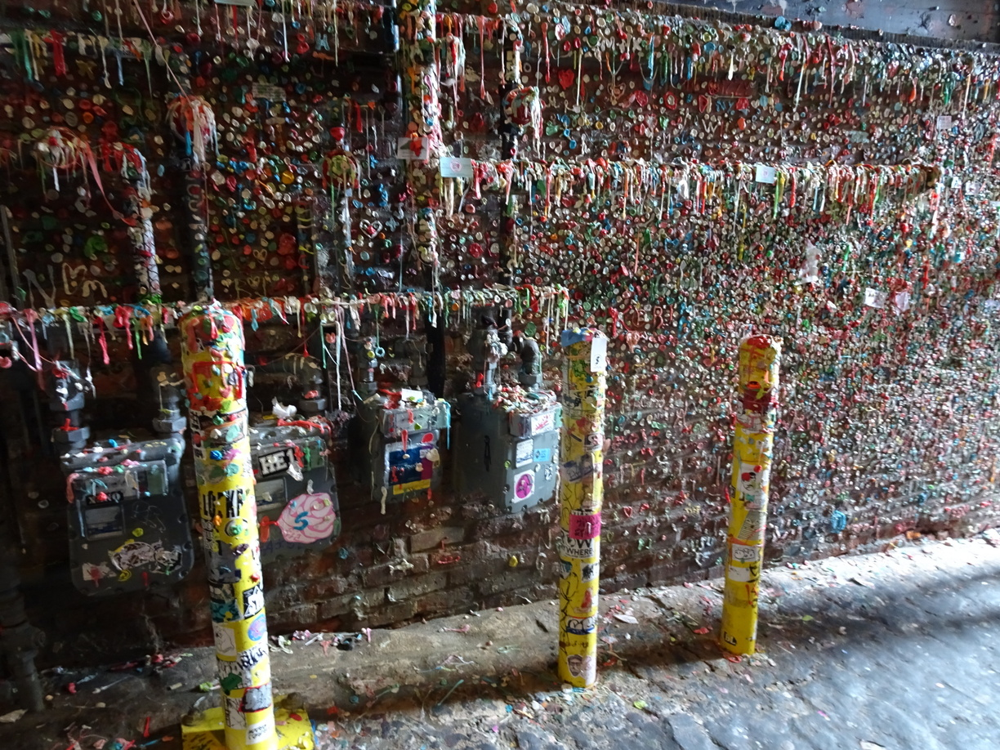

W Seattle spędziliśmy kilka dni. Najbardziej charakterystyczną atrakcją i ikoną miasta jest futurystyczna 184 metrowa wieża widokowa Space Needle.
Nie tracąc czasu na wspinanie się na górę, legliśmy sobie na trawniku pod wieżą, która stanowiła tło dla kolorowego amfiteatru, gdzie w 1991 Pearl Jam zagrał swoją pierwszą płytę.
Scena się praktycznie nie zmieniła.
Po pół roku udało nam się spotkać parkę z Florydy: Toma i Becky, którzy kontynuowali swoją coroczną tradycję przejeżdżając trasę na rowerach wzdłuż brzegu Pacyfiku.
Posiedzieliśmy sobie wspólnie spędzając chwile na gaduchach. Namawialiśmy ich na podróż do Ameryki Południowej, ale po ich minach widać było, że zdecydowanie wolą kręcić się po swoim kraju.

Kolejnym sławnym miejscem, które chciałam koniecznie zobaczyć w mieście, był klub muzyczny, gdzie młode kapele grunge'owe stawiały swoje pierwsze kroki. Koncertowy kawałek Love, Hate, Love kapeli Alice in Chains, który uwielbiam, został nakręcony właśnie w Moore Theatre.
Niestety, mogłam się nim nacieszyć tylko z zewnątrz, ponieważ był zamknięty.

Turyści za to zachwycają się innymi miejscami w mieście jak, np. publiczny bazar.
Też się tam wybraliśmy, żeby nie było. Pike Place Market mieści się zaraz przy zatoce Elliot, dlatego przychodzi się tam głównie po świeże owoce morza i ryby.
Rolnicy również wystawiają bezpośrednio swoje zbiory na sprzedaż. Tak też zaczęła się historia tego miejsca. Mieszkańcy, kupujący warzywa u pośrednich sprzedawców, skarżyli się na wysokie ceny cebuli. Za to rolnicy sprzedawali swoje produkty do hurtowni za zbyt niskie kwoty. Aby uczynić rzeczy sprawiedliwymi dla rolników i konsumentów, zaproponowano rynek publiczny. 17 sierpnia 1907 roku otwarto Pike Place Market. Nowe miejsce pozwoliło rolnikom cieszyć się zyskami, na które zasłużyli, a konsumentom zapewniło dostęp do świeżych produktów po uczciwych cenach.
My akurat kupiliśmy tam świeże pączki, starą whisky i powędrowaliśmy w stronę długo oczekiwanej przeze mnie latarni z klipu Hunger Strike. Ścieżka wiodła przez piękny ogromny park Discovery. Gdy wyszliśmy z pośród wysokich drzew i zarośli, wyłoniła się kamienista plaża pokryta wyrzuconym przez wodę drewnem. Na koniuszku lądu znajdowała się charakterystyczna niska biała latarnia, która bardziej przypominała domek z wieżyczką.
Wyjeżdżając z Seattle, pojechaliśmy zobaczyć mały park Viretta, który znajduje się na południe od dawnego domu Kurta Cobaina. Jako że Seattle jest górzyste, przez przypadek zajechaliśmy od góry tego parku i nie mieliśmy możliwości do niego wejść. Musieliśmy poszukać wejścia ulicę niżej. Park wyglądał bardziej jak mały zielony skwer z kilkoma drzewami i pobazgranymi ławkami. Fani Nirvany zbierają się tam w rocznicę śmierci Cobaina, aby złożyć mu hołd. Drewniane ławki, będące de facto pomnikiem wokalisty, pokryte są napisami skierowanymi do ikony rocka. Były też i kwiatki w wazonie z pachołka. Zostawiliśmy tam swoje myśli i ruszyliśmy do naszego ostatniego celu - Vancouver.

## Album

<grid>
  -./20170617_131906.jpg -./20170619_100021.jpg -./DSC04659.jpg -./DSC04666.jpg
  -./DSC04673.jpg -./DSC04683.jpg -./DSC04695.jpg -./DSC04706.jpg
  -./DSC04722.jpg -./DSC04753.jpg -./DSC04778.jpg -./DSC04790.jpg
  -./DSC04806.jpg -./20170617_132341.jpg -./DSC04657.jpg -./DSC04660.jpg
  -./DSC04668.jpg -./DSC04677.jpg -./DSC04686.jpg -./DSC04699.jpg
  -./DSC04707.jpg -./DSC04738.jpg -./DSC04757.jpg -./DSC04779.jpg
  -./DSC04796.jpg -./DSC04671.jpg -./DSC04682.jpg -./DSC04693.jpg
  -./DSC04703.jpg -./DSC04713.jpg -./DSC04742.jpg -./DSC04770.jpg
  -./DSC04781.jpg -./DSC04801.jpg
</grid>

<grid columns={2}>-./20170618_115147.jpg -./DSC04658.jpg</grid>

