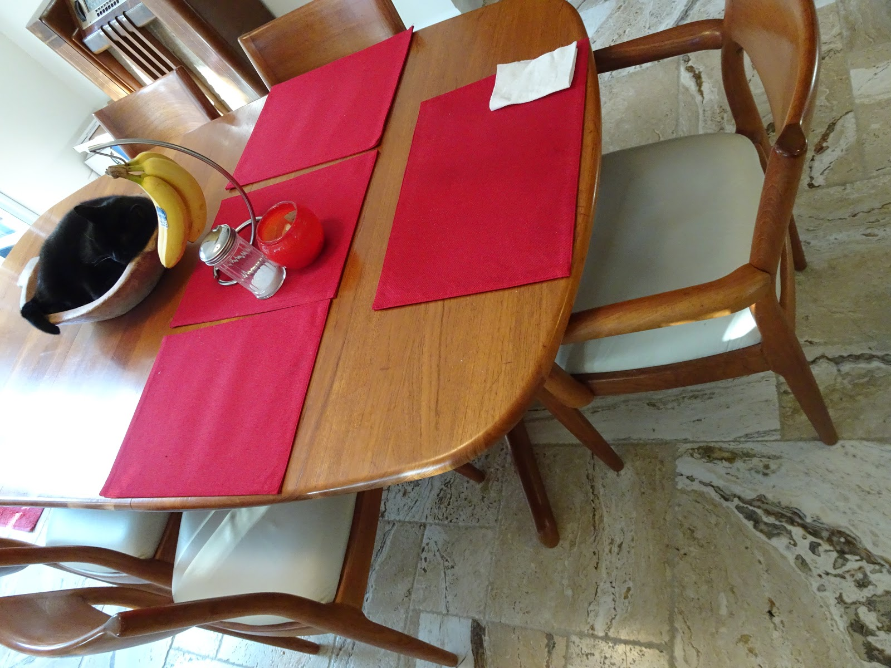
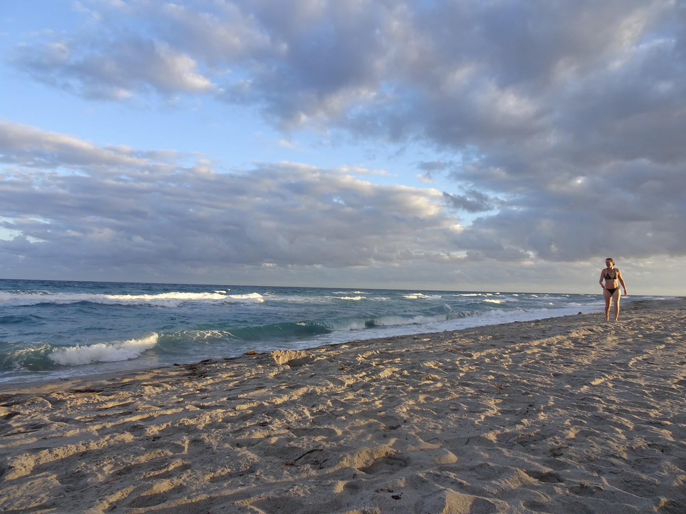

Pomimo, że to święto to jakieś nieporozumienie, cudownie spędziliśmy ten czwartkowy dzień. Było bardzo dużo gości, pomimo to, ta wyjątkowa para, Tommie i Vance, posadzila nas przy stole. Głównym daniem był oczywiście wielki czarny kot..

nieee no indyk, ale były także gołąbki, nasze Polskie danie, które nauczyliśmy się robić za granica :) Wszyscy chwalili i cieszyli się z tego urozmaicenia dziwacznie wymawiając nazwę. Było rodzinnie i wesoło. Ku naszemu zdziwieniu był też husky, (husky na Florydzie!) który świętował 13 urodziny. Chyba tyle przeżył dzięki klimie ;)
Po uczcie wybraliśmy się na plaże :) Nie odważyliśmy się pływać, gdyż fale Atlantyku były ogromne, a mieliśmy kilka piwek na koncie. Na deser objedliśmy się brałnim ;) Dzień zakończyliśmy przysypiając przy seansie filmowym.
Kolejny dzień spędziliśmy w gronie ogromnych żółwi i małych żółwików. Przeszliśmy się do centrum rehabilitacji morskich stworzeń, gdzie chore lub zranione żółwie mogą odzyskać siły.
Poniżej zdjęcia z uczty, plaży i centrum.

## Album

<grid>
  -./dsc01239.jpg -./dsc01250.jpg -./dsc01245.jpg -./dsc01242.jpg
  -./dsc01243.jpg -./dsc01244.jpg -./dsc01237.jpg -./dsc01235.jpg
  -./dsc01233.jpg -./dsc01229.jpg -./dsc01241.jpg -./dsc01206.jpg
  -./dsc01214.jpg -./dsc01217.jpg -./dsc01208.jpg -./dsc01209.jpg
  -./dsc01218.jpg -./dsc01220.jpg -./dsc01210.jpg -./dsc01211.jpg
  -./dsc01224.jpg -./dsc01226.jpg -./dsc01212.jpg -./dsc01262.jpg
  -./dsc01258.jpg -./dsc01257.jpg -./dsc01252.jpg
</grid>
