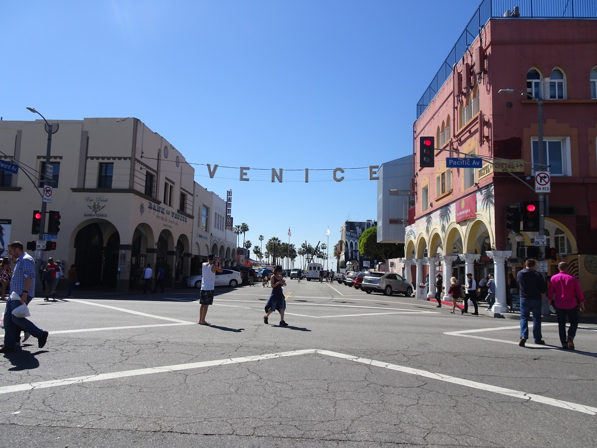
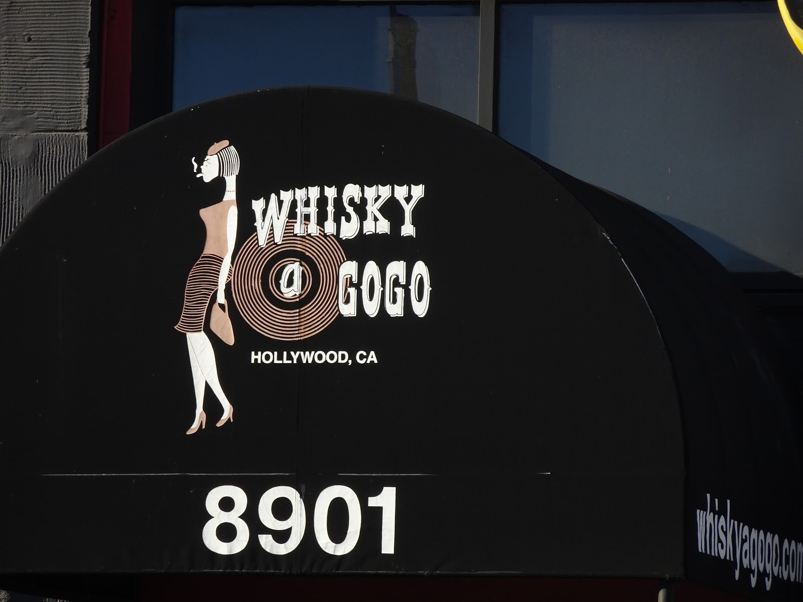

Będąc w El Ej nie mogłam odpuścić sobie tych kilku miejsc, które należały do Jima i zespołu The Doors. Dla mnie to historyczne miejsca... ta scena, ten lokal, ten dom... Teraz to tylko głuche budynki, ale kiedyś można było odlecieć w muzycznym transie ich muzyki. Na rowerze trudno było zaliczyć wszystkie lokalizacje związane z Doorsami, dlatego wybrałam kilka, które zapadły mi w pamięci. 
Pierwszy raz usłyszałam ryk Jima, kiedy szukając byle jakich koncertów po sieci natrafiłam na występ The Doors w Hollywood Bowl. Szukając tego sławnego amfiteatru w LA, wyobrażałam sobie jego wielką scenę, jak na Amerykę przystało. Hollywood Bowl okazał się jednak skromnym budynkiem, gdzie rzeczywiście jest miejsce na kameralny koncert. Obiekt jest otwarty dla wszystkich, gdy nie ma przedstawień. Obok znajduje się również darmowe muzeum mówiące o transformacjach sceny i o wszystkich artystach, którzy na niej stanęli. Przed samą scenę wjechaliśmy rowerami i usłyszałam organy Raya Manzarka ;) Ponad 40 lat temu, 5 lipca 1968 roku, odbył się pierwszy taki prestiżowy koncert zespołu, który odniósł ogromny sukces. 


Na drugim planie hollywoodzkie wzgórza.


Uchwyt na winko :)


Gdybym wierzyła w reinkarnację, pomyślałabym, że spotkałam Jima ;)


Początek Doorsów przypisuje się miejscu Venice Beach. Ray i Jim znali się już ze studiów, ale dopiero to jedno niespodziewane spotkanie i szczera rozmowa skierowały ich na wspólną drogę. Gdy Jim przyznał, że pisze teksty i przedstawił jeden z nich, Ray był oczarowany i zaprosił go do swojego zespołu.

```grid|3



```

Ich kariera, jako Doors zaczęła się od m.in. od grania w klubie London Fog, ale dopiero występy w Whisky-a-Go-Go przeszły do legendy. Gdy po raz pierwszy wykonali tam utwór The End w pełnej wersji, gdzie Jim wspomina o matce i ojcu, zostali wywaleni z klubu, ale ten fakt przysporzył im jeszcze większą popularność. 

```grid|2


```

Na tej samej ulicy, Sunset Boulevard, znajduje się luksusowy hotel, Chateau Marmont, w którym mieszkał Jim. Ogromny budynek wyjęty jakby z francuskiego wzgórza. Kompletnie nie pasujący do otoczenia... Może dawniej...

```grid|2


```

I studio zespołu, gdzie nagrali płytę L.A. Woman, która została wydana w kwietniu 1971 roku, czyli 3 miesiące przed śmiercią Jima. Budynek popada w ruinę... Jest na nim tylko tabliczka upamiętniająca działalność zespołu. 

```grid|3


```

Dawne były to dzieje, ale miło było zobaczyć ich miejscówki, ulice którymi się przechadzali. Ich muzyka jednak nie przeminie. Myślę, że jeszcze wiele osób po nas odbędzie taką wycieczkę.
