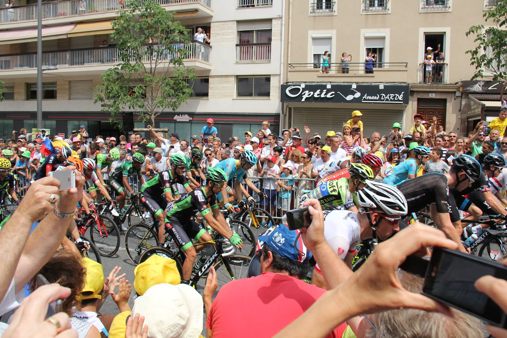
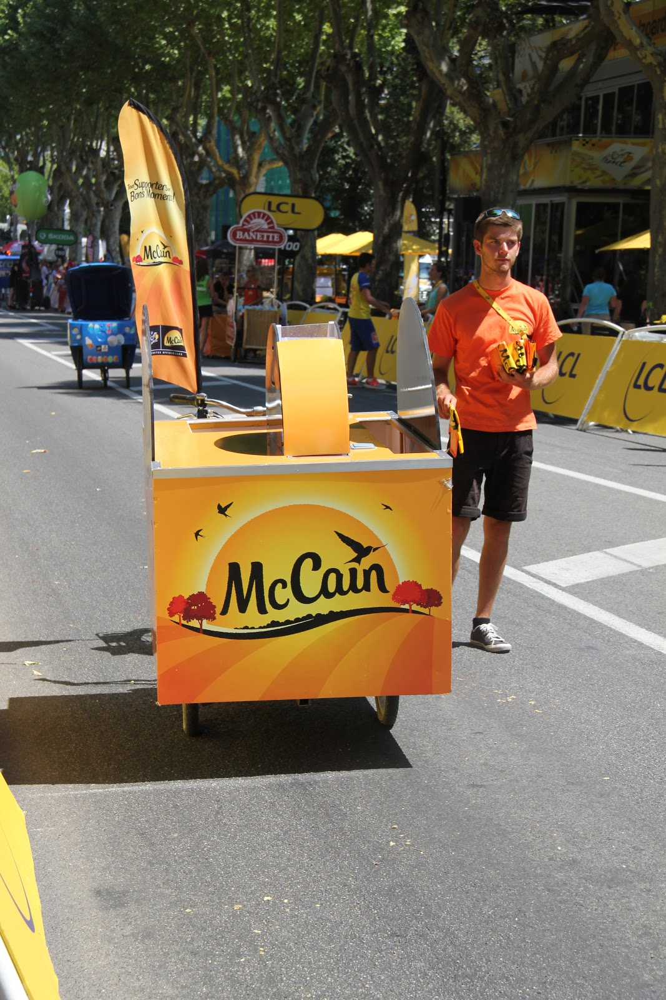

<grid>

</grid>

If you are going to visit France you should do it in the time of the great tour. It's like a huge festival with many attractions and pleasant atmosphere. Everyone, we met, was very friendly, helpful, and there were also many people from different countries to make friends with.

 We started our journey in the Pyrenees waiting for riders near <b>Plateau de Beille. </b>We got there the day before to look around and set a little camp. There was no problem to find a place to stay.

When travelling by a smaller car it's easier to find a place to stop and it's defintetly a better option if staying in a city or town. Campers are not allowed to park in the centre or in the most of the car parks. However, in the mountains you can park whenever you want but remeber that the road would be closed and you wouldn't be allowed to drive for some time. Obviously, when taravelling, there are some problems due to closed roads during the day of the tour but if you have a good map you can find a circut. We managed to see the start and finish on the same day, but once. It's easier to watch as they finish and start the race but on the next day in the same city. I don't recommend following the peleton because it causes a lot of stress ;)
Funny thing is that being on the tour does not mean that you know what is going on. Without TV set or the Internet you do not know the news from the stage, so we sometimes wrote text messages to our friends asking about the present situation. Anyway, we had an occasion to see the whole stage when we were waitning on the finish line in Gap, there were some large outdoor screens. You need to be very early there if you want to see something, especially in the cities because there are not much space on the streets. It was a long day of sitting, standing and steering just to see the last sprint but it was worth it ! Fortunately, the sponsors were taking care of poor, hungry and thirsty specators and even gendarmerie ;) Are you fancy trying some crispy-hard baguette? :)

Some jellies were also provided for all hardworking officers. 

Would you like to meet one of your favourite cyclists? Of course :) We were lucky to meet ours from Poland, Rafał‚ Majka, Michał‚ Kwiatkowski, Bartosz Huzarski i Michał Gołaś and we got some team gadgets like caps and water bottles from them. The best moment to look for cyclists is in the morning before the start. Find out where the buses of teams are parking and just wait patiently. We were cheering very loudly in front of Majka's bus and he got off eventually. Surprisingly, he gave us a special VIP wristband so we could hop over the barrier and roam around among other riders.

Undoubtedly, you will experience the tour in totally other way than you see on TV. If we had had more time we would have stayed there to the end of the race because every day is different and more exciting.
Probably, you'll have more question to ask about the tour, please write below.
If you have been to the tour, share your experience, good or bad ;)

<grid>

</grid>

<grid>

</grid>
<grid columns="2">

</grid>
