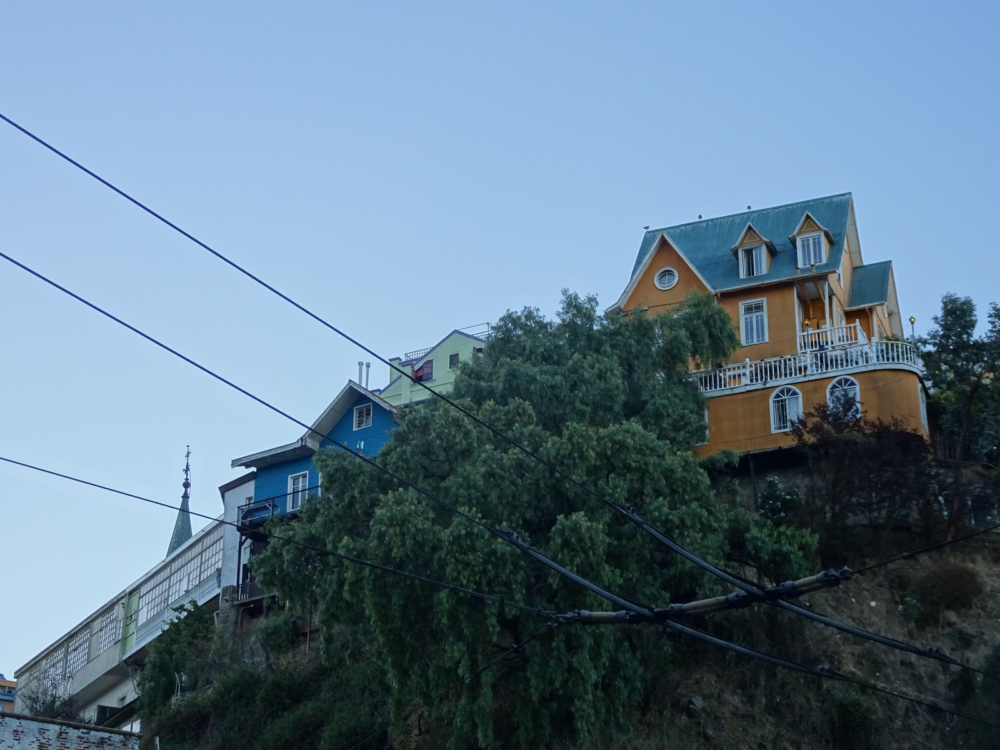

Everybody in Chile said that we had to see<strong> V A L P A R A I S O</strong> so we did it. Fortunately, we didn't ride there because it's not bike friendly since there are many stairs, uneven surfaces, holes, and people on the people. :) We stayed in Quilpue, 20 km from Val, and took a train there that was very cheap, about one dollar. Valparaiso appeared totally<strong> different</strong> that I was expecting,

it wasn't only beautiful and colorful as everybody said and we saw on colored pictures on google... In my opinion it was a nice coastal city with artistic soul where you can walk around and discover some acid murals etc. but I would not recommend it for bikers.

but we had a&nbsp;<strong>great time</strong>, anyway,(thanks to friendly natives Gonzalo, his wonderful partner Maria Jose and their family.) We went to the Latin disco and danced salsa (not in the sauce) or pretended it ... whole night :)

We tried deliciously prepared <strong>seafood and local fish</strong>
<strong><em>machas a la parmesana,</em></strong>

<grid>

</grid>

<strong><em>ceviche</em></strong>

 and
<em><strong>disco pisco</strong></em> of course.

Page with all recipes is in preparation and will be uploaded soon :)

O yeah, this city is perfect for parting and having good time so we forgot about harsh biking life style for a while ;) - it was a <strong>sweet escape</strong>.

<grid>

</grid>
<grid columns="2">

</grid>
<grid>

</grid>