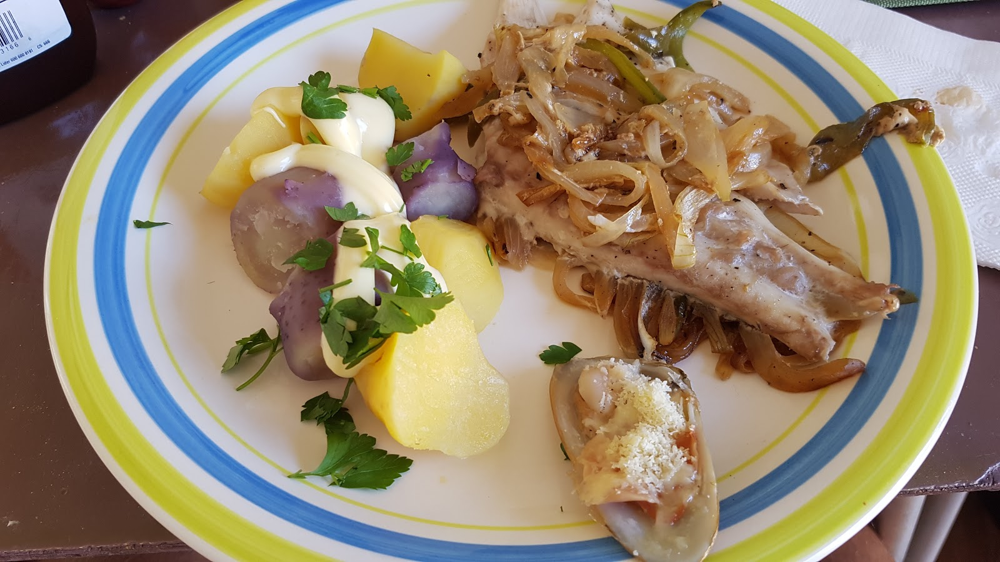

Kiedy pytaliśmy, czego w Chile nie można przegapić, każdy wspominał o <strong> <span style="color: #ff6600;">V</span> <span style="color: #800080;">A</span> <span style="color: #ff00ff;">L</span> <span style="color: #0000ff;">P</span> <span style="color: #00ff00;">A</span> <span style="color: #993366;">R</span> <span style="color: #008080;">A</span> <span style="color: #ff0000;">I</span> <span style="color: #00ffff;">S</span> <span style="color: #008000;">O</span></strong>, mieście w kolorach tęczy leżącym nad Pacyfikiem. Ruszyliśmy zatem nad wybrzeże zimnego oceanu, pijąc po drodze mote i jedząc pastel de choclo.

```grid|2


```

Na szczęście zatrzymaliśmy się niedaleko miasta, ponieważ Valparaiso <span style="color: #808080;"><strong>nie jest</strong></span> przyjazne rowerzystom. Jest dużo schodów, stromych podjazdów i nierównych powierzchni, a wąskie uliczki uniemożliwiają poruszanie się po mieście pełnym turystów.


Miasto trochę przekoloryzowane w internetowych grafikach, bo w rzeczywistości wygląda trochę szaro i jak w przedszkolu ... 
ale tak czy inaczej , bawiliśmy się dobrze m.in. na latynoskiej dyskotece tańcząc salsę (nie tańczyliśmy w sosie;) lub udając ;)
Piliśmy pisco tańcząc<span style="color: #ff00ff;"><strong> disco</strong></span> :) (sfermentowane winogrona poddane destylacjii)


 W międzyczasie jedliśmy pysznie przygotowane owoce morza:
<strong><em><span style="color: #ff6600;">machas a la parmesana</span></em></strong>,<strong><span style="color: #800080;"><em>ceviche</em></span></strong>

```grid|2


```

oraz pyszna rybkę<em><span style="color: #008000;"><strong> reineta</strong></span></em>.



Palce lizać !!! Strona z przepisami pojawi się wkrótce! :) Valparaiso jest stworzone do imprez, tak jak u nas Mielno, ale jest troszeczkę ładniejsze. Mieszka w nim wielu <span style="color: #008000;"><em>artystów</em></span>, czy pijaków :) co widać na murach miasta. Ogółem, była to fajna odskocznia od ciężkiego fit bike życia ;) Troszeczkę się spłukaliśmy, ale warto było :D

```grid|4


```
```grid|5


```
```grid|3


```
```grid|4


```
```grid|2


```
```grid|4


```
```grid|6


```
```grid|5


```
```grid|3


```
```grid|4


```
```grid|2


```
```grid|5


```
```grid|6


```
```grid|3


```
```grid|4


```