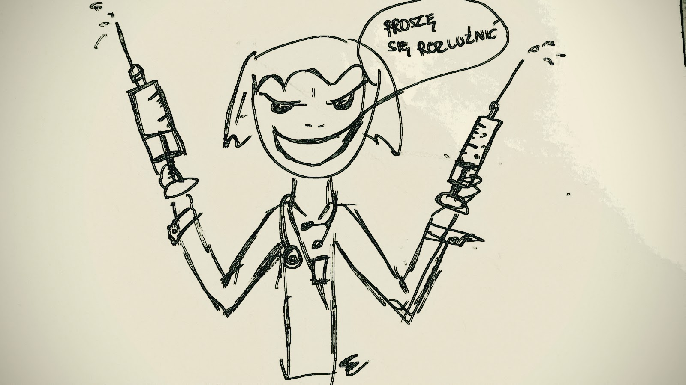

Beginning of the trip...

Wracając do wizy, potrzebujemy:
* paszport
* haracz bezzwrotny za rozpatrzenie wniosku $160; –info
* zdjęcie (najlepiej swojej roboty skan lub zrobione telefonem; –kryteria-)
* Internet 😉

Dla dociekliwych o wiele więcej aktualnych info jest na stronie konsulatu, ale komu by się chciało tyle czytać 😉  

Na wypełnienie wniosku ( znajdziemy go na stronie Departamentu Stanu) należy uzbierać dużo cierpliwości oraz przyda się rachunek sumienia i słownik, ponieważ można otrzymać pytanie „Czy jesteś terrorystą?” „Czy kogoś zamordowałeś?” Radzę zaznaczyć NO .. jasne 🙂 Można otrzymać, bo pytania są różne dla poszczególnych aplikantów i zależą od wcześniej zaznaczonych odpowiedzi. Spokojnie, na dokończenie wniosku mamy miesiąc i można wrócić do każdego punktu, warto zapamiętać niektóre odpowiedzi, gdyż w rozmowie face-to-face zadają podobne pytania. Warto zapisać wniosek na dysku i numer aplikacji. Jedyne problematyczne pytanie jakie napotkaliśmy to „Gdzie się zatrzymamy?” No jak to! w namiocie! lub under the bridge downtown 😉 ale taka odpowiedź raczej by nie przeszła. Podaliśmy adres znajomego i telefon, ale pewnie można wpisać byle jaki adres hotelu i przejdzie (więcej o to nie pytali). Na koniec ładujemy zdjęcie i jeśli zaakceptowane wysyłamy formularz. Kolejno system skieruje nas do uregulowania płatności. Pozostaje umówić się na wizytę z panem konsulem, którą rezerwujemy on-line. Wolnych terminów było sporo, a to był kwiecień…za to godziny takie sobie bo tylko 8 lub 9 rano zatem skoro świt pośpiesznie ruszyliśmy do Warszawy, a bo korki albo wypadek, a wcale nie trzeba było się śpieszyć…

Przed ambasadą garstka ludzi stojących na baczność, wpuszczą nas czy nie?! Minęła dziewiąta, a my nadal sterczymy jak osły czekając aż ktoś nas może zawoła 😉 Po prostu samemu się wchodzi i mówi -jestem tu umówiony- i zaczyna się trzepanie; wszystkie noże, pistolety, i inne metale do koszyka, i być może przejdziesz przez bramkę. Telefon niestety należy wyłączyć i oddać na czas pobytu w ambasadzie. Zresztą wszystkie inne sprzęty są zabronione. Nie radze brać paska, bo to żenujące przy wszystkich się motać z paskiem. Najlepiej zabrać ze sobą tylko kasę i dokumenty to nie będzie dodatkowych problemów. Wkraczamy na dużą poczekalnie, oddajemy linie papilarne, sprawdzają paszport, bierzemy numerek i czekamy na tą ważną rozmowę. Po ok dwóch godzinach wyświetla się numerek i pędzimy.

Sympatyczny, przysadzisty Myster mówiący łamaną polszczyzną z zabawnym akcentem top model pytał głównie o cel podróży, jaka trasa, ile kasy weźmiemy, kiedy zamierzamy opuścić ten piękny kraj. I jedno zadał podchwytliwe „Skąd mam mieć pewność, że wrócicie do Polski i nie zostaniecie w US?”  Polska to najpiękniejszy kraj na świecie i tyle:) Zabrali nam paszporty i po tygodniu zostały zwrócone do punktu TNT, gdyż dostawa do domu kosztuje ponad dwadzieścia złotych. 

Dostaliśmy więc wizę ważną 10 lat, ale jeszcze czeka nas kolejna rozmowa w Nowym Yorku i tam dowiemy się jak długo możemy pedałować po stanach. Zwykle dają na sześć miesięcy i oby tak było w naszym przypadku. 

Także nie ma czego się bać, wiza turystyczna to bułka z masłem! 