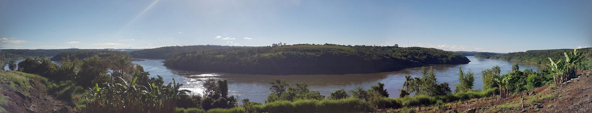

After hitchhiking to Iguazu, we found a place in great Argentinian family in the city called Wanda. Wanda is Polish name, but we thought that was just coincidence. When we came here it turned out that this is city created by Polish immigrants.
We were so positively surprised. Our host, Eduardo, offered us tour around downtown and the area. We happily agreed to that. But why Wanda? What does it mean? As I wrote this is a Polish name, but origin of city name is different. It is based on old Polish legend, which says that there was a princess Wanda, who didn't want to marry German guy.
First thing we saw in the city was old wall with "sculpture" on it with history of the town. In the middle of the wall is Polish emblem, our white eagle. It looks great!
A lot of people are grand grand Polish people, but unfortunately we didn't find anybody who talk in our native language. But what's funny, friends of our family has the same (or similar but changed to be Spanish friendly) surname :)
Next part of the trip took place in the main street of Wanda, where is the monument of the gratitude to Polish immigrants. We also saw two churches, one "present" catholic church and one created long time ago, which name was the same as name of the Polish Sanctuary Czestochowa. Church is unfortunately closed nowadays, so we saw it only from outside. On the side of the church there is a monument of Polish Pope John Paul II.
Last part of this story was with the nature. First we saw little campground, which is situated nearby small waterfalls, where kids have a lot o fun.
Then we went to see Parana river. It was wonderful, I can easily say that it was one of the best experience seeing the power of nature for us. We saw the river from above and from the water level. From there you can see panoramic view for Paraguay green hills, islands in the middle of the river and how riverbed runs. View is incredible, you have to see the photos.
We're going to prepare 360 degrees photos for you, to see this view. Unfortunately, you have to wait a little bit, but we will definitely update this post in a week!

## Album

<grid>
  -./dsc01385.jpg -./dsc01386.jpg -./dsc01387.jpg -./dsc01388.jpg
  -./dsc01389.jpg -./dsc01396.jpg -./dsc01393.jpg -./dsc01391.jpg
  -./dsc01390.jpg -./dsc01397.jpg -./dsc01398.jpg -./dsc01399.jpg
  -./dsc01400.jpg -./dsc01401.jpg -./dsc01407.jpg -./dsc01406.jpg
</grid>

<grid columns="2">
  -./dsc01405.jpg -./dsc01403.jpg -./dsc01402.jpg -./dsc01408.jpg
  -./dsc01409.jpg -./dsc01410.jpg -./dsc01411.jpg -./dsc01412.jpg
  -./dsc01413.jpg -./dsc01414.jpg -./dsc01415.jpg -./dsc01416.jpg
  -./dsc01417.jpg -./dsc01422.jpg -./dsc01421.jpg -./dsc01420.jpg
  -./dsc01419.jpg -./dsc01418.jpg
</grid>

<grid>
  -./dsc01428.jpg -./dsc01423.jpg -./dsc01424.jpg -./dsc01430.jpg
  -./dsc01425.jpg -./dsc01431.jpg -./dsc01426.jpg -./dsc01433.jpg
  -./dsc01427.jpg -./dsc01434.jpg -./dsc01441.jpg -./dsc01451.jpg
  -./dsc01442.jpg -./dsc01453.jpg -./dsc01443.jpg -./dsc01446.jpg
  -./dsc01447.jpg -./dsc01435.jpg -./dsc01436.jpg -./dsc01437.jpg
  -./dsc01438.jpg -./dsc01439.jpg -./20161204_160502.jpg -./20161204_170157.jpg
  -./20161204_171352.jpg -./20161204_171700.jpg -./20161204_171805.jpg
  -./20161204_172037.jpg -./20161204_172046.jpg -./20161204_173436.jpg
</grid>

