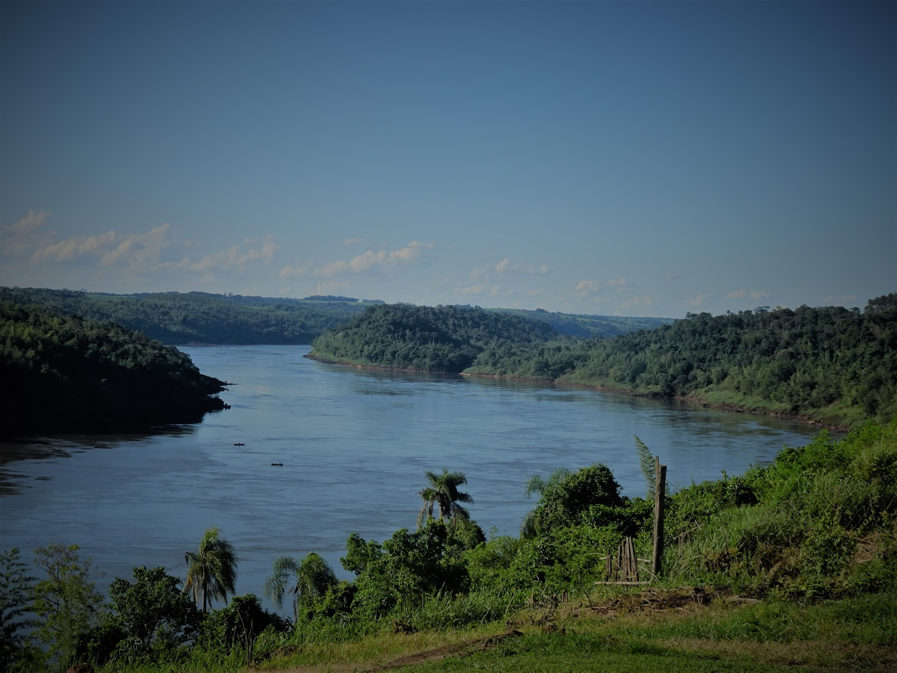
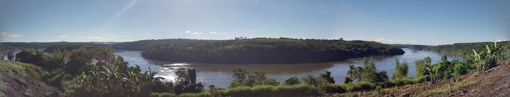

Po podróży autostopem znaleźliśmy nocleg u argentyńskiej rodziny w miejscowości Wanda. Po przybyciu tu, dowiedzieliśmy się, że jest to miasto założone przez polskich imigrantów!
Całkiem nas to zaskoczyło. Eduardo, nasz gospodarz, zaoferował, że oprowadzi nas po miejscowości. Pierwszym miejscem, które odwiedziliśmy był mur. Przedstawia on historię miejscowości, od pierwszych osadników począwszy.
W centrum w oczy rzuca się nasz biały orzeł!, a pod nim napis Bóg, Honor, Ojczyzna. Dlaczego Wanda? Pochodzenie tej nazwy wywodzi się prawdopodobnie z legendy o księżniczce Wandzie, co Niemca nie chciała, ale wydaje się nam, że mieszkańcy zrobili swoją wersję tej legendy.
Wielu mieszkańców Wandy jest przodkami polskich emigrantów, języka polskiego niestety nie usłyszeliśmy, ale co ciekawe gdy się przedstawiliśmy okazało się, że przyjaciele rodziny u której mieszkamy mają na nazwisko Szafer, daleka rodzina? :)
W dalszej części wycieczki, zobaczyliśmy główną ulicę Wandy, w której również usytuowany jest pomnik z wyrazami wdzięczności dla Polaków, pojechaliśmy zobaczyć katolicki kościół i...
dotarliśmy do Częstochowy :). W Argentynie, polscy misjonarze stworzyli malutki drewniany kościółek (niestety zamknięty), który został nazwany Częstochowa. Obok kościoła znajduje się pomnik papieża Jana Pawła II oraz Jego kilka słynnych cytatów.
Na koniec zwiedzania Eduardo wziął nas by zobaczyć atrakcje przyrodnicze w okolicy. Zobaczyliśmy kemping z małymi wodospadami, który był wypełniony dzieciakami korzystającymi z uroków kąpieli (niczym dawna miejscowość Wisła w Polsce) oraz cud natury, którym jest rzeka Parana.
Z wysokości kilkuset metrów nad poziomem wody mogliśmy podziwiać pełne zielieni wzgórza rozciągające się po stronie Paragwaju. Widok nie do opisania, zapraszamy do oglądania zdjęć.
W najbliższym czasie (pewnie za tydzień) przygotujemy z tego widoku zdjęcia 360 stopni, dzięki czemu będziecie mogli zobaczyć tą rzekę jeszcze bliżej!

<grid>

</grid>
<grid columns="2">

</grid>
<grid>

</grid>

