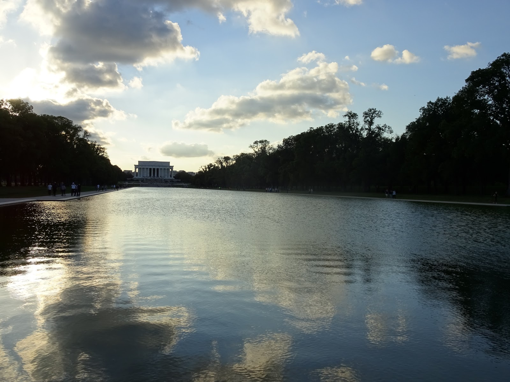

After Philly we had enough of big cities but Washington surprised us positively. We met super people again who welcomed us in their house around trees and wild animals :) They took us for a nice drive around Washington at night where everything was illuminated. The design of city was based on European cities like Paris or Amsterdam so it looks familiar to us. 
During the day we left our bikes and walked around Washington. The weather was beautiful we took many pictures of famous buildings with the nice bright sky.
What was worth seeing in D.C.? I think everything!!!
The biggest pencil ever is made of stones and it's the highest stone building in the world 554 feet :) It made a big impression on us. At night it looked unreal, surreal and enormous. It's a nice view on the other places from there.
The World War II Memorial is also a beautiful place that was interestingly designed. I like the combination of stones, water and sculptured pictures telling stories about war. It's a good place for reflection.
We also saw United States Capitol, where the United States Congress and the legislative branch of the federal government are situated.
The White House is really white :) but unfortunately president is not a member of couchsurfing website ;) Actually, the White House looks pretty small comparing to other buildings in Washington.
Anyway, the best thing in this city is that museums are for free and they are so huge and full of interesting exhibitions. I could spend all day there. We are interested in Indian History so we went to Indian History Museum first and we spent almost 4 hours there and did not manage to see everything. Then we went to Air and Space museum and it was amazing too. You could do experiments and learn how things fly :)
If you really want to see everything in Washington you should stay there for about a week or so. Unfortunately we had to move on with our adventure so we could not stay there longer. Below there are some nice pictures from D.C. Enjoy :)

<grid columns="2">

</grid>
<grid>

</grid>
<grid columns="2">

</grid>