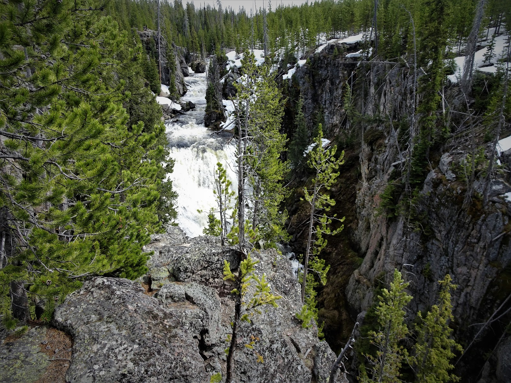
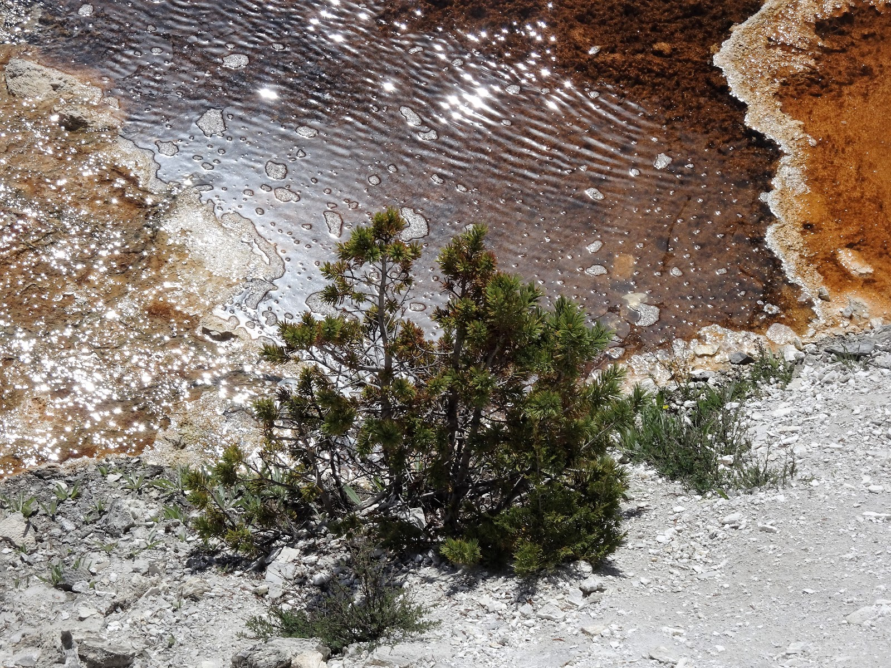

Tak! Zrujnowany, rozjechany, zabetonowany!!! Parking, nie park. Taki jest Park Narodowy Yellowstone. Jadąc rowerami po jego drodze przeżyliśmy piekło. Samochód za samochodem, pełno autobusów i te cholerne, znienawidzone do końca życia, kampery. Każdy pojazd ma wstęp do woli. Zawsze i wszędzie znajdzie miejsce na jednym z kilkunastu wielkich parkingów, które wybudowano przy KAŻDYM gorącym źródle tudzież gejzerze.  Niektórzy mówią, że ten park to ZOO, bo wystarczy zaparkować zrobić fotkę i jechać dalej. Co niektórzy nawet nie ruszą tyłka z auta i pstrykają fotki przez okno. A jak się człowiek zmęczy jazdą może coś zjeść w restauracji i pospać w hotelu. W tym parku nie ma miejsca na zadumę i intymny kontakt z przyrodą. Jako pierwszy park na świecie, nie świeci przykładem. 
<youtube>SfY4Eng6WFM</youtube>
Dla miłośników przyrody, ludzi wędrujących i rowerzystów nie ma miejsca. Co roku na drogach w Yellowstone ginie garstka ludzi uderzonych przez lusterka dużych pickupów czy kamperów. I to był szesnasty maja, czyli można powiedzieć, że po za sezonem. Może lepiej byłoby przyjechać w czerwcu lub lipcu. Łatwiej byśmy omijali auta stojące w korku. 
Pomimo bliskich spotkań z autami zobaczyliśmy wiele.

West Thumb Geyser Basin


Mammoth Hot Springs
 


Grand Prismatic Spring


W niektórych miejscach ziemia bulgotała, parowała lub tryskała z niej para lub woda. Były żółte i białe skały. W powietrzu czuć było zapach siarki jak w sylwestrową noc. Nie urzekły mnie ani gorące źródła, ani gejzery. Stary wierny gejzer Old Faithful zastał przysłonięty wielgachnym parkingiem, budynkiem Visitor Center, a droga do niego, pięknie wybetonowana, sprawiała wrażenie jakbym z daleka patrzyła na fontannę, a nie cud natury. Po wybuchu gejzeru zgromadzona publiczność klaskała jak na przedstawieniu. 

Większość wyprawy po USA myśleliśmy o tym, aby dotrzeć do tego parku i zanurzyć się w otchłani jego nadzwyczajnej przyrody. Nasz pobyt planowany na ok. 5 dni skrócił się do dwóch. Nigdy tam nie wrócę. Współczuje wszystkim zwierzętom, które muszą znosić ten hałas i harmider przez całe lato. W sierpniu z powodu zaćmienia słońca ma się zjawić tam ok 4 mln ludzi. W północnej części parku odbywały się prace drogowe, buldożery i koparki rozgarniały górę na kolejną drogę. Tak wygląda konserwacja natury w Yellowstone. 


```grid|3


```
```grid|2


```
```grid|4


```
```grid|3


```
```grid|2


```
```grid|5


```
```grid|4



```
```grid|2


```
```grid|6



```
```grid|3


```
```grid|4


```

```grid|3


```
```grid|2


```
```grid|4


```
```grid|5


```
```grid|3


```
```grid|6


```
```grid|4


```
```grid|3


```