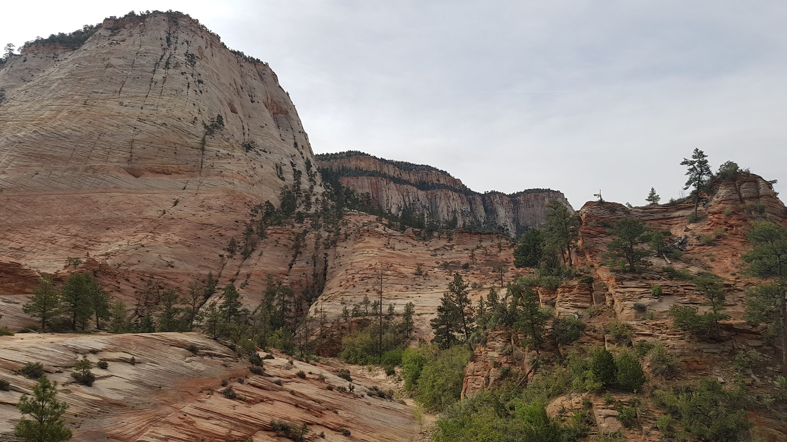
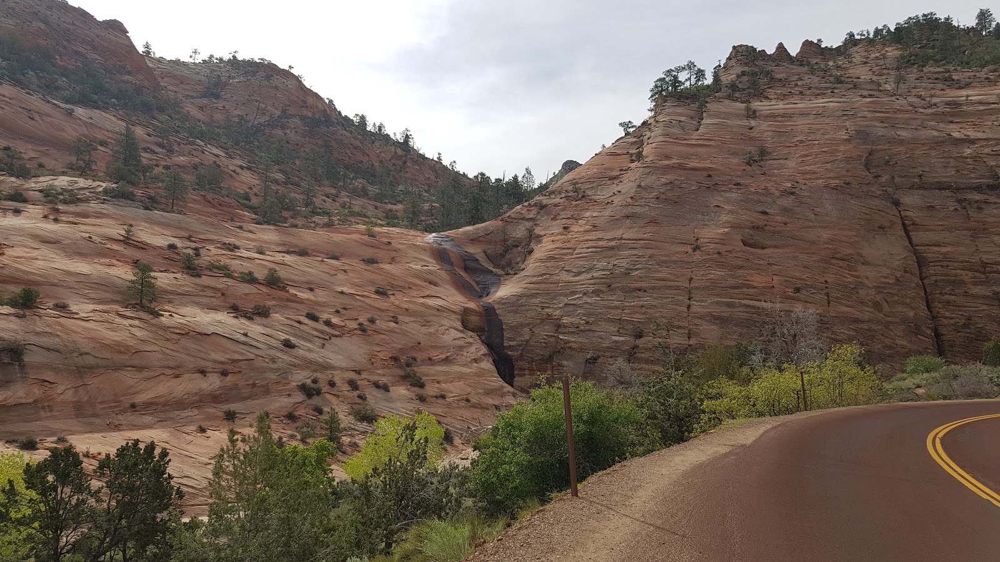
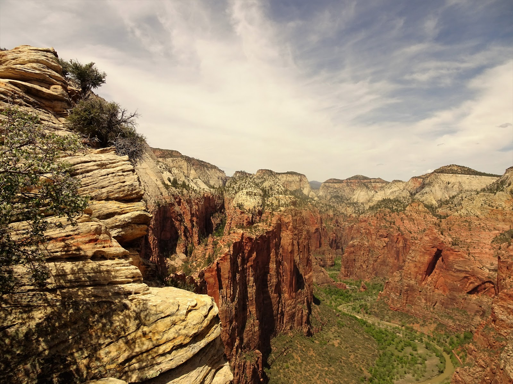
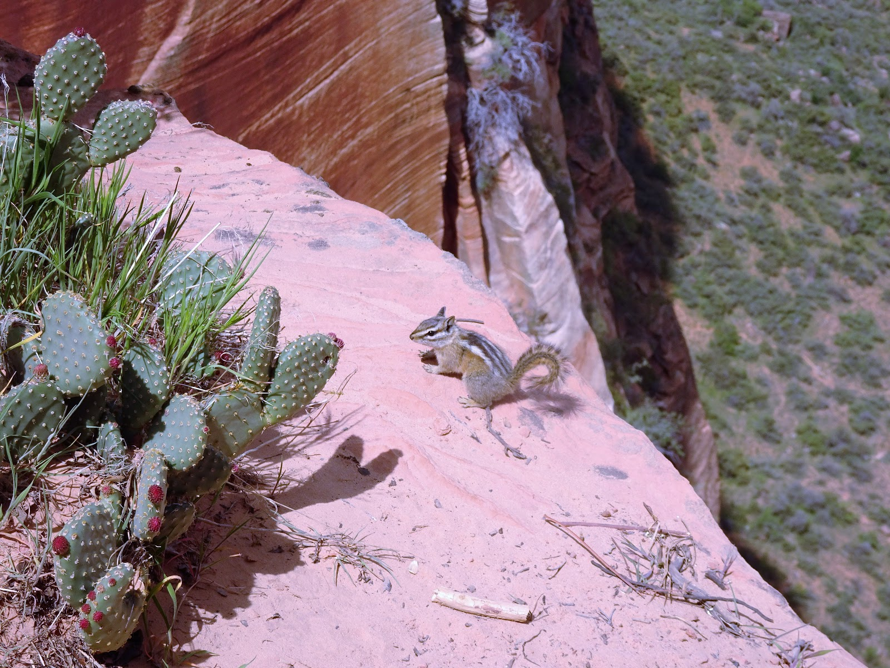
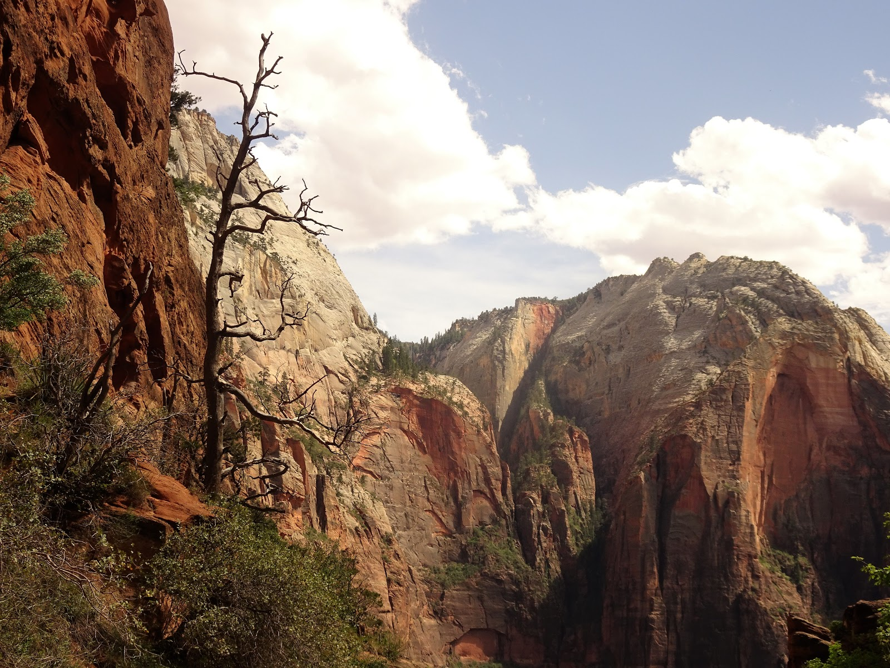
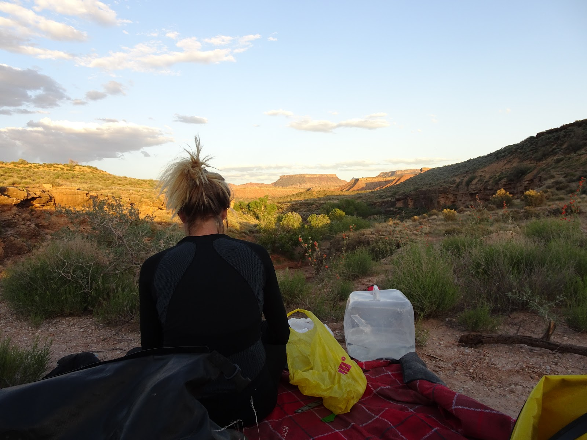

Po uroczej Patagonii, ten tak mało znany park zrobił na nas największe wrażenie w Ameryce Północnej i zaliczamy go do listy najpiękniejszych miejsc. Mogłabym godzinami podziwiać te arcydzieła, które wyrzeźbiły siły natury- woda i wiatr. 
<youtube>7BgAIXJqYJs</youtube>
W Zion uderzyliśmy od strony wschodniej drogą nr 9 zwaną Mount Carmel Hwy. Piękne widoki zakłócił korek do tunelu przez który przejazd rowerem jest zabroniony, więc musieliśmy się uśmiechać do stających w kolejce kierowców i wystawiać kciuka. Po małej godzince znalazł się dobry człowiek chętny do pomocy i przeprawił nas przez tunel. Szybo się zapakowaliśmy i w drogę. Pomimo zjazdu nie chciało się nabierać szybkich prędkości. Skalne rzeźby wymagały atencji i zadumy. Po dotarciu do Visitor Center zostawiliśmy rowery i ruszyliśmy pieszo do magicznego miejsca, gdzie lądują anioły. Angels Landing Trail był wymagający i przy dużym wietrze można było stracić równowagę i się ześlizgnąć ze stromej skały. Kilka osób spadło i żaden anioł nie podfrunął z pomocą. Musieliśmy bardzo uważać. Nasze zmęczone nogi chwiały się i czasami tylko łańcuch był jedynym punktem przyczepności. Nic dziwnego, że od roku 2004 zginęło tam 7 osób. Po trudnym hajku czekał nas wypad z parku i "zarezerwowane" cudowne miejsce nad rzeką Virgin.

<grid columns="2">

</grid>
<grid>

</grid>

<grid columns="2">

</grid>
<grid>

</grid>